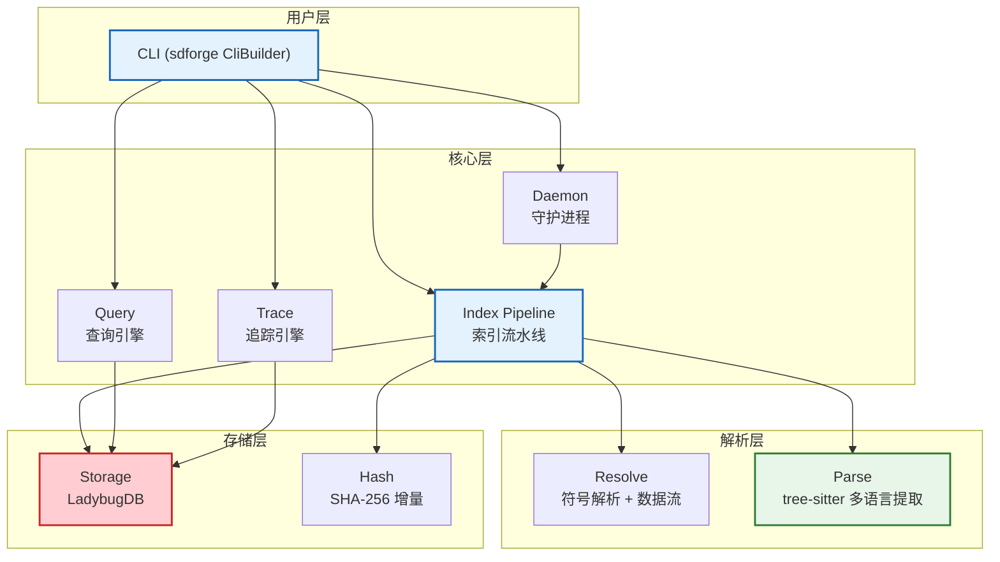

<div align="center">


**基于 LadybugDB 与 tree-sitter 的多语言代码知识图谱工具**

[](LICENSE) &nbsp; [](https://www.rust-lang.org) &nbsp; [](https://github.com/Kirky-X/codenexus/actions/workflows/ci.yml) &nbsp; [](https://crates.io/crates/codenexus)

[English](README_EN.md) | 简体中文

</div>

---

## 目录

- [简介](#简介)
- [核心特性](#核心特性)
- [安装](#安装)
- [快速开始](#快速开始)
- [CLI 命令](#cli-命令)
- [MCP 集成](#mcp-集成)
- [复杂度分析](#复杂度分析)
- [架构](#架构)
- [支持语言](#支持语言)
- [开发](#开发)
- [贡献](#贡献)
- [路线图](#路线图)
- [许可证](#许可证)

## 简介

CodeNexus 将源代码仓库索引为可查询的知识图谱。它使用 [tree-sitter](https://tree-sitter.github.io/) 进行多语言语法解析，[LadybugDB](https://github.com/ladybugdb/ladybugdb) 进行图存储，支持符号追踪、影响分析和数据流分析。

默认 `full` 预设支持 **21 种语言**：C、Rust、Fortran、Python、TypeScript、Go、Java、C++、JavaScript、Ruby、Haskell、OCaml、Scala、PHP、C#、Bash、HTML、CSS、JSON、Regex、Verilog。可通过 `lang-*` feature 选择所需语言，构建最小子集。

## 核心特性

| 特性 | 说明 |
|------|------|
| 多语言解析 | 21 种语言（默认 `full` 预设），基于 tree-sitter，可用 `lang-*` feature 按需裁剪 |
| 图数据库 | LadybugDB 图存储，44 种节点类型 + 30 种边类型 |
| 增量索引 | SHA-256 文件哈希比对，仅重新解析变更文件 |
| 并行解析 | Rayon 并行 + 线程局部 parser 池 |
| RAM 优先索引 | LZ4 压缩源码到内存，单次 `COPY FROM` 批量入库（`--ram_first`） |
| 符号追踪 | 调用链 (Calls) 与数据流 (DataFlows) 双向追踪 |
| 影响分析 | 变更影响半径分析，按深度分层 |
| 歧义消解 | 多匹配符号按置信度排序消解（自动选择唯一匹配；无法唯一确定时报错） |
| 置信度分层 | 每条边携带分层（SameFile / ImportScoped / Global）+ 0.0-1.0 分数 |
| 跨语言 FFI | C-Fortran bind(C)、Rust extern 等跨语言调用解析 |
| 团队制品 | `export`/`import` 压缩 `.graph.zst` 制品，共享索引 |
| 多智能体 MCP | `setup` 自动检测 Claude Code/Cursor/Codex；`hook` 输出 PreToolUse/PostToolUse JSON；`mcp` stdio 服务 |
| 文件监视 | 守护进程模式，自动增量索引（`daemon` feature） |
| 向量嵌入 | 默认启用的语义搜索（`embed` feature，含于 `full` 预设） |
| 污点追踪 | 跨语言多跳污点路径追踪（`TaintPathTracer`，BFS 遍历 DataFlows/Reads/Writes/FfiCalls） |
| 国际化 | Unicode case folding + NFC 规范化（ICU4X，`i18n` feature，含于 `full` 预设） |

## 安装

```bash
# 从 crates.io 安装（默认 full 预设，含全部 21 语言 + 所有功能）
cargo install codenexus

# 从源码构建
git clone https://github.com/Kirky-X/codenexus.git
cd codenexus
cargo install --path .

# 或直接编译
cargo build --release

# 仅构建 MCP 功能（默认 full 预设已含全部语言）
cargo build --release --features mcp
```

### Feature 开关

**预设**：`default = ["full"]`

| Feature | 默认 | 说明 |
|---------|------|------|
| `minimal` | — | 最小预设：仅 `lang-rust` |
| `core` | — | 核心预设：`lang-c` + `lang-rust` + `lang-python` |
| `full` | 启用 | 完整预设：`core` + Fortran/TypeScript/Go/Java/C++/JavaScript/Ruby/Haskell/OCaml/Scala/PHP/C#/Bash/HTML/CSS/JSON/Regex/Verilog + daemon/analysis/complexity/api-review/community/cross-service/lsp/cli/mcp/cache/embed/i18n |
| `lang-c` | — | C 语言解析器（tree-sitter-c） |
| `lang-rust` | 启用 | Rust 语言解析器（tree-sitter-rust） |
| `lang-fortran` | — | Fortran 语言解析器（tree-sitter-fortran） |
| `lang-python` | — | Python 语言解析器（tree-sitter-python） |
| `lang-typescript` | — | TypeScript 语言解析器（tree-sitter-typescript） |
| `lang-go` | — | Go 语言解析器（tree-sitter-go） |
| `lang-java` | — | Java 语言解析器（tree-sitter-java） |
| `lang-cpp` | — | C++ 语言解析器（tree-sitter-cpp） |
| `lang-javascript` | — | JavaScript 语言解析器（tree-sitter-javascript） |
| `lang-ruby` | — | Ruby 语言解析器（tree-sitter-ruby） |
| `lang-haskell` | — | Haskell 语言解析器（tree-sitter-haskell） |
| `lang-ocaml` | — | OCaml 语言解析器（tree-sitter-ocaml） |
| `lang-scala` | — | Scala 语言解析器（tree-sitter-scala） |
| `lang-php` | — | PHP 语言解析器（tree-sitter-php） |
| `lang-csharp` | — | C# 语言解析器（tree-sitter-c-sharp） |
| `lang-bash` | — | Bash 语言解析器（tree-sitter-bash） |
| `lang-html` | — | HTML 语言解析器（tree-sitter-html） |
| `lang-css` | — | CSS 语言解析器（tree-sitter-css） |
| `lang-json` | — | JSON 语言解析器（tree-sitter-json） |
| `lang-regex` | — | 正则语言解析器（tree-sitter-regex） |
| `lang-verilog` | — | Verilog 语言解析器（tree-sitter-verilog） |
| `daemon` | 启用 | 文件监视守护进程（notify + notify-debouncer-full） |
| `embed` | 启用 | 向量嵌入语义搜索（reqwest HTTP + 本地 ONNX 推理） |
| `lsp` | 启用 | LSP 增强解析（7 个 LSP 客户端：Rust rust-analyzer、Python pyright、C/C++ clangd、Go gopls、TypeScript ts-lang-server、Fortran fortls、Java jdtls） |
| `analysis` | 启用 | 死代码检测 + 架构概览（纯 Cypher 聚合） |
| `complexity` | 启用 | AST 复杂度分析（圈/认知/嵌套/长度/Halstead/可维护性/时间/空间复杂度，依赖 `analysis`） |
| `api-review` | 启用 | API 审查工具包（route_map/shape_check/api_impact/tool_map） |
| `community` | 启用 | 社区检测（Louvain 模块度优化，依赖 petgraph） |
| `cross-service` | 启用 | 跨服务调用链检测（HTTP 路由模式匹配） |
| `mcp` | 启用 | MCP 服务器（sdforge `mcp` stdio 传输） |
| `cli` | 启用 | CLI 二进制（sdforge `cli` 传输，二进制必需） |
| `cache` | 启用 | 查询结果缓存（oxcache） |
| `i18n` | 启用 | Unicode case folding + NFC 规范化（ICU4X，`full` 预设含） |

> **日志系统**：inklog 是唯一日志后端（console + file rotation + daily 滚动 + LZ4 压缩），不再提供 tracing-subscriber 可选后端。

```bash
# 最小构建（仅 Rust，不含 daemon/analysis）
cargo build --release --no-default-features --features minimal

# 核心构建（C + Rust + Python）
cargo build --release --no-default-features --features core

# 单语言精简构建（例如仅 C）
cargo build --release --no-default-features --features lang-c

# 完整构建（默认，含所有语言 + 全部功能）
cargo build --release

# 含向量嵌入的构建
cargo build --release --features embed
```

## 快速开始

> 所有子命令参数均为 **必填的 snake_case 长选项**（例如 `--symbol`、`--trace_type`）。布尔选项需显式传值（`true`/`false`）。数据库路径通过全局 `--db` 选项指定（默认值 `.codenexus/<项目名称>.lbug`，需置于子命令之前；`<项目名称>` 取 `--name`，缺失时取 `--path` 所在目录名）。

```bash
# 1. 索引一个代码仓库
codenexus index --path /path/to/project --name myproject

# 1b. RAM 优先索引（LZ4 内存压缩，适合中小仓库，更快）
codenexus index --path /path/to/project --name myproject --ram_first true

# 2. 查询函数
codenexus query --cypher "MATCH (f:Function) RETURN f.name LIMIT 10"

# 3. 追踪调用链
codenexus trace --symbol main --trace_type calls --depth 5 --path_filter "" --detect_cycles false --cross_service false
# 3b. 增强追踪：路径过滤 + 环检测 + 跨服务
codenexus trace --symbol main --trace_type calls --depth 5 --path_filter "/src/api/**" --detect_cycles true --cross_service true

# 4. 分析变更影响（多维 + 风险评估）
codenexus impact --symbol parse_function --depth 3 --edge_types "" --max_depth 0 --include_tests false
codenexus impact --symbol parse_function --edge_types "CALLS,IMPLEMENTS,USES_TYPE" --max_depth 5 --include_tests true

# 5. 搜索符号（5 种模式 + BM25 全文）
codenexus search --text "parse" --limit 20 --mode exact --fulltext false --project ""
codenexus search --text "get.*user" --mode regex --fulltext false --project ""
codenexus search --text "getuser" --mode fuzzy --fulltext false --project ""
codenexus search --text "authentication logic" --fulltext true --project ""

# 6. 360° 符号上下文（基础 + 多维增强）
codenexus context --symbol main --depth 1 --project "" --enhanced false
codenexus context --symbol main --project myproject --enhanced true

# 7. 检测 git diff 影响的符号
codenexus detect_changes --path /path/to/project --mode git

# 8. 重命名符号（图编辑 + 文本搜索；apply=false 即 dry-run）
codenexus rename --from old_name --to new_name --path /path/to/project --apply false

# 9. 导出 / 导入团队制品（--db 为全局选项，置于子命令之前）
codenexus --db ./my.lbug export --output team.graph.zst --project ""
codenexus --db ./shared.lbug import --input team.graph.zst --reindex false --path "" --name ""

# 10. 多智能体 MCP 集成
codenexus setup                    # 自动检测智能体，写入 MCP 配置
codenexus hook                     # 输出 PreToolUse/PostToolUse JSON
codenexus mcp                      # stdio MCP 服务（JSON-RPC 2.0）

# 11. 查看索引状态
codenexus status

# 12. 启动文件监视守护进程
codenexus daemon --path /path/to/project --name myproject

# 13. 列出所有项目
codenexus list

# 14. 删除项目
codenexus clean --project myproject

# 15. 死代码检测（多边类型 + FFI/导出检测 + 置信度）
codenexus dead_code --project myproject --entry "" --check_exported true --check_ffi true --edge_types ""
codenexus dead_code --project myproject --edge_types "CALLS,FFI_CALLS,IMPLEMENTS,USAGE,TESTS"

# 16. 跨服务调用链检测（HTTP REST / gRPC / GraphQL / 消息队列 / 事件总线）
codenexus cross_service --project myproject                    # 省略 --protocol = 所有协议
codenexus cross_service --project myproject --protocol grpc

# 17. 架构概览（模块边界 + 依赖方向 + 分层 + 跨服务依赖）
codenexus architecture --project myproject
```

## [CLI 命令](#cli-命令)

| 命令 | 说明 |
|------|------|
| `index` | 索引代码仓库到知识图谱（`--ram_first` 启用 LZ4 内存模式） |
| `query` | 执行 Cypher 查询（`--cypher`） |
| `trace` | 追踪符号的调用/数据流路径（`--symbol`/`--trace_type`/`--depth`/`--path_filter`/`--detect_cycles`/`--cross_service`） |
| `impact` | 分析符号变更的影响半径（`--symbol`/`--edge_types`/`--max_depth`/`--include_tests` 多维分析 + `risk_assessment`） |
| `search` | 按名称或内容搜索符号（`--text`/`--mode` exact/regex/fuzzy/graph/multi；`--fulltext` BM25 全文；`--project` 项目过滤） |
| `context` | 360° 符号视图：入度调用/导入、出度调用、所属流程（`--symbol`/`--project`/`--enhanced` 多维 SymbolContext） |
| `detect_changes` | git diff → 受影响符号 + risk_level |
| `rename` | 高置信度图编辑 + 文本搜索编辑（`--from`/`--to`/`--path`；`--apply false` 为 dry-run） |
| `export` | 导出 LadybugDB 转储 → zstd 制品（`--output`；`--project` 可选；数据库由全局 `--db` 指定） |
| `import` | 导入制品 → LadybugDB（`--input`；`--reindex` 增量补齐本地差异；`--path`/`--name` 配合 `--reindex`） |
| `setup` | 自动检测已安装的智能体（Claude Code/Cursor/Codex）并写入 MCP 配置 |
| `hook` | 输出 PreToolUse/PostToolUse JSON（exit 0，永不阻塞） |
| `mcp` | sdforge-based stdio MCP 服务（`mcp` feature） |
| `daemon` | 启动文件监视守护进程 |
| `status` | 查看索引状态 |
| `list` | 列出所有已索引项目 |
| `clean` | 删除项目及其索引 |
| `dead_code` | 死代码检测（多边类型 + FFI/导出检测 + High/Medium/Low 置信度，`analysis` feature） |
| `architecture` | 架构概览（模块边界 + 依赖方向 + 分层 + 跨服务依赖，`analysis` feature） |
| `complexity` | AST 复杂度分析（8 项指标 + 可配置阈值，`complexity` feature） |
| `route_map` | HTTP 路由映射（API 端点清单，`api-review` feature） |
| `shape_check` | API 形状检查（请求/响应结构验证，`api-review` feature） |
| `api_impact` | API 变更影响分析（`--endpoint` 可选，省略=分析所有端点；`api-review` feature） |
| `tool_map` | 工具映射（MCP 工具清单，`api-review` feature） |
| `community` | 社区检测（`--resolution` 可选，省略=默认 0.5；Louvain 模块度优化，`community` feature） |
| `cross_service` | 跨服务调用链检测（`--protocol` 可选，省略=所有协议；HTTP REST/gRPC/GraphQL/消息队列/事件总线，`cross-service` feature） |
| `lsp_goto_def` | LSP 定义跳转（rust-analyzer 集成，`lsp` feature） |
| `lsp_hover` | LSP 悬停信息（rust-analyzer 集成，`lsp` feature） |

## [MCP 集成](#mcp-集成)

CodeNexus 使用 [sdforge](https://crates.io/crates/sdforge) 提供 MCP（Model Context Protocol）服务器，通过 sdforge `mcp` stdio 传输暴露 **6 个工具**：

| 工具 | 说明 |
|------|------|
| `query` | 执行 Cypher 查询 |
| `trace` | 追踪符号调用/数据流路径 |
| `impact` | 分析符号变更影响半径（上游调用者子图） |
| `search` | 按名称或内容搜索符号（结构化 / BM25 全文） |
| `context` | 360° 符号视图（调用者/被调用者/所属流程） |
| `architecture` | 架构概览（模块边界 + 依赖方向 + 分层 + 跨服务依赖） |

```bash
# 启动 MCP 服务（stdio）
codenexus mcp [--db <DB_PATH>]

# 自动检测智能体并写入 MCP 配置
codenexus setup
```

`setup` 自动检测已安装的 Claude Code（`~/.claude/`）、Cursor（`~/.cursor/`）、Codex（`~/.codex/`），并写入对应的 MCP 配置文件，指向 `codenexus mcp`。使用 `--force` 可跳过确认提示覆盖已有配置。

## [复杂度分析](#复杂度分析)

`complexity` 子命令对项目内所有函数计算 AST 复杂度指标，输出 JSON（含 `complexity` 数组与 `summary` 统计）。

### 指标

| 指标 | 字段 | 说明 |
|------|------|------|
| 圈复杂度 | `cyclomatic` | McCabe 1976，含分支节点 + 显式出口（return/break/continue）+ 逻辑运算符 |
| 认知复杂度 | `cognitive` | 按嵌套层级加权的 SonarQube 风格复杂度 |
| 嵌套深度 | `nesting_depth` | 分支节点最大嵌套层数 |
| 函数长度 | `function_length` | 起止行差 +1 |
| Halstead 复杂度 | `halstead` | Halstead 1977：`n1/n2/N1/N2/volume/difficulty/effort/delivered_bugs` |
| 可维护性指数 | `maintainability_index` | Microsoft 2007 修订公式，0-100（越高越好） |
| 时间复杂度 | `time_complexity` | AST 模式估算：O(1)/O(log n)/O(n)/O(n log n)/O(n^2)/O(n^3)/O(2^n) |
| 空间复杂度 | `space_complexity` | 分配模式识别：O(1)/O(n)/O(n^2) |

每项指标按阈值分为 Green / Yellow / Red / Critical 四级，`overall_severity` 取最高级别。

### 阈值 CLI 参数

| 参数 | 说明 |
|------|------|
| `--cyclomatic_green <N>` / `--cyclomatic_yellow <N>` / `--cyclomatic_red <N>` | 圈复杂度阈值 |
| `--cognitive_green <N>` / `--cognitive_yellow <N>` / `--cognitive_red <N>` | 认知复杂度阈值 |
| `--nesting_green <N>` / `--nesting_yellow <N>` / `--nesting_red <N>` | 嵌套深度阈值 |
| `--func_length_green <N>` / `--func_length_yellow <N>` / `--func_length_red <N>` | 函数长度阈值 |
| `--halstead_volume_green <N>` / `--halstead_volume_yellow <N>` / `--halstead_volume_red <N>` | Halstead volume 阈值 |
| `--maintainability_green <N>` / `--maintainability_yellow <N>` / `--maintainability_red <N>` | 可维护性指数阈值（越高越好） |
| `--time_complexity_green <O(...)>` / `--time_complexity_yellow <O(...)>` / `--time_complexity_red <O(...)>` | 时间复杂度阈值 |
| `--space_complexity_yellow <O(...)>` / `--space_complexity_red <O(...)>` | 空间复杂度阈值（3 级，无 Critical） |

`<O(...)>` 取值：时间 `O(1)` / `O(log n)` / `O(n)` / `O(n log n)` / `O(n^2)` / `O(n^3)` / `O(2^n)`，空间 `O(1)` / `O(n)` / `O(n^2)`。所有阈值与标志参数（含 `--red_only`/`--sort_by_severity`）均可省略；省略时 `u32` 阈值与 `O(...)` 字符串阈值走默认值（见下表），`bool` 标志默认 `false`。

### 默认阈值

| 指标 | Green | Yellow | Red |
|------|-------|--------|-----|
| cyclomatic | 10 | 20 | 25 |
| cognitive | 10 | 15 | 20 |
| nesting | 3 | 5 | 6 |
| func_length | 30 | 100 | 200 |
| halstead_volume | 100 | 1000 | 8000 |
| maintainability | 85 | 65 | 25 |
| time_complexity | O(log n) | O(n) | O(n^2) |
| space_complexity | — | O(1) | O(n) |

> `maintainability` 阈值含义反转：MI 越高越好，`value >= green → Green`，`value >= yellow → Yellow`，`value >= red → Red`，否则 `Critical`。`space_complexity` 只有 3 级（Green/Yellow/Red），无 Critical。

### 示例

```bash
# 默认阈值分析
codenexus complexity --project myproject

# 自定义圈复杂度阈值（green=5, yellow=10, red=15）
codenexus complexity --project myproject --cyclomatic_green 5 --cyclomatic_yellow 10 --cyclomatic_red 15

# 仅显示 Red 和 Critical 级函数并按严重度排序
codenexus complexity --project myproject --red_only true --sort_by_severity true

# 自定义时间复杂度阈值（green=O(1), yellow=O(n log n), red=O(n^2)）
codenexus complexity --project myproject --time_complexity_green "O(1)" --time_complexity_yellow "O(n log n)" --time_complexity_red "O(n^2)"
```

## [架构](#架构)

### 三层源码结构

| 层 | 入口 | 说明 |
|----|------|------|
| Rust SDK | `src/lib.rs` | 库 crate，暴露公共 API（模型/解析/存储/索引/查询/追踪/service 模块） |
| CLI 二进制 | `src/main.rs` | 使用 sdforge `CliBuilder` + `inventory` 分发到 `service::*` 处理器 |
| MCP 服务器 | `src/service/` | sdforge `#[forge]` 宏统一暴露 CLI 和 MCP 接口，由 `cli`/`mcp` feature 门控 |

> v0.3.2 起，CLI 和 MCP 接口通过 sdforge 的 `#[forge]` 宏统一封装在 `src/service/` 模块中，
> 每个命令定义 core 函数 + CLI wrapper + MCP wrapper，替代了此前的 `src/cli/*_cmd.rs` 和 `src/mcp/` 模块。

### 索引管线



### 索引流程

1. **文件发现** — `ignore` crate 遵守 `.gitignore` 规则
2. **增量哈希** — SHA-256 比对，跳过未变更文件
3. **并行解析** — Rayon 并行 + tree-sitter 提取节点/边
4. **符号解析** — FQN 生成、调用解析、数据流分析、跨语言 FFI
5. **批量入库** — CSV 生成 + `COPY FROM` 批量加载

### 图模型

- **44 种节点类型**：Project, Folder, File, Module, Class, Struct, Enum, Trait, Impl, Function, Method, Variable, GlobalVar, Parameter, Const, Static, Macro, TypeAlias, Typedef, Namespace, Interface, Constructor, Property, Record, Delegate, Annotation, Template, Union, Variant, Field, Event, Handler, Middleware, Service, Endpoint, Route, Process, Database, Config, Test, Section, Community, Tool, Embedding
- **30 种边类型**：Contains, Defines, MemberOf, Calls, FfiCalls, DataFlows, Reads, Writes, Implements, Extends, UsesType, References, Imports, Includes, HasMethod, HasProperty, Accesses, MethodOverrides, MethodImplements, StepInProcess, HandlesRoute, Fetches, HandlesTool, EntryPointOf, Usage, Tests, HttpCalls, AsyncCalls, Emits, ListensOn
- 每条边携带置信度分数 (0.0-1.0) 和置信度分层（`SameFile` / `ImportScoped` / `Global`）

## [支持语言](#支持语言)

默认 `full` 预设编译 **21 种语言**。下表列出其中 8 种核心语言（C/Rust/Fortran/Python/TypeScript/Go/Java/C++）及其主要提取的节点/边类型；`full` 在此基础上额外启用 JavaScript、Ruby、Haskell、OCaml、Scala、PHP、C#、Bash、HTML、CSS、JSON、Regex、Verilog。

| 语言 | 节点类型 | 边类型 |
|------|----------|--------|
| C | Function, GlobalVar, Struct, Enum, Typedef, Macro | Calls, Imports, Reads, Writes, Includes |
| Rust | Function, Struct, Enum, Trait, Impl, Const, Static, Macro, Module, TypeAlias | Calls, Imports, Reads, Writes |
| Fortran | Module, Function | Calls, Imports, FfiCalls |
| Python | Function, Method, Class | Calls, Imports, Extends |
| TypeScript | Function, Class, Method, Interface, Enum, TypeAlias, Const | Calls, Imports |
| Go | Function, Method, Struct, Interface, TypeAlias | Defines, Calls, Imports |
| Java | Class, Interface, Enum, Method | Defines, Calls, Imports |
| C++ | Function, Method, Class, Struct, Namespace, Enum, Template | Defines, Calls, Imports |

## [开发](#开发)

```bash
# 运行测试
cargo test

# 代码检查
cargo clippy -- -D warnings

# 格式化
cargo +nightly fmt

# 基准测试
cargo bench
```

## [贡献](#贡献)

欢迎提交 Issue 和 Pull Request。请确保通过 `cargo test` 和 `cargo clippy -- -D warnings`。

详细贡献指南请参考 [CONTRIBUTING.md](docs/CONTRIBUTING.md)。

## [路线图](#路线图)

CodeNexus 按当前优先级排序的规划工作：

- [x] v0.1.0 — 多语言索引（C/Rust/Fortran/Python/TypeScript）、图模式（44 种节点类型 + 30 种边类型）、`query`/`trace`/`impact`/`context`/`search`、增量索引、RAM 优先模式、MCP 服务、团队 `export`/`import`、守护进程模式、置信度分层、歧义消解
- [x] v0.1.x — 稳定性与性能加固：增量重索引覆盖、大仓库内存调优、更多语言专属边提取
- [x] v0.2.0 — `lsp` feature：LSP 增强提取，超越 tree-sitter 的类型精确解析（rust-analyzer 集成）
- [x] v0.2.0 — 扩展语言覆盖（Go、Java、C++，以及 JavaScript/Ruby/Haskell/OCaml/Scala/PHP/C#/Bash/HTML/CSS/JSON/Regex/Verilog），由新的 `lang-*` feature 控制
- [x] v0.2.0 — 分析工具包：死代码检测、架构概览、API 审查（route_map/shape_check/api_impact/tool_map）、社区检测、跨服务链接检测
- [x] v0.2.1 — AST 复杂度分析：圈/认知复杂度、嵌套深度、函数长度，绿/黄/红/致命四级告警
- [x] v0.3.0 — sdforge-based MCP 服务器：`#[forge]` 宏 + sdforge `mcp` stdio 传输，替代手写 JSON-RPC；6 个工具（query/trace/impact/search/context/architecture）
- [x] v0.3.2 — 跨语言数据流端到端追踪：`TaintPathTracer` BFS 遍历 DataFlows/Reads/Writes/FfiCalls 边
- [x] v0.3.2 — 向量嵌入默认开启语义搜索（`embed` feature 已包含在 `full` 预设中）
- [x] v0.3.3 — 国际化模块（`i18n` feature）：ICU4X Unicode case folding + NFC 规范化 + CJK 边界检测
- [x] v0.3.3 — Harness 现代化：CI 升级 Rust 1.91 + 6 特性矩阵 + dependabot + codeql + crates.io 发布
- [ ] 未来 — 基于查询门面的 Web UI / 图可视化

## [许可证](#许可证)

[MIT](LICENSE)
