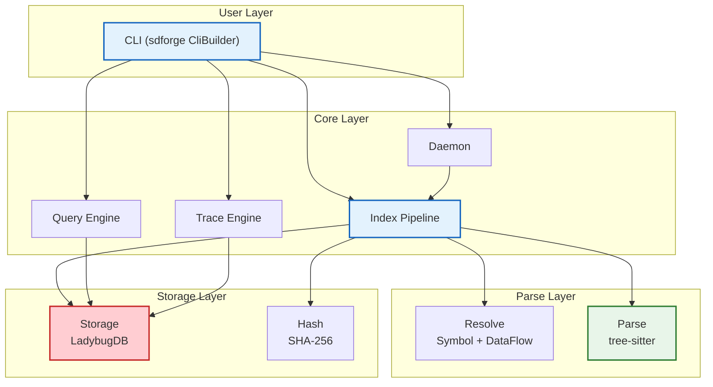

<div align="center">


**A multi-language code knowledge graph tool built on LadybugDB and tree-sitter**

[](LICENSE) &nbsp; [](https://www.rust-lang.org) &nbsp; [](https://github.com/Kirky-X/codenexus/actions/workflows/ci.yml) &nbsp; [](https://crates.io/crates/codenexus)

English | [简体中文](README.md)

</div>

---

## Table of Contents

- [Overview](#overview)
- [Key Features](#key-features)
- [Installation](#installation)
- [Quick Start](#quick-start)
- [CLI Commands](#cli-commands)
- [MCP Integration](#mcp-integration)
- [Complexity Analysis](#complexity-analysis)
- [Architecture](#architecture)
- [Supported Languages](#supported-languages)
- [Development](#development)
- [Contributing](#contributing)
- [Roadmap](#roadmap)
- [License](#license)

## Overview

CodeNexus indexes source code repositories into a queryable knowledge graph. It uses [tree-sitter](https://tree-sitter.github.io/) for multi-language parsing and [LadybugDB](https://github.com/ladybugdb/ladybugdb) for graph storage, supporting symbol tracing, impact analysis, and data-flow analysis.

CodeNexus turns a codebase into a structured graph of symbols and their relationships (calls, data flows, imports, FFI bindings, ...). Once indexed, you can query the graph with a Cypher subset, trace how a symbol is reached, measure the blast radius of a change, and feed the graph to AI agents through a Model Context Protocol (MCP) server.

Supports **21 languages** with the default `full` preset: C, Rust, Fortran, Python, TypeScript, Go, Java, C++, JavaScript, Ruby, Haskell, OCaml, Scala, PHP, C#, Bash, HTML, CSS, JSON, Regex, Verilog. Build a minimal subset with `lang-*` features.

### Typical Use Cases

- **Impact analysis before refactoring** — find every caller of a function across files and languages before editing it.
- **Onboarding a new codebase** — index a repo, then `query`/`context`/`trace` to navigate symbols and their relationships instead of grepping.
- **AI agent grounding** — run `codenexus mcp` so Claude Code / Cursor / Codex can call `query`, `context`, `impact`, and `detect_changes` tools with real call-graph data.
- **Team knowledge sharing** — `export` an index as a `.graph.zst` artifact and `import` it on a teammate's machine.

## Key Features

| Feature | Description |
|---------|-------------|
| Multi-language parsing | 21 languages (default `full` preset) via tree-sitter, trimmable with `lang-*` features |
| Graph database | LadybugDB storage with 44 node types + 30 edge types |
| Incremental indexing | SHA-256 file hash diffing, re-parses only changed files |
| Parallel parsing | Rayon parallelism + thread-local parser pool |
| RAM-first indexing | LZ4-compress source into memory, single `COPY FROM` dump (`--ram-first`) |
| Symbol tracing | Bidirectional call (Calls) and data-flow (DataFlows) tracing |
| Impact analysis | Change impact radius analysis, layered by depth |
| Disambiguation | Ranked multi-match symbol resolution by confidence (auto-selects the unique match; errors if it cannot be disambiguated) |
| Confidence tiers | Each edge carries a tier (SameFile / ImportScoped / Global) + 0.0-1.0 score |
| Cross-language FFI | C-Fortran `bind(C)`, Rust `extern`, and other FFI call resolution |
| Team artifacts | `export`/`import` compressed `.graph.zst` artifacts for sharing indexes |
| Multi-agent MCP | `setup` auto-detects Claude Code/Cursor/Codex; `hook` emits PreToolUse/PostToolUse JSON; `mcp` stdio server |
| File watching | Daemon mode with auto-incremental indexing (`daemon` feature) |
| Vector embedding | Enabled-by-default semantic search (`embed` feature, included in `full` preset) |
| Taint tracing | Cross-language multi-hop taint path tracing (`TaintPathTracer`, BFS over DataFlows/Reads/Writes/FfiCalls) |
| Internationalization | Unicode case folding + NFC normalization (ICU4X, `i18n` feature, included in `full` preset) |

## Installation

```bash
# Install from crates.io (default full preset, all 21 languages + all features)
cargo install codenexus

# Build from source
git clone https://github.com/Kirky-X/codenexus.git
cd codenexus
cargo install --path .

# Or compile directly
cargo build --release

# Build MCP only (default full preset includes all languages)
cargo build --release --features mcp
```

### Feature Flags

**Preset**: `default = ["full"]`

| Feature | Default | Description |
|---------|---------|-------------|
| `minimal` | — | Minimal preset: `lang-rust` only |
| `core` | — | Core preset: `lang-c` + `lang-rust` + `lang-python` |
| `full` | enabled | Full preset: `core` + Fortran/TypeScript/Go/Java/C++/JavaScript/Ruby/Haskell/OCaml/Scala/PHP/C#/Bash/HTML/CSS/JSON/Regex/Verilog + daemon/analysis/complexity/api-review/community/cross-service/lsp/cli/mcp/cache/embed/i18n |
| `lang-c` | — | C language parser (tree-sitter-c) |
| `lang-rust` | enabled | Rust language parser (tree-sitter-rust) |
| `lang-fortran` | — | Fortran language parser (tree-sitter-fortran) |
| `lang-python` | — | Python language parser (tree-sitter-python) |
| `lang-typescript` | — | TypeScript language parser (tree-sitter-typescript) |
| `lang-go` | — | Go language parser (tree-sitter-go) |
| `lang-java` | — | Java language parser (tree-sitter-java) |
| `lang-cpp` | — | C++ language parser (tree-sitter-cpp) |
| `lang-javascript` | — | JavaScript language parser (tree-sitter-javascript) |
| `lang-ruby` | — | Ruby language parser (tree-sitter-ruby) |
| `lang-haskell` | — | Haskell language parser (tree-sitter-haskell) |
| `lang-ocaml` | — | OCaml language parser (tree-sitter-ocaml) |
| `lang-scala` | — | Scala language parser (tree-sitter-scala) |
| `lang-php` | — | PHP language parser (tree-sitter-php) |
| `lang-csharp` | — | C# language parser (tree-sitter-c-sharp) |
| `lang-bash` | — | Bash language parser (tree-sitter-bash) |
| `lang-html` | — | HTML language parser (tree-sitter-html) |
| `lang-css` | — | CSS language parser (tree-sitter-css) |
| `lang-json` | — | JSON language parser (tree-sitter-json) |
| `lang-regex` | — | Regex language parser (tree-sitter-regex) |
| `lang-verilog` | — | Verilog language parser (tree-sitter-verilog) |
| `daemon` | enabled | File-watching daemon (notify + notify-debouncer-full) |
| `embed` | enabled | Vector embedding semantic search (reqwest HTTP + local ONNX inference) |
| `lsp` | enabled | LSP-enhanced extraction (7 LSP clients: Rust rust-analyzer, Python pyright, C/C++ clangd, Go gopls, TypeScript ts-lang-server, Fortran fortls, Java jdtls) |
| `analysis` | enabled | Dead code detection + architecture overview (pure Cypher aggregation) |
| `complexity` | enabled | AST complexity analysis (cyclomatic/cognitive/nesting/length/Halstead/maintainability/time/space, depends on `analysis`) |
| `api-review` | enabled | API review toolkit (route_map/shape_check/api_impact/tool_map) |
| `community` | enabled | Community detection (Leiden modularity optimization, depends on petgraph) |
| `cross-service` | enabled | Cross-service call chain detection (HTTP route pattern matching) |
| `mcp` | enabled | MCP server via sdforge `mcp` stdio transport |
| `cli` | enabled | CLI binary (sdforge `cli` transport; required by the binary) |
| `cache` | enabled | Query result caching (oxcache) |
| `i18n` | enabled | Unicode case folding + NFC normalization (ICU4X, included in `full` preset) |

> **Logging**: inklog is the sole logging backend (console + file rotation + daily rotation + LZ4 compression); the tracing-subscriber optional backend is no longer available.

```bash
# Minimal build (Rust only, no daemon/analysis)
cargo build --release --no-default-features --features minimal

# Core build (C + Rust + Python)
cargo build --release --no-default-features --features core

# Single-language lean build (e.g., C only)
cargo build --release --no-default-features --features lang-c

# Full build (default, all languages + all features)
cargo build --release

# Build with vector embedding
cargo build --release --features embed
```

## Quick Start

> All subcommand flags are **required snake_case long options** (e.g. `--symbol`, `--trace_type`); boolean options take an explicit `true`/`false` value. The database path is the global `--db` option (default `.codenexus/<project>.lbug`, placed before the subcommand; `<project>` is taken from `--name`, or falls back to the `--path` directory name).

```bash
# 1. Index a codebase into the knowledge graph
codenexus index --path /path/to/project --name myproject

# 1b. RAM-first indexing (LZ4 in-memory, faster for small-medium repos)
codenexus index --path /path/to/project --name myproject --ram_first true

# 2. Verify the index
codenexus status
codenexus list

# 3. Start exploring
codenexus query --cypher "MATCH (f:Function) RETURN f.name LIMIT 10"
codenexus context --symbol main --depth 1 --project "" --enhanced false
```

### Common Workflows

```bash
# Trace call paths
codenexus trace --symbol main --trace_type calls --depth 5 --path_filter "" --detect_cycles false --cross_service false
# Enhanced tracing: path filter + cycle detection + cross-service
codenexus trace --symbol main --trace_type calls --depth 5 --path_filter "/src/api/**" --detect_cycles true --cross_service true

# Analyze change impact (multi-dimensional + risk assessment)
codenexus impact --symbol parse_function --depth 3 --edge_types "" --max_depth 0 --include_tests false
codenexus impact --symbol parse_function --edge_types "CALLS,IMPLEMENTS,USES_TYPE" --max_depth 5 --include_tests true

# Search symbols (5 modes + BM25 full-text)
codenexus search --text "parse" --limit 20 --mode exact --fulltext false --project ""
codenexus search --text "get.*user" --mode regex --fulltext false --project ""
codenexus search --text "getuser" --mode fuzzy --fulltext false --project ""
codenexus search --text "authentication logic" --fulltext true --project ""

# 360° symbol context (basic + enhanced)
codenexus context --symbol main --depth 1 --project "" --enhanced false
codenexus context --symbol main --project myproject --enhanced true

# Detect git-diff affected symbols before committing
codenexus detect_changes --path /path/to/project --mode git

# Rename a symbol (graph-edits + text-search; --apply false = dry-run)
codenexus rename --from old_name --to new_name --path /path/to/project --apply false

# Export / import team artifacts (--db is a global option, before the subcommand)
codenexus --db ./my.lbug export --output team.graph.zst --project ""
codenexus --db ./shared.lbug import --input team.graph.zst --reindex false --path "" --name ""

# Start file-watching daemon for auto-incremental indexing
codenexus daemon --path /path/to/project --name myproject

# Remove a project and its index
codenexus clean --project myproject

# Dead code detection (multi-edge-type + FFI/export + confidence)
codenexus dead_code --project myproject --entry "" --check_exported true --check_ffi true
codenexus dead_code --project myproject --edge_types "CALLS,FFI_CALLS,IMPLEMENTS,USAGE,TESTS"

# Cross-service call chain detection (HTTP/gRPC/GraphQL/MQ/event bus)
codenexus cross_service --project myproject --protocol ""
codenexus cross_service --project myproject --protocol grpc

# Architecture overview (module boundaries + dependency directions + layers)
codenexus architecture --project myproject
```

## [CLI Commands](#cli-commands)

| Command | Description |
|---------|-------------|
| `index` | Index a codebase into the knowledge graph (`--ram-first` for LZ4 in-memory) |
| `query` | Execute a Cypher query |
| `trace` | Trace a symbol's call/data-flow paths (`--symbol`/`--trace_type`/`--depth`/`--path_filter`/`--detect_cycles`/`--cross_service`) |
| `impact` | Analyze the impact radius of changing a symbol (`--edge-types`/`--max-depth`/`--include-tests` multi-dimensional + `risk_assessment`) |
| `search` | Search symbols by name or content (`--mode` exact/regex/fuzzy/graph/multi; `--fulltext` BM25; `--project` filter) |
| `context` | 360° symbol view (`--project`/`--enhanced` multi-dimensional SymbolContext) |
| `detect_changes` | Git diff → affected symbols + risk_level |
| `rename` | Graph-edits for high-confidence + text-search edits (`--from`/`--to`/`--path`; `--apply false` = dry-run) |
| `export` | Export LadybugDB dump → zstd artifact (`--output`; `--project` optional; DB via global `--db`) |
| `import` | Import artifact → LadybugDB (`--input`; `--reindex` with `--path`/`--name` for local diff) |
| `setup` | Auto-detect installed agents (Claude Code/Cursor/Codex) and write MCP config |
| `hook` | Emit PreToolUse/PostToolUse JSON (exit 0, never blocks) |
| `mcp` | stdio MCP server (JSON-RPC 2.0, protocol 2024-11-05) |
| `daemon` | Start the file-watching daemon |
| `status` | Show indexing status |
| `list` | List all indexed projects |
| `clean` | Remove a project and its index |
| `dead_code` | Dead code detection (9 edge types + FFI/export + High/Medium/Low confidence, `analysis` feature) |
| `architecture` | Architecture overview (module boundaries + dependency directions + layers + cross-service deps, `analysis` feature) |
| `complexity` | AST complexity analysis (8 metrics + configurable thresholds, `complexity` feature) |
| `route_map` | HTTP route mapping (API endpoint inventory, `api-review` feature) |
| `shape_check` | API shape check (request/response structure validation, `api-review` feature) |
| `api_impact` | API change impact analysis (`api-review` feature) |
| `tool_map` | Tool mapping (MCP tool inventory, `api-review` feature) |
| `community` | Community detection (Leiden modularity optimization, `community` feature) |
| `cross_service` | Cross-service call chain detection (HTTP REST/gRPC/GraphQL/message queue/event bus, `cross-service` feature) |
| `lsp_goto_def` | LSP go-to-definition (rust-analyzer integration, `lsp` feature) |
| `lsp_hover` | LSP hover info (rust-analyzer integration, `lsp` feature) |

## [Complexity Analysis](#complexity-analysis)

The `complexity` subcommand computes AST complexity metrics for every function in a project, emitting JSON with a `complexity` array and a `summary` aggregate.

### Metrics

| Metric | Field | Description |
|--------|-------|-------------|
| Cyclomatic | `cyclomatic` | McCabe 1976 — branch nodes + explicit exits (return/break/continue) + logical operators |
| Cognitive | `cognitive` | Nesting-weighted SonarQube-style complexity |
| Nesting depth | `nesting_depth` | Maximum branch-node nesting depth |
| Function length | `function_length` | End line − start line + 1 |
| Halstead | `halstead` | Halstead 1977: `n1/n2/N1/N2/volume/difficulty/effort/delivered_bugs` |
| Maintainability Index | `maintainability_index` | Microsoft 2007 revision, 0-100 (higher = better) |
| Time complexity | `time_complexity` | AST-pattern estimate: O(1)/O(log n)/O(n)/O(n log n)/O(n^2)/O(n^3)/O(2^n) |
| Space complexity | `space_complexity` | Allocation-pattern recognition: O(1)/O(n)/O(n^2) |

Each metric is classified Green / Yellow / Red / Critical against thresholds; `overall_severity` is the maximum.

### Threshold CLI flags

| Flag | Description |
|------|-------------|
| `--cyclomatic_green <N>` / `--cyclomatic_yellow <N>` / `--cyclomatic_red <N>` | Cyclomatic thresholds |
| `--cognitive_green <N>` / `--cognitive_yellow <N>` / `--cognitive_red <N>` | Cognitive thresholds |
| `--nesting_green <N>` / `--nesting_yellow <N>` / `--nesting_red <N>` | Nesting depth thresholds |
| `--func_length_green <N>` / `--func_length_yellow <N>` / `--func_length_red <N>` | Function length thresholds |
| `--halstead_volume_green <N>` / `--halstead_volume_yellow <N>` / `--halstead_volume_red <N>` | Halstead volume thresholds |
| `--maintainability_green <N>` / `--maintainability_yellow <N>` / `--maintainability_red <N>` | Maintainability Index thresholds (higher = better) |
| `--time_complexity_green <O(...)>` / `--time_complexity_yellow <O(...)>` / `--time_complexity_red <O(...)>` | Time complexity thresholds |
| `--space_complexity_yellow <O(...)>` / `--space_complexity_red <O(...)>` | Space complexity thresholds (3-level, no Critical) |

`<O(...)>` values: time `O(1)` / `O(log n)` / `O(n)` / `O(n log n)` / `O(n^2)` / `O(n^3)` / `O(2^n)`, space `O(1)` / `O(n)` / `O(n^2)`. Unset flags fall back to defaults.

### Default thresholds

| Metric | Green | Yellow | Red |
|--------|-------|--------|-----|
| cyclomatic | 10 | 20 | 25 |
| cognitive | 10 | 15 | 20 |
| nesting | 3 | 5 | 6 |
| func_length | 30 | 100 | 200 |
| halstead_volume | 100 | 1000 | 8000 |
| maintainability | 85 | 65 | 25 |
| time_complexity | O(log n) | O(n) | O(n^2) |
| space_complexity | — | O(1) | O(n) |

> `maintainability` is inverted: MI higher = better, so `value >= green → Green`, `value >= yellow → Yellow`, `value >= red → Red`, else `Critical`. `space_complexity` has only 3 levels (Green/Yellow/Red), no Critical.

### Examples

```bash
# Analyse with default thresholds
codenexus complexity --project myproject

# Custom cyclomatic thresholds (green=5, yellow=10, red=15)
codenexus complexity --project myproject --cyclomatic_green 5 --cyclomatic_yellow 10 --cyclomatic_red 15

# Show only Red and Critical functions, sorted by severity
codenexus complexity --project myproject --red_only true --sort_by_severity true

# Custom time complexity thresholds (green=O(1), yellow=O(n log n), red=O(n^2))
codenexus complexity --project myproject --time_complexity_green "O(1)" --time_complexity_yellow "O(n log n)" --time_complexity_red "O(n^2)"
```

## [Architecture](#architecture)

### Source Layout

CodeNexus is split across three entry points:

- `src/lib.rs` — Rust SDK interface (library crate). Embed the indexing pipeline, query facade, or trace engine in another Rust project by depending on the `codenexus` crate.
- `src/main.rs` — CLI binary. Uses sdforge `CliBuilder` + `inventory` to dispatch to `service::*` handlers.
- `src/service/` — Unified service layer. sdforge `#[forge]` macro exposes both CLI and MCP interfaces, gated by `cli`/`mcp` features. Each command defines a core function + CLI wrapper + MCP wrapper.

### Indexing Pipeline



### Indexing Flow

1. **File discovery** — `ignore` crate honors `.gitignore` rules
2. **Incremental hashing** — SHA-256 diffing, skips unchanged files
3. **Parallel parsing** — Rayon parallelism + tree-sitter node/edge extraction
4. **Symbol resolution** — FQN generation, call resolution, data-flow analysis, cross-language FFI
5. **Bulk loading** — CSV generation + `COPY FROM` batch insert

### Graph Model

- **44 node types**: Project, Folder, File, Module, Class, Struct, Enum, Trait, Impl, Function, Method, Variable, GlobalVar, Parameter, Const, Static, Macro, TypeAlias, Typedef, Namespace, Interface, Constructor, Property, Record, Delegate, Annotation, Template, Union, Variant, Field, Event, Handler, Middleware, Service, Endpoint, Route, Process, Database, Config, Test, Section, Community, Tool, Embedding
- **30 edge types**: Contains, Defines, MemberOf, Calls, FfiCalls, DataFlows, Reads, Writes, Implements, Extends, UsesType, References, Imports, Includes, HasMethod, HasProperty, Accesses, MethodOverrides, MethodImplements, StepInProcess, HandlesRoute, Fetches, HandlesTool, EntryPointOf, Usage, Tests, HttpCalls, AsyncCalls, Emits, ListensOn
- Each edge carries a confidence score (0.0-1.0) and a confidence tier (`SameFile` / `ImportScoped` / `Global`)

### Supported Languages

The default `full` preset compiles **21 languages**. The table below lists the core 8; `full` additionally enables JavaScript, Ruby, Haskell, OCaml, Scala, PHP, C#, Bash, HTML, CSS, JSON, Regex, and Verilog.

| Language | Node Types | Edge Types |
|----------|------------|------------|
| C | Function, GlobalVar, Struct, Enum, Typedef, Macro | Calls, Imports, Reads, Writes, Includes |
| Rust | Function, Struct, Enum, Trait, Impl, Const, Static, Macro, Module, TypeAlias | Calls, Imports, Reads, Writes |
| Fortran | Module, Function | Calls, Imports, FfiCalls |
| Python | Function, Method, Class | Calls, Imports, Extends |
| TypeScript | Function, Class, Method, Interface, Enum, TypeAlias, Const | Calls, Imports |
| Go | Function, Method, Struct, Interface, TypeAlias | Defines, Calls, Imports |
| Java | Class, Interface, Enum, Method | Defines, Calls, Imports |
| C++ | Function, Method, Class, Struct, Namespace, Enum, Template | Defines, Calls, Imports |

## Configuration

CodeNexus is a CLI tool and is configured primarily through command-line flags. A small number of environment variables are honored:

| Variable | Default | Description |
|----------|---------|-------------|
| `RUST_LOG` | `info` | `tracing` log level (`error`/`warn`/`info`/`debug`/`trace`), supports `codenexus=debug` style filtering. |
| `CODENEXUS_DB_PATH` | `./codenexus.lbug` | Default LadybugDB database path used when `--db` is not passed to `index`/`query`/`status`/etc. |

See [`.env.example`](.env.example) for a copy-paste template. CodeNexus does not read a `.env` file itself; that file is for shells or process managers.

### Agent Integration

Run `codenexus setup` to auto-detect installed AI agents (Claude Code, Cursor, Codex) and write the MCP configuration into the right location for each. After setup, the agent can call CodeNexus tools (`query`, `context`, `impact`, `detect_changes`, `rename`, ...) over the MCP stdio server started by `codenexus mcp`.

For Git hooks, `codenexus hook` emits `PreToolUse`/`PostToolUse` JSON events and always exits 0, so it can be wired into a hook without blocking agent actions.

## [Development](#development)

```bash
# Run tests
cargo test

# Lint (CI gate)
cargo clippy -- -D warnings

# Format (requires nightly rustfmt for imports_granularity/group_imports)
cargo +nightly fmt

# Benchmarks
cargo bench
```

See [CONTRIBUTING.md](docs/CONTRIBUTING.md) for the full development workflow.

## [Contributing](#contributing)

Issues and Pull Requests are welcome. Please read [CONTRIBUTING.md](docs/CONTRIBUTING.md) for:

- Development environment setup
- Conventional Commits conventions
- Pull Request workflow
- Test and lint requirements (`cargo test` and `cargo clippy -- -D warnings` must pass)
- Code style (`cargo +nightly fmt`)

By participating, you agree to abide by the [Code of Conduct](docs/CODE_OF_CONDUCT.md).

## [Roadmap](#roadmap)

CodeNexus planned work, ordered by current priority:

- [x] v0.1.0 — Multi-language indexing (C/Rust/Fortran/Python/TypeScript), graph schema (44 node types + 30 edge types), `query`/`trace`/`impact`/`context`/`search`, incremental indexing, RAM-first mode, MCP server, team `export`/`import`, daemon mode, confidence tiers, disambiguation
- [x] v0.1.x — Stability and performance hardening: incremental reindex coverage, larger-repo memory tuning, more language-specific edge extraction
- [x] v0.2.0 — `lsp` feature: LSP-enhanced extraction for type-accurate resolution beyond tree-sitter (rust-analyzer integration)
- [x] v0.2.0 — Expand language coverage (Go, Java, C++) behind new `lang-*` features
- [x] v0.2.0 — Analysis toolkit: dead-code detection, architecture overview, API review (route-map/shape-check/api-impact/tool-map), community detection, cross-service link detection
- [x] v0.2.1 — AST complexity analysis: cyclomatic/cognitive complexity, nesting depth, function length with green/yellow/red/critical severity alerting
- [x] v0.3.0 — sdforge-based MCP server: `#[forge]` macro + sdforge `mcp` stdio transport, replacing hand-written JSON-RPC; 6 tools (query/trace/impact/search/context/architecture)
- [x] v0.3.2 — Cross-language data-flow tracing end-to-end: `TaintPathTracer` BFS over DataFlows/Reads/Writes/FfiCalls edges
- [x] v0.3.2 — Vector embedding default-on semantic search (`embed` feature included in `full` preset)
- [x] v0.3.3 — Internationalization module (`i18n` feature): ICU4X Unicode case folding + NFC normalization + CJK boundary detection
- [x] v0.3.3 — Harness modernization: CI upgraded to Rust 1.91 + 6-feature matrix + dependabot + codeql + crates.io publish
- [ ] Future — Web UI / graph visualization on top of the query facade

## [License](#license)

[MIT](LICENSE)

## Acknowledgments

CodeNexus would not be possible without these projects:

- [tree-sitter](https://tree-sitter.github.io/) — incremental parsing framework that powers all language extractors
- [LadybugDB](https://github.com/ladybugdb/ladybugdb) — graph database backing the knowledge graph
- [Rayon](https://github.com/rayon-rs/rayon) — data-parallel parsing
- [ignore](https://docs.rs/ignore) — `.gitignore`-aware file discovery
- [sdforge](https://crates.io/crates/sdforge) — CLI and MCP framework
- [Model Context Protocol](https://modelcontextprotocol.io/) — spec for the `mcp` server
- Every tree-sitter grammar maintainer — the per-language grammar crates do the hard parsing work

Project author: **Kirky.X** — [github.com/Kirky-X](https://github.com/Kirky-X)
