# CodeNexus - 架构设计文档（ADD）

> **文档状态：** 🟡 评审中
>
> **保密级别：** 内部公开
>
> **版本：** v0.1
>
> **日期：** 2026-06-23
>
> **撰写人：** CodeNexus Team
>
> **评审人：** [待定]
>
> **阅读对象：** 架构师、后端开发、技术负责人
>
> **关联 PRD：** PRD.md
> **关联 TRD：** TRD.md

---

## 0. 文档导读

### 0.1 文档目的与适用范围

**目的：** 定义 CodeNexus 的系统架构，包括 C4 视图、动态行为、数据架构、核心机制与架构决策记录（ADR）。

**适用场景：**
- ✅ 指导 CodeNexus 的开发实现
- ✅ 评审架构决策的合理性
- ✅ 新成员理解系统设计

### 0.2 相关文档

| 文档类型 | 文件名 | 相关章节 |
| -------- | -------- | -------- |
| 产品需求 | PRD.md 3-4 | 功能清单、功能详述 |
| 技术需求 | TRD.md 2-4 | 技术选型、性能指标 |
| 数据库设计 | DDD.md 4-7 | LadybugDB 图模式 |
| 实现计划 | .trae/documents/codenexus-implementation-plan.md 3-4 | 数据模型、实施阶段 |

### 0.3 变更记录

| 版本 | 日期 | 修订人 | 变更内容 | 审核人 |
| :----- | :--------- | :----- | :------- | :------- |
| v0.1 | 2026-06-23 | CodeNexus Team | 初稿：C4 视图 + 动态行为 + 数据架构 + ADR | — |
| v0.2 | 2026-06-28 | CodeNexus Team | 新增 ADR-015~024：trait-kit、管线 DAG、ScopeResolver、ConfidenceTier、MRO、团队制品、Cypher 子集、多智能体 MCP、歧义消解、RAM 优先索引；废弃 ADR-005 | — |

---

## 1. 执行摘要（Executive Summary）

> **技术决策层导读：** 一页纸说清"系统边界、技术选型、核心风险、关键决策"。

| 要素 | 内容 |
| :--- | :--- |
| **系统定位** | 面向 Agent 与开发者的代码库索引工具，建立可查询的代码知识图谱 |
| **核心挑战** | 多语言解析准确性 / 跨语言 FFI 追踪 / 大型代码库索引性能 |
| **技术选型** | Rust + LadybugDB（lbug crate）+ tree-sitter + rayon + notify |
| **架构风格** | 单 crate 多 mod / 流水线架构 / 分层解析（tree-sitter + 可选 LSP） |
| **关键指标** | 索引 ≥ 100 文件/秒 / 查询 P99 ≤ 200ms / 覆盖率 ≥ 90% |
| **重大决策** | LadybugDB 官方 crate 而非手动 FFI；tree-sitter 默认 + LSP 可选；仅 CLI 不提供 MCP |
| **风险等级** | 🟡 中风险（跨语言 FFI 准确率）— tree-sitter-fortran 已验证可用 |

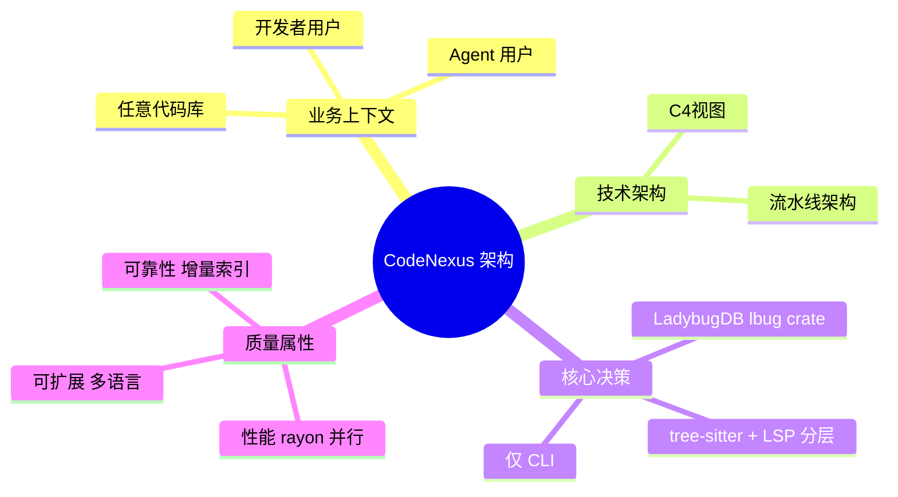

---

## 2. 现状与需求分析（Current State & Requirements）

### 2.1 现状痛点

| 维度 | 现状 | 痛点 | 量化数据 |
| :--- | :--- | :--- | :--- |
| **索引对象** | GitNexus 仅支持 Git 仓库 | 非 Git 代码库无法索引 | — |
| **跨语言** | 现有工具不支持 FFI 追踪 | C↔Rust、C↔Fortran 调用关系丢失 | — |
| **变量追踪** | 现有工具仅追踪函数调用 | 变量数据流（参数传递、赋值）缺失 | — |
| **Agent 集成** | 现有工具提供 MCP 服务器 | Agent 需 MCP 客户端，集成复杂 | — |

### 2.2 需求矩阵（功能性 + 非功能性）

> **引用说明**：详细的技术需求、性能指标见 **TRD.md §1-4**。本文档仅引用关键架构需求。

| 需求类型 | 需求描述 | 优先级 | 架构影响 | 来源文档 |
| :--- | :--- | :---: | :--- | :--- |
| **功能性** | 支持任意代码库索引 | P0 | 流水线架构，文件发现 + 解析 + 存储 | 引用 PRD §4.1 |
| **功能性** | 多语言解析（C/Rust/Fortran 等） | P0 | Extractor trait 抽象，每语言一个提取器 | 引用 PRD §4.1 |
| **功能性** | 变量数据流追踪 | P0 | DataFlows 边类型，BFS 遍历 | 引用 PRD §4.2 |
| **功能性** | 跨语言 FFI 调用解析 | P0 | cross_lang 模块，名称+签名匹配 | 引用 PRD §4.2 |
| **非功能性** | 索引 ≥ 100 文件/秒 | P0 | rayon 并行，线程局部 parser | 引用 TRD §3.1 |
| **非功能性** | 增量索引 | P0 | SHA-256 哈希，选择性重解析 | 引用 TRD §3.3 |
| **非功能性** | 覆盖率 ≥ 90% | P0 | 模块化设计，可测试性 | 引用 TRD §7.2 |

---

## 3. C4 架构视图（C4 Model Views）

### 3.1 Level 1：系统上下文图（System Context）

> **受众：** 全员（产品、运营、管理层、技术）
>
> **抽象层级：** 30,000 英尺，描述系统与外部世界的交互边界。

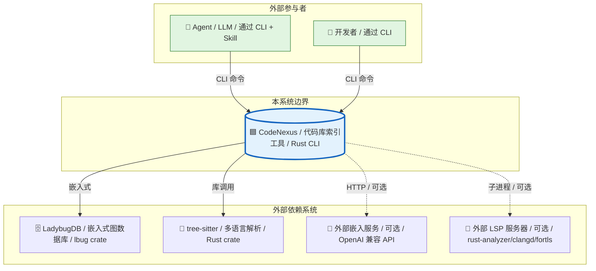

### 3.2 Level 2：容器图（Container Diagram）

> **受众：** 技术负责人、开发、测试、运维
>
> **抽象层级：** 10,000 英尺，描述系统内部的可部署单元。

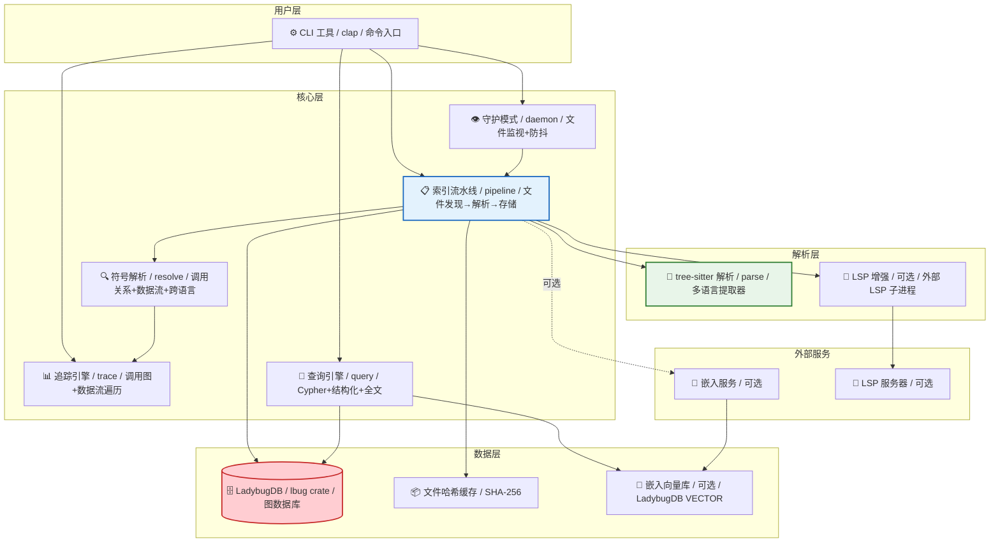

### 3.3 Level 3：组件图（Component Diagram）

> **受众：** 开发团队、架构师
>
> **抽象层级：** 1,000 英尺，描述单个容器内部的组件结构与交互。

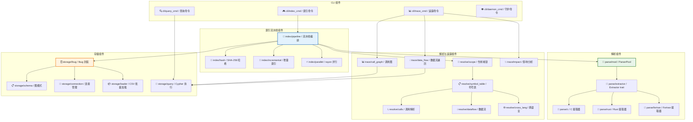

### 3.4 Level 4：代码/类图（Code Diagram）

> **受众：** 核心开发
>
> **说明：** 仅对核心数据模型绘制。

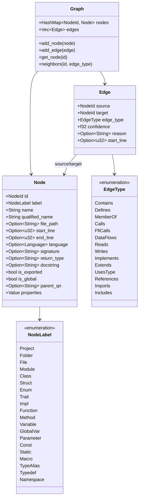

---

## 4. 动态行为视图（Dynamic Views）

### 4.1 核心流程序列图

#### 场景：代码库索引全流程

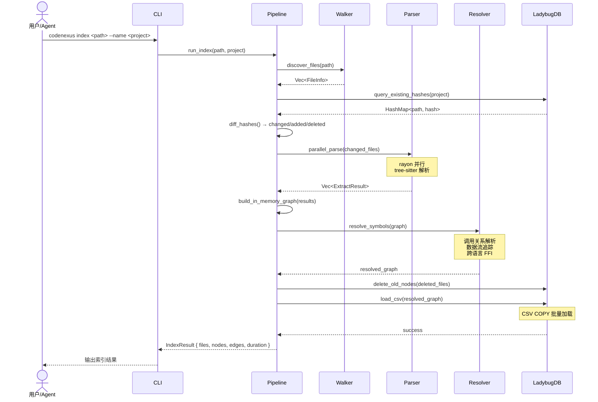

### 4.2 状态机图

#### 索引状态机

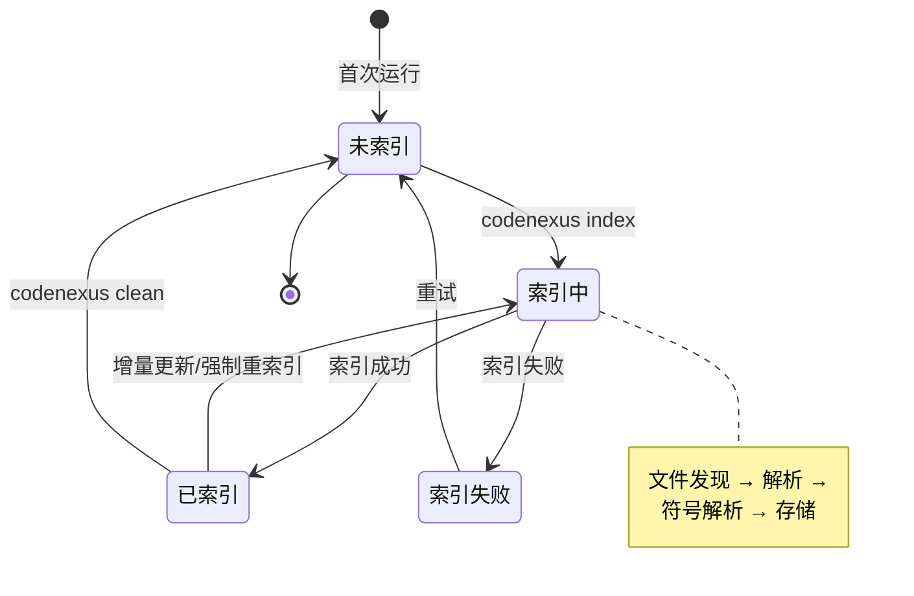

#### 守护模式状态机

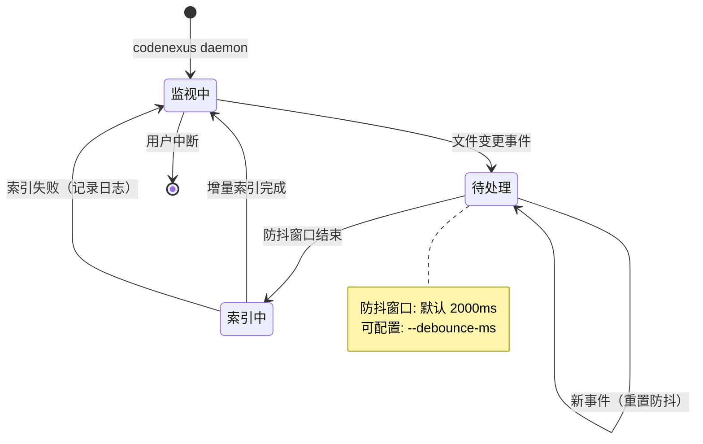

### 4.3 异常/补偿流程

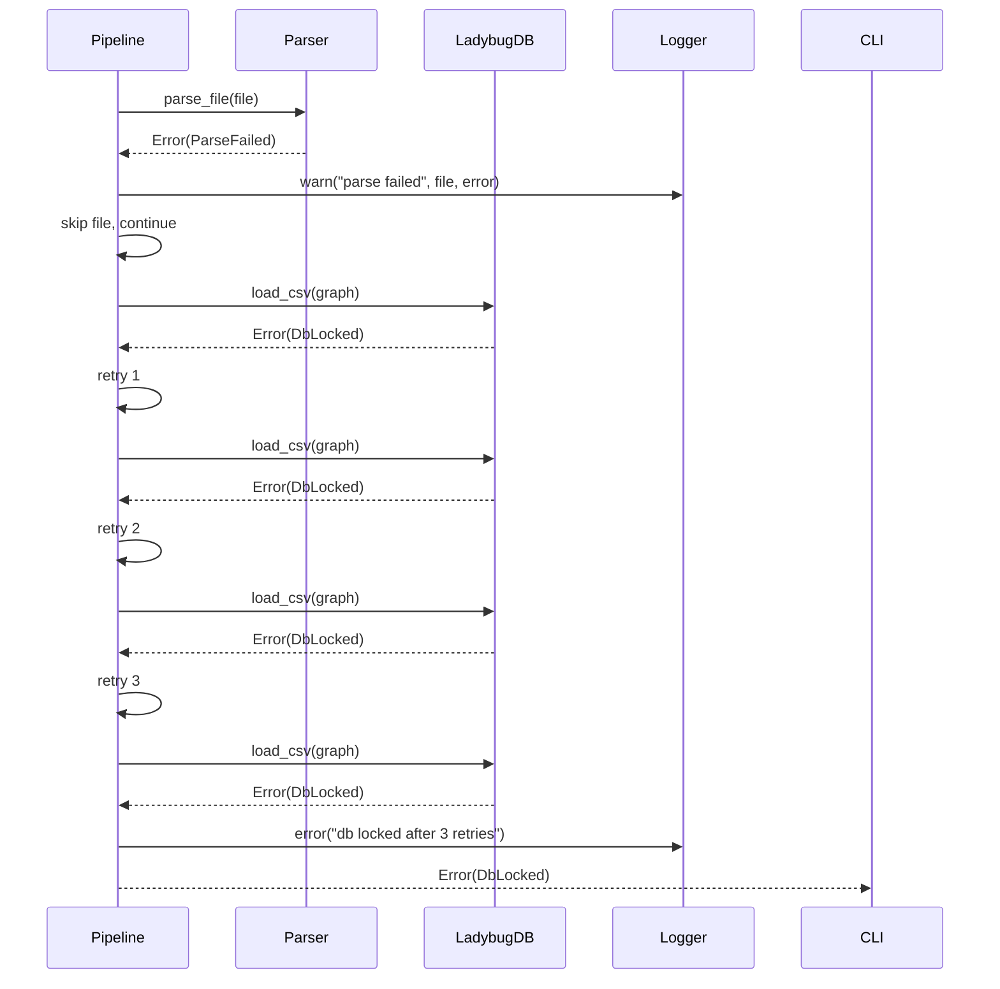

---

## 5. 部署架构（Deployment Architecture）

### 5.1 部署拓扑图

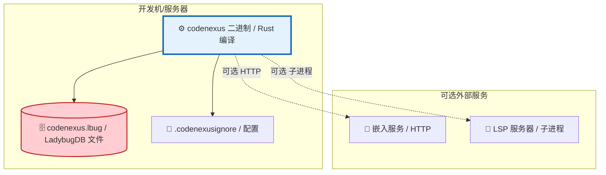

### 5.2 部署策略

| 策略 | 实现方式 | 适用场景 |
| :--- | :--- | :--- |
| **本地部署** | cargo build --release 产出单一二进制 | 开发者本地使用 |
| **CI/CD 集成** | 二进制加入 CI 镜像 | 代码审查自动化 |
| **Agent 集成** | 二进制 + Skill 文件 | Agent 调用 |

---

## 6. 数据架构（Data Architecture）

### 6.1 数据流图

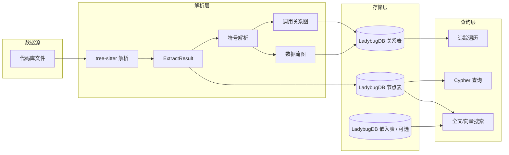

### 6.2 数据模型

> 详细图模式定义见 **DDD.md §4-5**。

| 数据类型 | 存储位置 | 分片策略 | 说明 |
| :--- | :--- | :--- | :--- |
| 节点（Node） | LadybugDB NODE TABLE | 按 project 属性隔离 | 20 种节点类型，每类型独立表 |
| 边（Edge） | LadybugDB REL TABLE | 单一 CodeRelation 表 | 14 种边类型，type 属性区分 |
| 文件哈希 | File 节点 hash 属性 | — | SHA-256，增量索引依据 |
| 嵌入向量 | LadybugDB Embedding 表 | 可选 | FLOAT[384]，VECTOR 扩展 |

---

## 7. 核心算法与机制设计（Core Mechanisms）

### 7.1 FQN 生成机制


| 属性 | 设计值 | 说明 |
| :--- | :--- | :--- |
| 格式 | `project.dir.subdir.filename.entity_name` | 点分隔 |
| 特殊处理 | Python `__init__.py` 去末尾段 | 模块路径 |
| 特殊处理 | C 头文件 `project.include.header.define_name` | 头文件 |
| 特殊处理 | Fortran 模块 `project.file.module.function` | 模块嵌套 |

### 7.2 增量索引机制

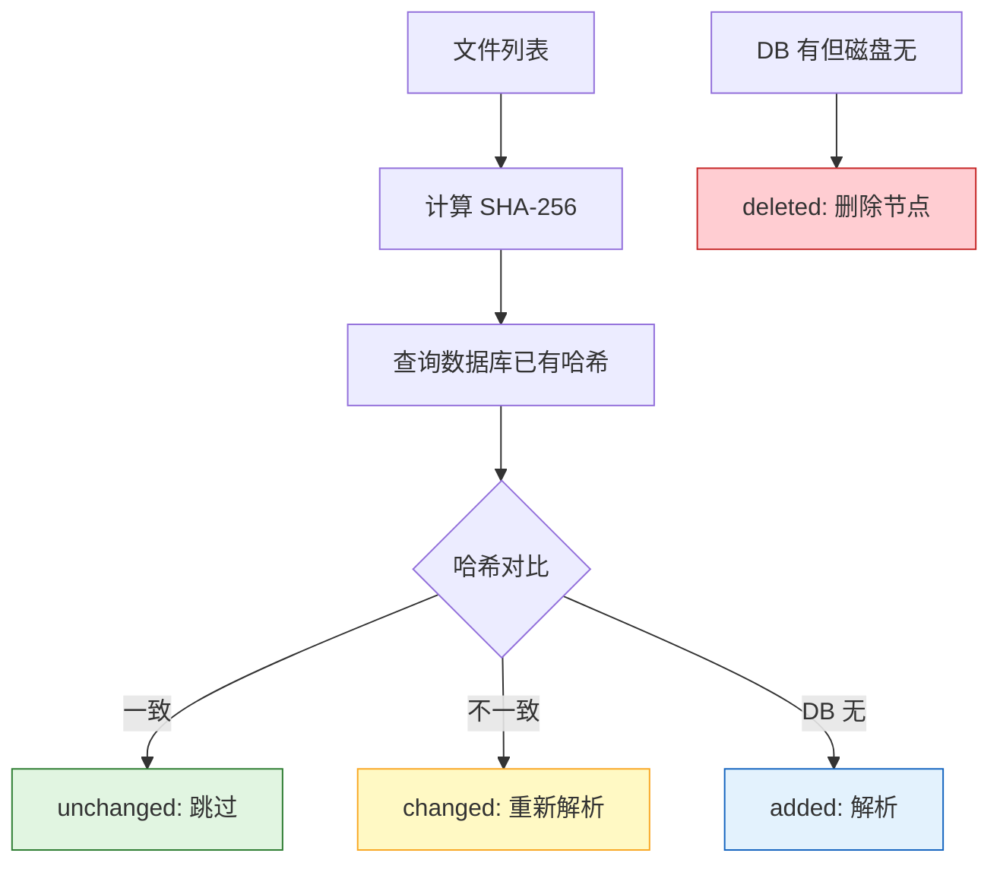

### 7.3 并行解析机制

| 属性 | 设计值 | 说明 |
| :--- | :--- | :--- |
| 并行框架 | rayon | 数据并行标准 |
| 并行粒度 | 文件级 | 每文件独立解析 |
| Parser 复用 | 线程局部 | 避免 `Parser::new()` 开销 |
| 合并策略 | 无锁 | 解析阶段不建立跨文件边 |
| 跨文件边 | 延迟到符号解析阶段 | 避免锁竞争 |

### 7.4 跨语言 FFI 解析机制

```mermaid
flowchart LR
    A[Rust extern "C" 块] --> B[提取函数名]
    B --> C[搜索 C 文件定义]
    C --> D{名称匹配?}
    D -->|是| E[签名匹配 参数数量/类型]
    D -->|否| F[未解析]
    E --> G{签名匹配?}
    G -->|是| H[FfiCalls 边 置信度 0.85]
    G -->|否| I[FfiCalls 边 置信度 0.70]

    style H fill:#e1f5e1,stroke:#2e7d32
    style I fill:#fff9c4,stroke:#f9a825
    style F fill:#ffcdd2,stroke:#c62828
```

---

## 8. 非功能需求设计（NFR / Quality Attributes）

### 8.1 性能设计

| 指标 | 目标值 | 达成手段 |
| :--- | :--- | :--- |
| **索引速度** | ≥ 100 文件/秒 | rayon 并行 + 线程局部 parser + CSV 批量加载 |
| **查询 P99** | ≤ 200ms | LadybugDB 索引 + Cypher 优化 |
| **追踪 P99** | ≤ 500ms | BFS 遍历 + 深度限制 |
| **增量索引** | 仅解析变更文件 | SHA-256 哈希 diff |

**性能容量规划**

| 时间节点 | 代码库规模 | 索引耗时 |
| :--- | :--- | :--- |
| 当前 | 1000 文件 | ≤ 10s |
| 3 个月后 | 10000 文件 | ≤ 100s |
| 6 个月后 | 100000 文件 | ≤ 1000s |

### 8.2 高可用设计

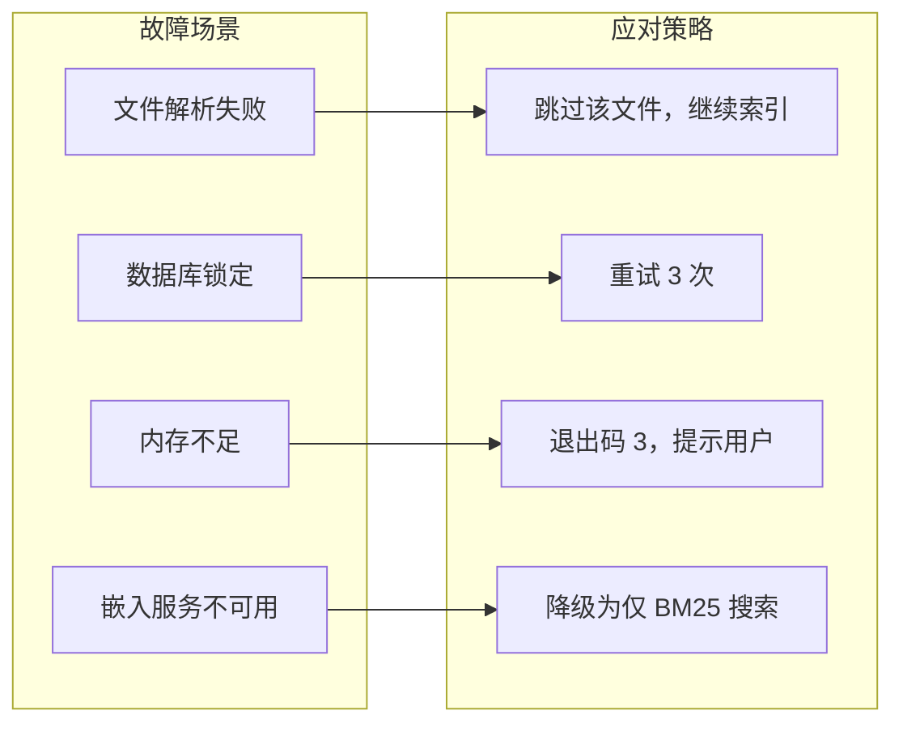

### 8.3 安全设计

| 层级 | 措施 | 实现 |
| :--- | :--- | :--- |
| **数据层** | 多项目隔离 | 节点 project 属性过滤 |
| **路径层** | 路径遍历防护 | 路径规范化 + 边界检查 |
| **网络层** | 嵌入服务 HTTPS | reqwest 默认 HTTPS |
| **执行层** | 无代码执行 | 仅静态解析 |

---

## 9. 架构决策记录（ADR）

> 所有影响两个以上模块、或不可逆转的决策必须记录 ADR。

| 决策ID | 决策内容 | 状态 | 上下文 | 决策 | 后果 | 日期 |
| :--- | :--- | :---: | :--- | :--- | :--- | :--- |
| **ADR-001** | 单 crate 多 mod | ✅ 已采纳 | 用户明确要求 | 单 crate 多 mod | 简化依赖管理，但 crate 较大 | 2026-06-23 |
| **ADR-002** | LadybugDB via 官方 lbug crate | ✅ 已采纳 | 需图数据库，LadybugDB 有官方 Rust crate | 使用 lbug crate v0.17 | 无需手动 FFI，但首次编译耗时 | 2026-06-23 |
| **ADR-003** | tree-sitter 默认 + LSP 可选 | ✅ 已采纳 | 需多语言解析，LSP 准确但复杂 | 分层：tree-sitter 默认，LSP 可选 feature | 默认零外部依赖，LSP 需用户安装 | 2026-06-23 |
| **ADR-004** | 嵌入为可选 feature | ✅ 已采纳 | 嵌入非核心功能 | `[feature=embed]` | 降低默认复杂度 | 2026-06-23 |
| **ADR-005** | 仅 CLI，不提供 MCP | ⛔ 已废弃 | 用户选择 | 仅 CLI + Skill | Agent 通过 CLI 交互 | 2026-06-23 |
| **ADR-006** | notify 文件监视 + 防抖 | ✅ 已采纳 | 索引非 Git 代码库 | notify + 防抖 | 需文件系统监视，非 git 轮询 | 2026-06-23 |
| **ADR-007** | 混合图模式 | ✅ 已采纳 | 便于 LLM 写 Cypher | 每类型 NODE TABLE + 单一 REL TABLE | 表数量多，但查询直观 | 2026-06-23 |
| **ADR-008** | 嵌套双重表示 | ✅ 已采纳 | 需快速查找父节点 | CONTAINS 边 + parent_qn 字段 | 冗余存储，但查询高效 | 2026-06-23 |
| **ADR-009** | SHA-256 文件哈希 | ✅ 已采纳 | 需增量索引 | SHA-256 | 可靠但稍慢于 xxHash | 2026-06-23 |
| **ADR-010** | rayon 并行解析 | ✅ 已采纳 | 需文件级并行 | rayon + 线程局部 parser | 无锁合并，但 parser 需线程局部 | 2026-06-23 |
| **ADR-011** | 符号解析：自研通用编排器 + 薄语言适配器 | ✅ 已采纳 | 需 C/Rust/Fortran 名称解析；stack-graphs 已归档停维且无 C/Rust/Fortran 定义 | GitNexus 风格：通用 passes + 每语言薄 ScopeResolver | 自研工作量 ~8,800 行，但完全可控 | 2026-06-24 |
| **ADR-012** | 用 ignore crate 替代自研 gitignore | ✅ 已采纳 | 文件发现需完整 gitignore 语义 | ripgrep 同源 ignore crate | 消除自研匹配引擎的 bug 风险 | 2026-06-24 |
| **ADR-013** | 用 notify-debouncer-full 替代自写防抖 | ✅ 已采纳 | 守护模式需事件防抖 | notify-rs 官方防抖器 | 消除自写 Debouncer 的竞态风险 | 2026-06-24 |
| **ADR-014** | 用 csv crate 替代自写 CSV 生成 | ✅ 已采纳 | LadybugDB COPY 需 RFC 4180 合规 CSV | csv crate（Rust 标准） | 免边界 case（转义/控制字符/UTF-8） | 2026-06-24 |
| **ADR-015** | trait-kit 统一能力注册表（T6） | ✅ 已采纳 | 需统一 Kit 容器，消除硬编码依赖 | `Kit` + `build_kit` + 类型键 `*Key` 注册 | 所有 *_cmd::run 接收 `&Kit`，可测试性大幅提升 | 2026-06-27 |
| **ADR-016** | 管线 DAG + 类型化阶段（H2） | ✅ 已采纳 | 索引流程需可扩展、可测试 | `Phase` trait + `DagPipeline` 拓扑排序 | 6 阶段（Scan/Parse/Scope/Resolve/Confidence/Load）解耦，单测隔离 | 2026-06-27 |
| **ADR-017** | ScopeResolver 作用域解析（H1/H3） | ✅ 已采纳 | 需 FQN 生成 + 跨文件符号绑定 | 每语言薄 ScopeResolver + 通用 passes | module/subroutine/function/program 等 4 类作用域节点统一处理 | 2026-06-27 |
| **ADR-018** | 置信度分层 ConfidenceTier（H4） | ✅ 已采纳 | 边置信度需分层表达来源 | `ConfidenceTier` 枚举（SameFile/ImportScoped/Global）+ `confidence` f32 | impact/trace 可按 `--min-confidence` 过滤 | 2026-06-27 |
| **ADR-019** | MRO 方法解析顺序（H5） | ✅ 已采纳 | OOP 多继承/菱形继承需确定性 MRO | C3 线性化算法 | MethodOverrides/MethodImplements 边构建在类型系统解析阶段 | 2026-06-27 |
| **ADR-020** | 团队制品 export/import（H7） | ✅ 已采纳 | 需共享索引制品 | zstd 压缩 `.graph.zst` + manifest + magic 校验 | `codenexus export`/`import`，`--reindex` 增量补齐 | 2026-06-27 |
| **ADR-021** | Cypher 子集校验（H6） | ✅ 已采纳 | LadybugDB Cypher 支持有限，需防注入 + 友好报错 | `validate_cypher_subset` 白名单校验 | 拒绝写操作/危险关键字，LLM 可安全生成查询 | 2026-06-27 |
| **ADR-022** | 多智能体 MCP 集成（H13，废弃 ADR-005） | ✅ 已采纳 | Agent 需原生 MCP 协议支持，CLI 交互不够 | `codenexus setup` 自动检测 + `hook` JSON + `mcp` stdio 服务 | JSON-RPC 2.0 协议 2024-11-05，支持 Claude Code/Cursor/Codex | 2026-06-28 |
| **ADR-023** | 排序歧义消解（H14） | ✅ 已采纳 | 多匹配符号查询需排序消解 | `disambiguation::resolve()` 门控 + `--uid`/`--file`/`--kind` 收窄 | Single→直接用 UID；Ambiguous→fail_loud exit 1 | 2026-06-28 |
| **ADR-024** | RAM 优先索引 + LZ4（H15） | ✅ 已采纳 | 中小仓库索引内存峰值需可控 | `lz4_flex` 纯 Rust 压缩 + `index_ram_first` + `--ram-first` | 默认流式保留，RAM 优先为可选路径 | 2026-06-28 |

### ADR 详细示例：ADR-011 符号解析方案

```markdown
## ADR-011：符号解析方案

### 状态

已采纳 ✅

### 上下文

CodeNexus 需对 C/Rust/Fortran 做名称解析（定义-引用绑定、调用关系、数据流）。需选择符号解析架构。

### 候选方案

1. **tree-sitter-stack-graphs**：GitHub 官方的 stack-graphs 库 + TSG DSL 定义名称解析规则。
2. **自研通用编排器 + 薄语言适配器**（GitNexus 风格）：通用 passes（receiver-bound-calls、free-call-fallback）跨语言复用，每语言实现薄 ScopeResolver。
3. **自研重量级每语言解析器**（codebase-memory-mcp 风格）：每语言独立实现完整类型推断（~3,000-5,300 行/语言）。

### 决策

选择方案 2：自研通用编排器 + 薄语言适配器。

### 理由

- **方案 1 被排除**：stack-graphs 仓库已于 2025-09-09 归档停止维护；且仅提供 Python/TypeScript 的语言定义，C/Rust/Fortran 需从零编写 TSG 规则，无参考实现。
- **方案 3 过重**：codebase-memory-mcp 每语言 3,000-5,300 行，总代码量 54K 行，不适合 MVP。
- **方案 2 平衡**：GitNexus 每语言 ScopeResolver 仅 55-421 行（C 仅 129 行、Rust 170 行），通用 passes 可复用，总工作量 ~8,800 行（MVP）。
- **两个参考实现都选择自研**，证明该领域无成熟通用库，自研是工程共识。
- **FFI 解析是核心差异化功能**：stack-graphs 是单语言名称解析框架，无法表达 C↔Rust FFI 调用匹配。

### 后果

- 自研工作量 ~8,800 行，但完全可控
- MVP 阶段不实现 CFG/PDG（数据流用轻量变量追踪替代）
- 每语言适配器可独立开发和测试
```

### ADR 详细示例：ADR-002 LadybugDB 访问方式

```markdown
## ADR-002：LadybugDB 访问方式

### 状态

已采纳 ✅

### 上下文

CodeNexus 需要图数据库存储代码知识图谱。LadybugDB（原 Kùzu）是嵌入式图数据库，支持 Cypher 查询、FTS+VECTOR 扩展。需选择 Rust 访问方式。

### 候选方案

1. **手动 FFI 绑定**：直接绑定 LadybugDB C/C++ API。控制力强，但维护成本高。
2. **官方 lbug crate**：LadybugDB 官方提供 Rust crate（v0.17.1）。开箱即用，但首次编译耗时。
3. **Node.js 子进程**：通过 @ladybugdb/core 子进程调用。无需 FFI，但性能差、依赖 Node.js。

### 决策

选择方案2：官方 lbug crate。

### 理由

- 官方维护，API 稳定
- 无需手动 FFI，降低维护成本
- 性能优于子进程方案
- 已通过 crates.io + docs.rs 验证可用

### 后果

- 首次编译耗时（C++ 从源码编译），但后续缓存
- 可设置 LBUG_SHARED=1 + 预编译库加速
- Windows 非 ASCII 路径需特殊处理（参考 GitNexus 方案）
```

---

## 10. 风险评估与缓解（Risk Assessment）

> **引用说明**：项目级风险见 **TRD.md §8**。本文档仅列出架构层面风险。

| 风险ID | 风险描述 | 可能性 | 影响度 | 风险等级 | 缓解措施 | 责任人 |
| :--- | :--- | :----: | :----: | :------: | :--- | :--- |
| **R-001** | ~~tree-sitter-fortran crate 不可用~~ → **已解决**：v0.5.1 已验证可用（MIT，51K 下载） | 低 | 中 | 🟢 低 | 无需替代方案 | 后端 |
| **R-002** | 跨语言 FFI 解析准确率低 | 中 | 中 | 🟡 中 | 名称+签名双匹配，置信度标注，LSP 增强 | 后端 |
| **R-003** | LadybugDB VECTOR 扩展 Windows 不支持 | 低 | 低 | 🟢 低 | 嵌入搜索 Windows 降级为仅 BM25 | 后端 |
| **R-004** | lbug crate 首次编译耗时 | 高 | 低 | 🟢 低 | 首次编译后缓存；支持预编译库 | 后端 |
| **R-005** | Windows 非 ASCII 路径问题 | 中 | 中 | 🟡 中 | 8.3 短名 / NTFS junction 兜底 | 后端 |

| 象限 | 区域特征 | 策略建议 |
| :--- | :--- | :--- |
| 象限1（高可能性·高影响度） | 重点关注 | 制定应急预案 |
| 象限2（低可能性·高影响度） | 密切监控 | 设定预警阈值 |
| 象限3（低可能性·低影响度） | 一般关注 | 常规管理 |
| 象限4（高可能性·低影响度） | 定期回顾 | 建立流程化 |

| 名称 | X值 | Y值 | 象限 |
| :--- | :-: | :-: | :--- |
| R-001 fortran crate | 0.1 | 0.3 | 象限3（已解决） |
| R-002 FFI 准确率 | 0.5 | 0.5 | 中线 |
| R-003 VECTOR Windows | 0.2 | 0.3 | 象限3 |
| R-004 编译耗时 | 0.8 | 0.2 | 象限4 |
| R-005 非 ASCII 路径 | 0.5 | 0.5 | 中线 |

---

## 11. 实施路线图（Implementation Roadmap）

| 阶段 | 任务 | 开始日期 | 工期 | 状态 |
| :--- | :--- | :--- | :--: | :--: |
| Phase 1 | 基础框架（数据模型 + LadybugDB 集成） | 2026-06-23 | — | ⚪ |
| Phase 2 | 文件发现 + tree-sitter 解析 | Phase 1 完成后 | — | ⚪ |
| Phase 3 | 符号解析 + 变量追踪 + 跨语言 | Phase 2 完成后 | — | ⚪ |
| Phase 4 | 索引流水线 + 存储 | Phase 3 完成后 | — | ⚪ |
| Phase 5 | 查询追踪 + CLI | Phase 4 完成后 | — | ⚪ |
| Phase 6 | 守护模式 + 可选嵌入 | Phase 5 完成后 | — | ⚪ |
| Phase 7 | 测试套件 + 90% 覆盖率 | Phase 6 完成后 | — | ⚪ |
| Phase 8 | 文档（PRD + TRD + ADD + DDD） | Phase 7 完成后 | — | 🟡 |
| Phase 9 | Skill 创建 | Phase 8 完成后 | — | ⚪ |

| 阶段 | 里程碑 | 交付物 | 通过标准 |
| :--- | :--- | :--- | :--- |
| **Phase 1** | 基础框架就绪 | 数据模型 + LadybugDB 连接 | 能创建数据库、执行 Cypher |
| **Phase 2** | 解析就绪 | C/Rust/Fortran 提取器 | 能提取函数/类/变量 |
| **Phase 3** | 追踪就绪 | 调用关系 + 数据流 + FFI | 能追踪跨函数调用链 |
| **Phase 4** | 索引就绪 | 完整流水线 | 能索引真实代码库 |
| **Phase 5** | CLI 就绪 | 完整 CLI | 能索引/查询/追踪 |
| **Phase 6** | 守护就绪 | 守护模式 + 嵌入 | 文件变更自动更新 |
| **Phase 7** | 测试就绪 | 测试套件 | 覆盖率 ≥ 90% |
| **Phase 8** | 文档就绪 | 四份文档 | 符合模板格式 |
| **Phase 9** | Skill 就绪 | Skill 文件 | Agent 可使用 |

---

## 12. 附录（Appendix）

### 12.1 术语表

| 术语 | 定义 |
| :--- | :--- |
| **C4 Model** | Context/Container/Component/Code 四层架构描述模型 |
| **ADR** | Architecture Decision Record，架构决策记录 |
| **FQN** | Fully Qualified Name，完全限定名 |
| **FFI** | Foreign Function Interface，跨语言函数调用接口 |
| **LadybugDB** | 嵌入式图数据库（原 Kùzu），支持 Cypher |
| **tree-sitter** | 增量解析库，支持多语言语法解析 |
| **RRF** | Reciprocal Rank Fusion，倒数排名融合 |
| **P99** | 99% 分位延迟 |

### 12.2 关联文档

| 文档 | 编号 | 链接 |
| :--- | :--- | :--- |
| 产品需求文档（PRD） | — | [PRD.md](PRD.md) |
| 技术需求文档（TRD） | — | [TRD.md](TRD.md) |
| 数据库设计文档（DDD） | — | [DDD.md](DDD.md) |
| 实现计划 | — | [.trae/documents/codenexus-implementation-plan.md](../.trae/documents/codenexus-implementation-plan.md) |

---

## 13. 评审签核（Review & Sign-off）

| 角色 | 姓名 | 签字 | 日期 | 评审意见 |
| :--- | :--- | :--: | :--: | :--- |
| 技术负责人 | | | | |
| 架构师 | | | | |
| 开发代表 | | | | |
| 测试代表 | | | | |

---

**文档结束**
