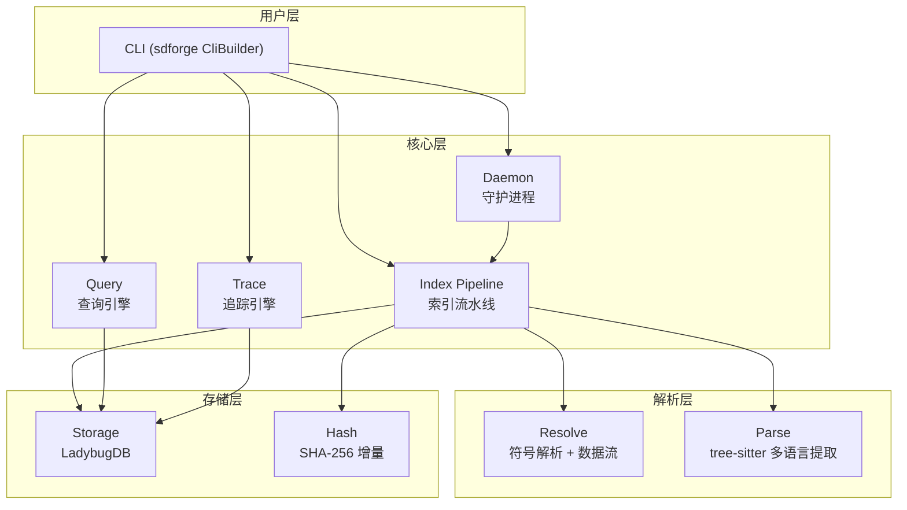

# 🏗️ CodeNexus 架构文档

CodeNexus 将源代码仓库索引为可查询的知识图谱：tree-sitter 多语言解析、LadybugDB 图存储。本文档基于 `src/` 实际结构介绍三层源码结构、索引管线与图模型，并说明 `architecture`、`diagram`、`arch_diff` 三个命令的输出语义（引入于 absorb-archify 变更，0.4.0 破坏性窗口）。

## 📋 目录

- [概述](#-概述)
- [三层源码结构](#️-三层源码结构)
- [索引管线](#-索引管线)
- [图模型](#️-图模型)
- [架构分析与架构图命令](#-架构分析与架构图命令)
  - [architecture](#architecture)
  - [diagram](#diagram)
  - [arch_diff](#arch_diff)
- [相关文档](#-相关文档)

---

## 🎯 概述

CodeNexus 采用「库 + 二进制」双目标 crate：`src/lib.rs` 暴露公共 API，`src/main.rs` 是 sdforge 驱动的 CLI 二进制，`src/service/` 用 `#[forge]` 宏统一封装 CLI 与 MCP 两套接口。索引方向为「文件发现 → 增量哈希 → 并行解析 → 符号解析 → 批量入库」，查询方向提供 Cypher 子集、结构化/BM25 全文搜索、调用链/数据流追踪与影响分析。模块划分与公开 API 的逐模块说明见 [📘 API 参考](API_REFERENCE.md)。

---

## 🏛️ 三层源码结构

v0.3.2 起，CLI 和 MCP 接口通过 sdforge 的 `#[forge]` 宏统一封装在 `src/service/` 模块中，每个命令定义 core 函数 + CLI wrapper + MCP wrapper，替代了此前的 `src/cli/*_cmd.rs` 和 `src/mcp/` 模块。

| 层         | 入口           | 说明                                                                       |
| ---------- | -------------- | -------------------------------------------------------------------------- |
| Rust SDK   | `src/lib.rs`   | 库 crate，暴露公共 API（模型/解析/存储/索引/查询/追踪/service 模块）       |
| CLI 二进制 | `src/main.rs`  | 使用 sdforge `CliBuilder` + `inventory` 分发到 `service::*` 处理器         |
| MCP 服务器 | `src/service/` | sdforge `#[forge]` 宏统一暴露 CLI 和 MCP 接口，由 `cli`/`mcp` feature 门控 |

---

## 🔄 索引管线

索引流程五步：

1. **文件发现** — `ignore` crate 遵守 `.gitignore` 规则
2. **增量哈希** — SHA-256 比对，跳过未变更文件
3. **并行解析** — Rayon 并行 + tree-sitter 提取节点/边
4. **符号解析** — FQN 生成、调用解析、数据流分析、跨语言 FFI
5. **批量入库** — CSV 生成 + `COPY FROM` 批量加载

大仓库的内存治理（`MemoryBudget` 三级压力、流式 CSV、管线流式化、buffer_pool 封顶等 L1–L7 防线）见 [⚡ 性能指南](PERFORMANCE.md)。

---

## 🕸️ 图模型

- **44 种节点类型**：Project, Folder, File, Module, Class, Struct, Enum, Trait, Impl, Function, Method, Variable, GlobalVar, Parameter, Const, Static, Macro, TypeAlias, Typedef, Namespace, Interface, Constructor, Property, Record, Delegate, Annotation, Template, Union, Variant, Field, Event, Handler, Middleware, Service, Endpoint, Route, Process, Database, Config, Test, Section, Community, Tool, Embedding
- **30 种边类型**：Contains, Defines, MemberOf, Calls, FfiCalls, DataFlows, Reads, Writes, Implements, Extends, UsesType, References, Imports, Includes, HasMethod, HasProperty, Accesses, MethodOverrides, MethodImplements, StepInProcess, HandlesRoute, Fetches, HandlesTool, EntryPointOf, Usage, Tests, HttpCalls, AsyncCalls, Emits, ListensOn
- 每条边携带置信度分数 (0.0-1.0) 和置信度分层（`SameFile` / `ImportScoped` / `Global`）

默认 `full` 预设编译 **21 种语言**（C、Rust、Fortran、Python、TypeScript、Go、Java、C++、JavaScript、Ruby、Haskell、OCaml、Scala、PHP、C#、Bash、HTML、CSS、JSON、Regex、Verilog）。下表列出其中 8 种核心语言及其主要提取的节点/边类型；`full` 在此基础上额外启用其余 13 种语言。图存储 Schema 的字段级设计见 [🗄️ 数据库设计文档（DDD）](DDD.md)。

| 语言       | 节点类型                                                                     | 边类型                                  |
| ---------- | ---------------------------------------------------------------------------- | --------------------------------------- |
| C          | Function, GlobalVar, Struct, Enum, Typedef, Macro                            | Calls, Imports, Reads, Writes, Includes |
| Rust       | Function, Struct, Enum, Trait, Impl, Const, Static, Macro, Module, TypeAlias | Calls, Imports, Reads, Writes           |
| Fortran    | Module, Function                                                             | Calls, Imports, FfiCalls                |
| Python     | Function, Method, Class                                                      | Calls, Imports, Extends                 |
| TypeScript | Function, Class, Method, Interface, Enum, TypeAlias, Const                   | Calls, Imports                          |
| Go         | Function, Method, Struct, Interface, TypeAlias                               | Defines, Calls, Imports                 |
| Java       | Class, Interface, Enum, Method                                               | Defines, Calls, Imports                 |
| C++        | Function, Method, Class, Struct, Namespace, Enum, Template                   | Defines, Calls, Imports                 |

---

## 📐 架构分析与架构图命令

以下说明 `architecture`、`diagram`、`arch_diff` 三个命令的输出语义（引入于 absorb-archify 变更，0.4.0 破坏性窗口）。

### architecture

`codenexus architecture --project 
` 输出 `ArchitectureOverview` JSON，
包含模块边界、依赖方向、分层与跨服务依赖。

#### cross_service_deps 的取值语义（行为修正）

`CrossServiceDep` 的 `from_module` / `to_module` 字段文档契约为**模块名**
（文件目录路径，如 `/src/api`）。在 0.4.0 之前的实现中，这两个字段被错误
地填入了**节点 id**（caller 函数 id 与 route 节点 id）。

自本版本起修正为模块名：

- `from_module` = 发起 fetch/gRPC 等调用的函数所在文件的目录；
- `to_module` = 被调用 Route 的处理函数（`HANDLES_ROUTE` 边的 source）所在
  文件的目录；
- 调用方与被调用方位于同一模块时不再产出记录（同模块调用不构成跨服务依
  赖）；callee 无法映射到模块（如 Route 无处理函数）时同样跳过。

依赖旧 id 取值的外部脚本需要按目录路径重新对齐。

### diagram

`codenexus diagram --project 
 --output <path>` 将架构 IR 确定性编译为
自包含交互式 HTML（确定性网格布局、正交路由、暗/亮主题、焦点与上游/下游
可达、路由探测、`/` 搜索、深链），并以 BLAKE3 回执报告交付产物哈希与质检
结果。可选参数：

| 参数 | 默认 | 说明 |
| --- | --- | --- |
| `--quality` | `standard` | `showcase` 档位下任何告警升级为错误并拒绝交付 |
| `--repo_root` | 空 | 提供 Git 工作树根目录时验证源码证据并挂 `SRC n` 徽标 |
| `--repo_url` | 空 | 校验 origin URL 一致性 |
| `--title` / `--locale` | 自动 | 标题与界面语言（`en` / `zh-CN`） |

组件类型（interface / service / storage / model）来自真实的分层事实
（Controller / Service / Repository / Model 层级分类），不基于命名猜测。

### arch_diff

`codenexus arch_diff --base_project <a> --head_project <b> --output <path>`
对两个已索引项目的架构 IR 做 canonical 规范化 + 实体级对比，输出
Before / Delta / After 三节 HTML 与机器回执 JSON（`<path>.receipt.json`，
两文件原子成对写入）。每条变更携带：

- `kind`：`added` / `removed` / `changed`；
- `changed_fields`：JSON Pointer（如 `/sublabel`）；
- `classification`：`topology`（实体增删）或 `semantic`（属性变化）。

对比在模块粒度架构事实层进行；符号级行变化请使用 `detect_changes`。

---

## 🔗 相关文档

| 文档 | 内容 |
|------|------|
| [📘 API 参考](API_REFERENCE.md) | 模块与 Facade 的接口细节 |
| [⚡ 性能指南](PERFORMANCE.md) | 索引管线内存治理（L1–L7）与基准数据 |
| [📐 架构设计文档（ADD）](ADD.md) | 架构决策记录 |
| [🗄️ 数据库设计文档（DDD）](DDD.md) | 图存储 Schema 设计 |
