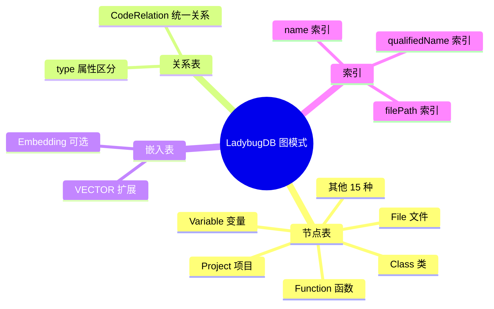
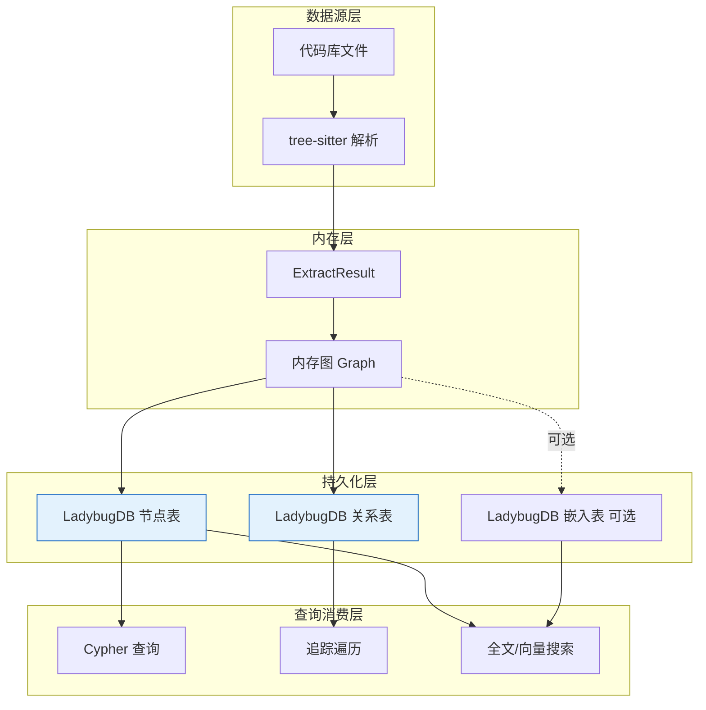
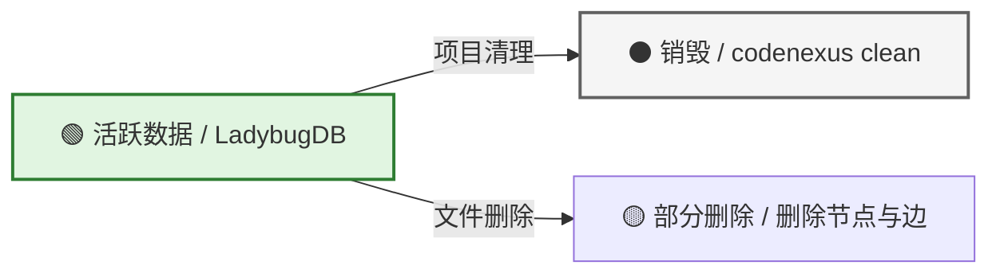
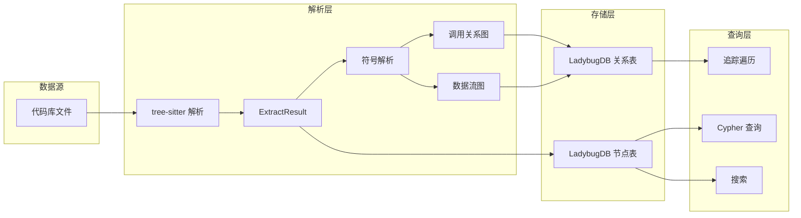
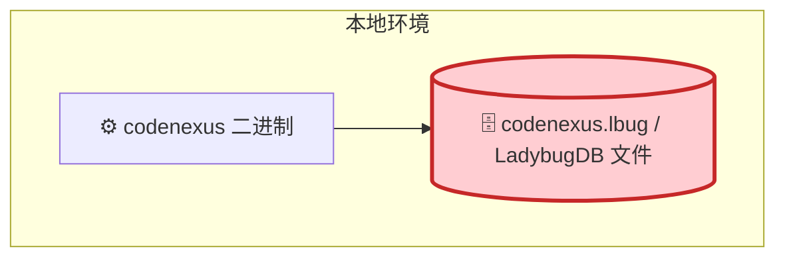

# CodeNexus - 数据库设计文档（DDD）

> **文档状态：** 🟡 评审中
>
> **保密级别：** 内部公开
>
> **版本：** v0.1
>
> **日期：** 2026-06-23
>
> **撰写人：** CodeNexus Team
>
> **评审人：** [待定]
>
> **阅读对象：** 架构师、后端开发、DBA
>
> **服务名称：** CodeNexus
>
> **数据库名：** codenexus.lbug（默认）
>
> **字符集：** UTF-8
>
> **存储引擎：** LadybugDB（嵌入式图数据库，原 Kùzu）
>
> **维护团队：** CodeNexus Team
>
> **关联文档：** PRD.md, TRD.md, ADD.md

---

## 0. 文档导读

### 0.1 文档目的与适用范围

**目的：** 定义 CodeNexus 的 LadybugDB 图数据库模式，包括节点表、关系表、索引、查询示例与数据生命周期。

**适用场景：**
- ✅ 指导 LadybugDB 图模式创建
- ✅ 评审数据库设计合理性
- ✅ 编写 Cypher 查询参考

**不适用场景：**
- ❌ 关系型数据库设计（CodeNexus 使用图数据库）
- ❌ 分布式数据库部署（LadybugDB 为嵌入式单机）

### 0.2 相关文档

| 文档类型 | 文件名 | 相关章节 |
| -------- | -------- | -------- |
| 产品需求 | PRD.md 4 | 功能详述 |
| 技术需求 | TRD.md 2 | 技术选型 |
| 架构设计 | ADD.md 6 | 数据架构 |
| 实现计划 | .trae/documents/codenexus-implementation-plan.md 3.2 | 数据模型 |

### 0.3 变更记录

| 版本 | 日期 | 修订人 | 变更内容 | 审核人 |
| :--- | :--- | :--- | :--- | :--- |
| v0.1 | 2026-06-23 | CodeNexus Team | 初稿：图模式 + 节点/边定义 + 索引 + 查询示例 | — |

---

## 1. 执行摘要（Executive Summary）

> **架构师/DBA/开发 5 分钟导读：** 本数据库设计什么规模、怎么存储、核心约束是什么。

| 要素 | 内容 |
| :--- | :--- |
| **数据规模** | 单项目 10万节点 + 30万边；多项目共存 |
| **核心表数** | 20 张节点表 + 1 张关系表 + 1 张嵌入表（可选） |
| **存储策略** | LadybugDB 嵌入式存储，单文件 `codenexus.lbug` |
| **多项目策略** | 节点带 `project` 属性，查询时过滤 |
| **敏感等级** | 🟢 公开（代码结构元数据） |
| **高可用架构** | 单机嵌入式，无高可用（本地工具） |



---

## 2. 设计规范与标准（Design Standards）

### 2.1 命名规范

> 统一命名是团队协作的基础，禁止拼音、缩写（除通用缩写）。

| 对象 | 命名规则 | 正例 | 反例 |
| :--- | :--- | :--- | :--- |
| **节点表名** | PascalCase，代码元素类型 | `Function` / `Class` / `File` | `function` / `t_function` |
| **关系表名** | PascalCase，单一关系表 | `CodeRelation` | `code_relation` / `edges` |
| **属性名** | camelCase，语义明确 | `qualifiedName` / `filePath` | `qn` / `fp` |
| **主键** | `id`，STRING 类型 | `id` | `pk` / `uuid` |
| **嵌入表名** | PascalCase | `Embedding` | `embeddings` |

### 2.2 数据类型规范

> LadybugDB 使用 Cypher 类型系统，与 PostgreSQL 类型映射如下。

| 业务场景 | LadybugDB 类型 | PostgreSQL 对应 | 说明 |
| :--- | :--- | :--- | :--- |
| 主键 / 外键 | `STRING` | `VARCHAR` | 应用层生成 UUIDv7 字符串 |
| 名称 / 路径 | `STRING` | `VARCHAR` | 代码符号名、文件路径 |
| 行号 | `INT64` | `BIGINT` | 源码行号 |
| 置信度 | `DOUBLE` | `DOUBLE PRECISION` | 0.0-1.0 |
| 布尔值 | `BOOLEAN` | `BOOLEAN` | is_exported / is_global |
| 代码内容 | `STRING` | `TEXT` | 函数/类源码 |
| 嵌入向量 | `FLOAT[N]` | `VECTOR(N)` | LadybugDB VECTOR 扩展 |
| 扩展属性 | `STRING`（JSON） | `JSONB` | 序列化为 JSON 字符串 |

### 2.3 通用字段（Audit Fields）

> 所有节点表包含以下通用字段。

| 字段名 | 类型 | 默认值 | 说明 | 是否索引 |
| :--- | :--- | :--- | :--- | :------: |
| `id` | `STRING` | 应用层生成 UUIDv7 | 物理主键 | PK |
| `project` | `STRING` | — | 所属项目名（多项目隔离） | IDX |
| `name` | `STRING` | — | 短名 | IDX |
| `qualifiedName` | `STRING` | — | 完全限定名（FQN） | IDX |
| `filePath` | `STRING` | — | 相对文件路径 | IDX |

---

## 3. 数据架构与分层（Data Architecture）

### 3.1 数据分层架构



---

## 4. 逻辑模型设计（Logical Model）

### 4.1 领域实体关系图

```mermaid
erDiagram
    Project ||--o{ File : "CONTAINS"
    Project ||--o{ Folder : "CONTAINS"
    Folder ||--o{ File : "CONTAINS"
    Folder ||--o{ Folder : "CONTAINS"
    File ||--o{ Function : "DEFINES"
    File ||--o{ Class : "DEFINES"
    File ||--o{ Variable : "DEFINES"
    Class ||--o{ Method : "CONTAINS"
    Class ||--o{ Variable : "CONTAINS"
    Function ||--o{ Parameter : "CONTAINS"
    Function ||--o{ Variable : "CONTAINS"
    Function ||--o{ Function : "CALLS"
    Function ||--o{ Variable : "DATAFLOWS"
    File ||--o{ File : "IMPORTS"

    Project {
        string id PK "项目ID"
        string name "项目名"
        string rootPath "根路径"
    }

    File {
        string id PK "文件ID"
        string name "文件名"
        string filePath "相对路径"
        string language "语言"
        string hash "SHA-256哈希"
    }

    Function {
        string id PK "函数ID"
        string name "函数名"
        string qualifiedName "FQN"
        string filePath "文件路径"
        int64 startLine "起始行"
        int64 endLine "结束行"
        string signature "签名"
        string returnType "返回类型"
        boolean isExported "是否导出"
        string content "源码"
    }

    Class {
        string id PK "类ID"
        string name "类名"
        string qualifiedName "FQN"
        string filePath "文件路径"
        int64 startLine "起始行"
        int64 endLine "结束行"
        boolean isExported "是否导出"
    }

    Variable {
        string id PK "变量ID"
        string name "变量名"
        string qualifiedName "FQN"
        boolean isGlobal "是否全局"
        string varType "变量类型"
    }
```

### 4.2 实体清单

| 序号 | 实体名 | 表名 | 中文名 | 数据域 | 行数预估 | 敏感等级 |
| :--: | :--- | :--- | :--- | :--- | :--- | :--- |
| 1 | `Project` | `Project` | 项目表 | 元数据 | 1-100 | 🟢 公开 |
| 2 | `Folder` | `Folder` | 目录表 | 结构 | 100-10000 | 🟢 公开 |
| 3 | `File` | `File` | 文件表 | 结构 | 100-100000 | 🟢 公开 |
| 4 | `Module` | `Module` | 模块表 | 结构 | 0-1000 | 🟢 公开 |
| 5 | `Class` | `Class` | 类表 | 定义 | 0-10000 | 🟢 公开 |
| 6 | `Struct` | `Struct` | 结构体表 | 定义 | 0-10000 | 🟢 公开 |
| 7 | `Enum` | `Enum` | 枚举表 | 定义 | 0-5000 | 🟢 公开 |
| 8 | `Trait` | `Trait` | Trait表 | 定义 | 0-5000 | 🟢 公开 |
| 9 | `Impl` | `Impl` | Impl块表 | 定义 | 0-10000 | 🟢 公开 |
| 10 | `Function` | `Function` | 函数表 | 定义 | 100-100000 | 🟢 公开 |
| 11 | `Method` | `Method` | 方法表 | 定义 | 0-50000 | 🟢 公开 |
| 12 | `Variable` | `Variable` | 变量表 | 定义 | 100-100000 | 🟢 公开 |
| 13 | `GlobalVar` | `GlobalVar` | 全局变量表 | 定义 | 0-5000 | 🟢 公开 |
| 14 | `Parameter` | `Parameter` | 参数表 | 定义 | 100-200000 | 🟢 公开 |
| 15 | `Const` | `Const` | 常量表 | 定义 | 0-5000 | 🟢 公开 |
| 16 | `Static` | `Static` | 静态变量表 | 定义 | 0-2000 | 🟢 公开 |
| 17 | `Macro` | `Macro` | 宏表 | 定义 | 0-2000 | 🟢 公开 |
| 18 | `TypeAlias` | `TypeAlias` | 类型别名表 | 定义 | 0-2000 | 🟢 公开 |
| 19 | `Typedef` | `Typedef` | C typedef表 | 定义 | 0-2000 | 🟢 公开 |
| 20 | `Namespace` | `Namespace` | 命名空间表 | 结构 | 0-2000 | 🟢 公开 |
| 21 | `Embedding` | `Embedding` | 嵌入向量表（可选） | 向量 | 0-100000 | 🟢 公开 |

### 4.3 关系定义（Relationship Definition）

> 所有关系存储在单一 `CodeRelation` 表中，通过 `type` 属性区分。

| 源表 | 目标表 | 关系类型 | type 值 | 业务说明 |
| :--- | :--- | :--- | :--- | :--- |
| `Project` | `File` | 包含 | `CONTAINS` | 项目包含文件 |
| `Project` | `Folder` | 包含 | `CONTAINS` | 项目包含目录 |
| `Folder` | `File` | 包含 | `CONTAINS` | 目录包含文件 |
| `Folder` | `Folder` | 包含 | `CONTAINS` | 目录嵌套 |
| `File` | `Function` | 定义 | `DEFINES` | 文件定义函数 |
| `File` | `Class` | 定义 | `DEFINES` | 文件定义类 |
| `File` | `Variable` | 定义 | `DEFINES` | 文件定义变量 |
| `Class` | `Method` | 包含 | `CONTAINS` | 类包含方法 |
| `Class` | `Variable` | 包含 | `CONTAINS` | 类包含字段 |
| `Function` | `Parameter` | 包含 | `CONTAINS` | 函数包含参数 |
| `Function` | `Variable` | 包含 | `CONTAINS` | 函数包含局部变量 |
| `Function` | `Function` | 调用 | `CALLS` | 同语言函数调用 |
| `Function` | `Function` | FFI调用 | `FFI_CALLS` | 跨语言 FFI 调用 |
| `Variable` | `Parameter` | 数据流 | `DATAFLOWS` | 变量传递给参数 |
| `Function` | `Variable` | 数据流 | `DATAFLOWS` | 返回值赋给变量 |
| `Variable` | `Variable` | 数据流 | `DATAFLOWS` | 变量赋值 |
| `Function` | `Variable` | 读取 | `READS` | 函数读取变量 |
| `Function` | `Variable` | 写入 | `WRITES` | 函数赋值变量 |
| `Struct` | `Trait` | 实现 | `IMPLEMENTS` | 结构体实现 trait |
| `Class` | `Class` | 继承 | `EXTENDS` | 类继承类 |
| `Function` | `Struct` | 使用类型 | `USES_TYPE` | 函数引用类型 |
| `Variable` | `Variable` | 引用 | `REFERENCES` | 变量引用变量 |
| `File` | `File` | 导入 | `IMPORTS` | 文件导入文件 |
| `File` | `File` | 包含 | `INCLUDES` | C #include / Fortran use |

```mermaid
erDiagram
    Project ||--o{ File : "1:N CONTAINS"
    File ||--o{ Function : "1:N DEFINES"
    File ||--o{ Class : "1:N DEFINES"
    Class ||--o{ Method : "1:N CONTAINS"
    Function ||--o{ Function : "N:N CALLS"
    Function ||--o{ Variable : "N:N DATAFLOWS"
    File ||--o{ File : "N:N IMPORTS"

    Project {
        string id PK
    }
    File {
        string id PK
        string project FK
    }
    Function {
        string id PK
        string project FK
    }
    Class {
        string id PK
        string project FK
    }
    Method {
        string id PK
        string project FK
    }
    Variable {
        string id PK
        string project FK
    }
```

---

## 5. 物理模型设计（Physical Model）

### 5.1 节点表定义：Project（项目表）

| 属性 | 值 |
| :--- | :--- |
| **表名** | `Project` |
| **中文名** | 项目表 |
| **业务定义** | 记录已索引的代码库项目 |
| **存储引擎** | LadybugDB NODE TABLE |
| **预估行数** | 1-100 |

#### 字段清单

| 序号 | 字段名 | 数据类型 | 可空 | 默认值 | 约束 | 中文名 | 业务说明 | 示例值 |
| :--: | :--- | :--- | :--: | :--- | :--- | :--- | :--- | :--- |
| 1 | `id` | `STRING` | 否 | 应用层生成 UUIDv7 | `PK` | 项目 ID | 全局唯一 | `proj_0190a3b5` |
| 2 | `name` | `STRING` | 否 | — | `UK` | 项目名 | 用户指定 | `myproject` |
| 3 | `rootPath` | `STRING` | 否 | — | — | 根路径 | 代码库绝对路径 | `/home/user/myproject` |
| 4 | `language` | `STRING` | 是 | — | — | 主要语言 | 检测到的主语言 | `rust` |
| 5 | `fileCount` | `INT64` | 否 | `0` | — | 文件数 | 索引的文件数 | `152` |
| 6 | `indexedAt` | `INT64` | 否 | — | — | 索引时间 | Unix 时间戳 | `1719129600` |

#### DDL

```cypher
CREATE NODE TABLE Project (
    id STRING,
    name STRING,
    rootPath STRING,
    language STRING,
    fileCount INT64,
    indexedAt INT64,
    PRIMARY KEY (id)
);
```

### 5.2 节点表定义：File（文件表）

| 属性 | 值 |
| :--- | :--- |
| **表名** | `File` |
| **中文名** | 文件表 |
| **业务定义** | 记录代码库中的文件 |
| **预估行数** | 100-100000 |

#### 字段清单

| 序号 | 字段名 | 数据类型 | 可空 | 约束 | 中文名 | 业务说明 | 示例值 |
| :--: | :--- | :--- | :--: | :--- | :--- | :--- | :--- |
| 1 | `id` | `STRING` | 否 | `PK` | 文件 ID | UUIDv7 | `file_0190a3b5` |
| 2 | `project` | `STRING` | 否 | `IDX` | 所属项目 | 项目名 | `myproject` |
| 3 | `name` | `STRING` | 否 | `IDX` | 文件名 | 短名 | `main.rs` |
| 4 | `filePath` | `STRING` | 否 | `IDX` | 文件路径 | 相对路径 | `src/main.rs` |
| 5 | `language` | `STRING` | 否 | — | 语言 | 枚举 | `rust` |
| 6 | `hash` | `STRING` | 否 | — | 文件哈希 | SHA-256 | `a1b2c3...` |
| 7 | `lineCount` | `INT64` | 是 | — | 行数 | 文件行数 | `152` |

#### DDL

```cypher
CREATE NODE TABLE File (
    id STRING,
    project STRING,
    name STRING,
    filePath STRING,
    language STRING,
    hash STRING,
    lineCount INT64,
    PRIMARY KEY (id)
);
```

### 5.3 节点表定义：Function（函数表）

| 属性 | 值 |
| :--- | :--- |
| **表名** | `Function` |
| **中文名** | 函数表 |
| **业务定义** | 记录代码中定义的函数 |
| **预估行数** | 100-100000 |

#### 字段清单

| 序号 | 字段名 | 数据类型 | 可空 | 约束 | 中文名 | 业务说明 | 示例值 |
| :--: | :--- | :--- | :--: | :--- | :--- | :--- | :--- |
| 1 | `id` | `STRING` | 否 | `PK` | 函数 ID | UUIDv7 | `func_0190a3b5` |
| 2 | `project` | `STRING` | 否 | `IDX` | 所属项目 | 项目名 | `myproject` |
| 3 | `name` | `STRING` | 否 | `IDX` | 函数名 | 短名 | `parse` |
| 4 | `qualifiedName` | `STRING` | 否 | `IDX` | FQN | 完全限定名 | `myproject.src.main.parse` |
| 5 | `filePath` | `STRING` | 否 | `IDX` | 文件路径 | 相对路径 | `src/main.rs` |
| 6 | `startLine` | `INT64` | 否 | — | 起始行 | 源码行号 | `10` |
| 7 | `endLine` | `INT64` | 否 | — | 结束行 | 源码行号 | `50` |
| 8 | `signature` | `STRING` | 是 | — | 签名 | 函数签名 | `fn parse(input: &str) -> Result<Node>` |
| 9 | `returnType` | `STRING` | 是 | — | 返回类型 | 类型名 | `Result<Node>` |
| 10 | `isExported` | `BOOLEAN` | 否 | — | 是否导出 | pub/extern | `true` |
| 11 | `docstring` | `STRING` | 是 | — | 文档注释 | 文档 | `Parse source code...` |
| 12 | `content` | `STRING` | 是 | — | 源码 | 函数体 | `fn parse(...) {...}` |
| 13 | `parentQn` | `STRING` | 是 | — | 父 FQN | 嵌套父节点 | `myproject.src.main.Parser` |

#### DDL

```cypher
CREATE NODE TABLE Function (
    id STRING,
    project STRING,
    name STRING,
    qualifiedName STRING,
    filePath STRING,
    startLine INT64,
    endLine INT64,
    signature STRING,
    returnType STRING,
    isExported BOOLEAN,
    docstring STRING,
    content STRING,
    parentQn STRING,
    PRIMARY KEY (id)
);
```

### 5.4 节点表定义：Class（类表）

#### DDL

```cypher
CREATE NODE TABLE Class (
    id STRING,
    project STRING,
    name STRING,
    qualifiedName STRING,
    filePath STRING,
    startLine INT64,
    endLine INT64,
    isExported BOOLEAN,
    docstring STRING,
    content STRING,
    parentQn STRING,
    PRIMARY KEY (id)
);
```

### 5.5 节点表定义：Variable（变量表）

#### DDL

```cypher
CREATE NODE TABLE Variable (
    id STRING,
    project STRING,
    name STRING,
    qualifiedName STRING,
    filePath STRING,
    startLine INT64,
    isGlobal BOOLEAN,
    varType STRING,
    parentQn STRING,
    PRIMARY KEY (id)
);
```

### 5.6 节点表定义：Parameter（参数表）

#### DDL

```cypher
CREATE NODE TABLE Parameter (
    id STRING,
    project STRING,
    name STRING,
    qualifiedName STRING,
    filePath STRING,
    startLine INT64,
    paramType STRING,
    paramIndex INT32,
    parentQn STRING,
    PRIMARY KEY (id)
);
```

### 5.7 其他节点表定义

> 以下节点表结构相似，仅列出 DDL。

```cypher
CREATE NODE TABLE Folder (
    id STRING, project STRING, name STRING, filePath STRING,
    PRIMARY KEY (id)
);

CREATE NODE TABLE Module (
    id STRING, project STRING, name STRING, qualifiedName STRING,
    filePath STRING, parentQn STRING,
    PRIMARY KEY (id)
);

CREATE NODE TABLE Struct (
    id STRING, project STRING, name STRING, qualifiedName STRING,
    filePath STRING, startLine INT64, endLine INT64, isExported BOOLEAN,
    docstring STRING, content STRING, parentQn STRING,
    PRIMARY KEY (id)
);

CREATE NODE TABLE Enum (
    id STRING, project STRING, name STRING, qualifiedName STRING,
    filePath STRING, startLine INT64, endLine INT64, isExported BOOLEAN,
    docstring STRING, content STRING, parentQn STRING,
    PRIMARY KEY (id)
);

CREATE NODE TABLE Trait (
    id STRING, project STRING, name STRING, qualifiedName STRING,
    filePath STRING, startLine INT64, endLine INT64, isExported BOOLEAN,
    docstring STRING, content STRING, parentQn STRING,
    PRIMARY KEY (id)
);

CREATE NODE TABLE Impl (
    id STRING, project STRING, name STRING, qualifiedName STRING,
    filePath STRING, startLine INT64, endLine INT64,
    implType STRING, parentQn STRING,
    PRIMARY KEY (id)
);

CREATE NODE TABLE Method (
    id STRING, project STRING, name STRING, qualifiedName STRING,
    filePath STRING, startLine INT64, endLine INT64, signature STRING,
    returnType STRING, isExported BOOLEAN, docstring STRING, content STRING,
    parameterCount INT32, parentQn STRING,
    PRIMARY KEY (id)
);

CREATE NODE TABLE GlobalVar (
    id STRING, project STRING, name STRING, qualifiedName STRING,
    filePath STRING, startLine INT64, varType STRING, isExported BOOLEAN,
    PRIMARY KEY (id)
);

CREATE NODE TABLE Const (
    id STRING, project STRING, name STRING, qualifiedName STRING,
    filePath STRING, startLine INT64, constType STRING, constValue STRING,
    isExported BOOLEAN, parentQn STRING,
    PRIMARY KEY (id)
);

CREATE NODE TABLE Static (
    id STRING, project STRING, name STRING, qualifiedName STRING,
    filePath STRING, startLine INT64, varType STRING, isExported BOOLEAN,
    parentQn STRING,
    PRIMARY KEY (id)
);

CREATE NODE TABLE Macro (
    id STRING, project STRING, name STRING, qualifiedName STRING,
    filePath STRING, startLine INT64, endLine INT64, signature STRING,
    content STRING, parentQn STRING,
    PRIMARY KEY (id)
);

CREATE NODE TABLE TypeAlias (
    id STRING, project STRING, name STRING, qualifiedName STRING,
    filePath STRING, startLine INT64, aliasType STRING, isExported BOOLEAN,
    parentQn STRING,
    PRIMARY KEY (id)
);

CREATE NODE TABLE Typedef (
    id STRING, project STRING, name STRING, qualifiedName STRING,
    filePath STRING, startLine INT64, typedefType STRING,
    parentQn STRING,
    PRIMARY KEY (id)
);

CREATE NODE TABLE Namespace (
    id STRING, project STRING, name STRING, qualifiedName STRING,
    filePath STRING, parentQn STRING,
    PRIMARY KEY (id)
);
```

### 5.8 关系表定义：CodeRelation（统一关系表）

| 属性 | 值 |
| :--- | :--- |
| **表名** | `CodeRelation` |
| **中文名** | 代码关系表 |
| **业务定义** | 存储所有代码元素之间的关系，通过 type 属性区分 |
| **预估行数** | 1000-1000000 |

#### 字段清单

| 序号 | 字段名 | 数据类型 | 可空 | 约束 | 中文名 | 业务说明 | 示例值 |
| :--: | :--- | :--- | :--: | :--- | :--- | :--- | :--- |
| 1 | `type` | `STRING` | 否 | `IDX` | 关系类型 | 枚举 | `CALLS` |
| 2 | `confidence` | `DOUBLE` | 否 | — | 置信度 | 0.0-1.0 | `0.95` |
| 3 | `reason` | `STRING` | 是 | — | 原因 | 附加信息 | `arg_index=0` |
| 4 | `startLine` | `INT64` | 是 | — | 起始行 | 源码行号 | `25` |
| 5 | `project` | `STRING` | 否 | `IDX` | 所属项目 | 多项目隔离 | `myproject` |

#### DDL

```cypher
CREATE REL TABLE CodeRelation (
    FROM Node TO Node,
    type STRING,
    confidence DOUBLE,
    reason STRING,
    startLine INT64,
    project STRING
);
```

### 5.9 嵌入表定义：Embedding（嵌入向量表，可选）

| 属性 | 值 |
| :--- | :--- |
| **表名** | `Embedding` |
| **中文名** | 嵌入向量表 |
| **业务定义** | 存储代码块的嵌入向量，用于语义搜索 |
| **预估行数** | 0-100000 |
| **依赖** | LadybugDB VECTOR 扩展 |

#### 字段清单

| 序号 | 字段名 | 数据类型 | 可空 | 约束 | 中文名 | 业务说明 | 示例值 |
| :--: | :--- | :--- | :--: | :--- | :--- | :--- | :--- |
| 1 | `id` | `STRING` | 否 | `PK` | 嵌入 ID | UUIDv7 | `emb_0190a3b5` |
| 2 | `nodeId` | `STRING` | 否 | `IDX` | 节点 ID | 关联的代码节点 | `func_0190a3b5` |
| 3 | `project` | `STRING` | 否 | `IDX` | 所属项目 | 多项目隔离 | `myproject` |
| 4 | `chunkIndex` | `INT32` | 否 | — | 块索引 | 分块序号 | `0` |
| 5 | `startLine` | `INT64` | 否 | — | 起始行 | 源码行号 | `10` |
| 6 | `endLine` | `INT64` | 否 | — | 结束行 | 源码行号 | `50` |
| 7 | `embedding` | `FLOAT[384]` | 否 | — | 嵌入向量 | 384 维 | `[0.1, 0.2, ...]` |
| 8 | `contentHash` | `STRING` | 否 | — | 内容哈希 | 去重 | `a1b2c3...` |

#### DDL

```cypher
CREATE NODE TABLE Embedding (
    id STRING,
    nodeId STRING,
    project STRING,
    chunkIndex INT32,
    startLine INT64,
    endLine INT64,
    embedding FLOAT[384],
    contentHash STRING,
    PRIMARY KEY (id)
);
```

---

## 6. 索引设计（Index Design）

### 6.1 节点表索引

```cypher
-- Project 表索引
CREATE INDEX idx_project_name ON Project(name);

-- File 表索引
CREATE INDEX idx_file_project ON File(project);
CREATE INDEX idx_file_name ON File(name);
CREATE INDEX idx_file_path ON File(filePath);
CREATE INDEX idx_file_hash ON File(hash);

-- Function 表索引
CREATE INDEX idx_func_project ON Function(project);
CREATE INDEX idx_func_name ON Function(name);
CREATE INDEX idx_func_qn ON Function(qualifiedName);
CREATE INDEX idx_func_path ON Function(filePath);

-- Class 表索引
CREATE INDEX idx_class_project ON Class(project);
CREATE INDEX idx_class_name ON Class(name);
CREATE INDEX idx_class_qn ON Class(qualifiedName);

-- Variable 表索引
CREATE INDEX idx_var_project ON Variable(project);
CREATE INDEX idx_var_name ON Variable(name);
CREATE INDEX idx_var_qn ON Variable(qualifiedName);
CREATE INDEX idx_var_global ON Variable(isGlobal);
```

### 6.2 关系表索引

```cypher
-- CodeRelation 表索引
CREATE INDEX idx_rel_type ON CodeRelation(type);
CREATE INDEX idx_rel_project ON CodeRelation(project);
```

### 6.3 嵌入表索引

```cypher
-- Embedding 表索引
CREATE INDEX idx_emb_node ON Embedding(nodeId);
CREATE INDEX idx_emb_project ON Embedding(project);

-- 向量索引（LadybugDB VECTOR 扩展）
CREATE VECTOR INDEX idx_emb_vector ON Embedding(embedding);
```

### 6.4 全文搜索索引（LadybugDB FTS 扩展）

```cypher
-- 函数名全文索引
CREATE FT INDEX fts_func_name ON Function(name);

-- 函数内容全文索引
CREATE FT INDEX fts_func_content ON Function(content);

-- 类名全文索引
CREATE FT INDEX fts_class_name ON Class(name);
```

---

## 7. 枚举值字典（Enumeration Dictionary）

### 7.1 节点类型（NodeLabel）

| 编码 | 名称 | 英文标识 | 业务说明 |
| :--: | :--- | :--- | :--- |
| 1 | 项目 | `Project` | 项目根 |
| 2 | 目录 | `Folder` | 目录 |
| 3 | 文件 | `File` | 文件 |
| 4 | 模块 | `Module` | 模块/命名空间 |
| 5 | 类 | `Class` | 类 |
| 6 | 结构体 | `Struct` | 结构体 |
| 7 | 枚举 | `Enum` | 枚举 |
| 8 | Trait | `Trait` | Trait/接口 |
| 9 | Impl | `Impl` | Impl 块 |
| 10 | 函数 | `Function` | 函数 |
| 11 | 方法 | `Method` | 方法 |
| 12 | 变量 | `Variable` | 局部变量 |
| 13 | 全局变量 | `GlobalVar` | 全局变量 |
| 14 | 参数 | `Parameter` | 函数参数 |
| 15 | 常量 | `Const` | 常量 |
| 16 | 静态变量 | `Static` | 静态变量 |
| 17 | 宏 | `Macro` | 宏 |
| 18 | 类型别名 | `TypeAlias` | 类型别名 |
| 19 | Typedef | `Typedef` | C typedef |
| 20 | 命名空间 | `Namespace` | 命名空间 |

### 7.2 关系类型（EdgeType）

| 编码 | 名称 | 英文标识 | 业务说明 | 置信度 |
| :--: | :--- | :--- | :--- | :---: |
| 1 | 包含 | `CONTAINS` | 结构嵌套关系 | 1.0 |
| 2 | 定义 | `DEFINES` | 文件定义符号 | 1.0 |
| 3 | 成员 | `MEMBER_OF` | 成员属于类/结构体 | 1.0 |
| 4 | 调用 | `CALLS` | 同语言函数调用 | 0.80-0.95 |
| 5 | FFI调用 | `FFI_CALLS` | 跨语言 FFI 调用 | 0.70-0.85 |
| 6 | 数据流 | `DATAFLOWS` | 变量数据流 | 0.90 |
| 7 | 读取 | `READS` | 函数读取变量 | 0.90 |
| 8 | 写入 | `WRITES` | 函数赋值变量 | 0.90 |
| 9 | 实现 | `IMPLEMENTS` | 结构体实现 trait | 1.0 |
| 10 | 继承 | `EXTENDS` | 类继承类 | 1.0 |
| 11 | 使用类型 | `USES_TYPE` | 函数引用类型 | 0.85 |
| 12 | 引用 | `REFERENCES` | 变量引用变量 | 0.85 |
| 13 | 导入 | `IMPORTS` | 文件导入文件 | 1.0 |
| 14 | 包含文件 | `INCLUDES` | C #include / Fortran use | 1.0 |

### 7.3 语言类型（Language）

| 编码 | 名称 | 英文标识 | 扩展名 |
| :--: | :--- | :--- | :--- |
| 1 | C | `c` | .c, .h |
| 2 | Rust | `rust` | .rs |
| 3 | Fortran | `fortran` | .f90, .f, .f95 |
| 4 | Python | `python` | .py |
| 5 | TypeScript | `typescript` | .ts, .tsx |

### 7.4 数据流类型（FlowType）

| 编码 | 名称 | 英文标识 | 业务说明 |
| :--: | :--- | :--- | :--- |
| 1 | 参数传递 | `ArgPass` | 变量传递给函数参数 |
| 2 | 返回赋值 | `ReturnAssign` | 函数返回值赋给变量 |
| 3 | 变量赋值 | `AssignFrom` | 变量被另一个变量赋值 |
| 4 | 变量被赋值 | `AssignTo` | 变量赋值给另一个变量 |

---

## 8. 数据归档与生命周期（Data Lifecycle）

### 8.1 归档策略



| 数据类型 | 归档条件 | 归档方式 | 保留时长 |
| :--- | :--- | :--- | :--- |
| **活跃项目数据** | 项目持续使用 | 保留在 LadybugDB | 用户决定 |
| **已清理项目数据** | codenexus clean | 删除所有节点与边 | 即时销毁 |
| **已删除文件数据** | 文件从磁盘删除 | 删除该文件的节点与关联边 | 即时销毁 |
| **嵌入向量数据** | 项目清理 | 随项目数据一起删除 | 即时销毁 |

### 8.2 增量更新流程

| 步骤 | 操作 | 验证 |
| :--- | :--- | :--- |
| 1. 文件哈希对比 | SHA-256 对比磁盘与数据库 | 哈希一致则跳过 |
| 2. 删除已移除文件 | 删除 File 节点 + 关联边 | 节点数减少 |
| 3. 解析变更文件 | tree-sitter 重新解析 | 提取新节点与边 |
| 4. 更新数据库 | 删除旧节点，插入新节点 | 数据一致性校验 |

---

## 9. 数据血缘与流转（Data Lineage）

### 9.1 索引数据血缘



### 9.2 字段级血缘示例

| 字段 | 上游来源 | 计算逻辑 | 下游消费 |
| :--- | :--- | :--- | :--- |
| `qualifiedName` | 文件路径 + 符号名 | `project.dir.file.name` 拼接 | 查询 / 追踪 / 嵌入 |
| `hash` | 文件内容 | SHA-256 | 增量索引 |
| `confidence` | 解析策略 | 直接匹配 0.95 / import 0.90 / 项目级 0.80 | 追踪结果排序 |
| `embedding` | 代码内容 | 外部嵌入服务 | 语义搜索 |

---

## 10. 高可用与容灾（High Availability）

### 10.1 部署架构



### 10.2 容灾策略

| 策略 | RTO | RPO | 实现方式 |
| :--- | :---: | :---: | :--- |
| **数据库损坏恢复** | 取决于代码库大小 | 0（重新索引） | 删除数据库文件，重新索引 |
| **索引中断恢复** | 即时 | 0（增量索引） | 重新运行 codenexus index |
| **误删项目恢复** | 取决于代码库大小 | 0（重新索引） | 重新索引该项目 |

---

## 11. 安全与合规（Security & Compliance）

### 11.1 数据分级

| 数据分级 | 示例 | 加密要求 | 存储要求 |
| :--- | :--- | :--- | :--- |
| **L1 公开** | 节点/边元数据 | 无 | LadybugDB 本地文件 |
| **L2 内部** | 代码内容、函数签名 | 无 | LadybugDB 本地文件 |
| **L3 机密** | 嵌入 API Key | 环境变量，不存储 | 内存中临时使用 |

### 11.2 访问控制

| 角色 | 访问权限 | 实现方式 |
| :--- | :--- | :--- |
| **本地用户** | 完全访问 | 文件系统权限 |
| **Agent** | 通过 CLI 访问 | CLI 命令 |
| **远程用户** | 禁止访问 | 无网络服务 |

### 11.3 审计要求

| 审计项 | 记录内容 | 保留时长 |
| :--- | :--- | :--- |
| **索引操作** | 项目名、文件数、耗时 | 随日志输出 |
| **清理操作** | 项目名、删除节点数 | 随日志输出 |
| **查询操作** | Cypher 语句、耗时 | 随日志输出 |

---

## 12. 物理 DDL（Physical DDL）

### 12.1 完整建表语句

```cypher
-- ============================================================================
-- 节点表（NODE TABLE）
-- ============================================================================

CREATE NODE TABLE Project (
    id STRING, name STRING, rootPath STRING, language STRING,
    fileCount INT64, indexedAt INT64,
    PRIMARY KEY (id)
);

CREATE NODE TABLE Folder (
    id STRING, project STRING, name STRING, filePath STRING,
    PRIMARY KEY (id)
);

CREATE NODE TABLE File (
    id STRING, project STRING, name STRING, filePath STRING,
    language STRING, hash STRING, lineCount INT64,
    PRIMARY KEY (id)
);

CREATE NODE TABLE Module (
    id STRING, project STRING, name STRING, qualifiedName STRING,
    filePath STRING, parentQn STRING,
    PRIMARY KEY (id)
);

CREATE NODE TABLE Class (
    id STRING, project STRING, name STRING, qualifiedName STRING,
    filePath STRING, startLine INT64, endLine INT64, isExported BOOLEAN,
    docstring STRING, content STRING, parentQn STRING,
    PRIMARY KEY (id)
);

CREATE NODE TABLE Struct (
    id STRING, project STRING, name STRING, qualifiedName STRING,
    filePath STRING, startLine INT64, endLine INT64, isExported BOOLEAN,
    docstring STRING, content STRING, parentQn STRING,
    PRIMARY KEY (id)
);

CREATE NODE TABLE Enum (
    id STRING, project STRING, name STRING, qualifiedName STRING,
    filePath STRING, startLine INT64, endLine INT64, isExported BOOLEAN,
    docstring STRING, content STRING, parentQn STRING,
    PRIMARY KEY (id)
);

CREATE NODE TABLE Trait (
    id STRING, project STRING, name STRING, qualifiedName STRING,
    filePath STRING, startLine INT64, endLine INT64, isExported BOOLEAN,
    docstring STRING, content STRING, parentQn STRING,
    PRIMARY KEY (id)
);

CREATE NODE TABLE Impl (
    id STRING, project STRING, name STRING, qualifiedName STRING,
    filePath STRING, startLine INT64, endLine INT64,
    implType STRING, parentQn STRING,
    PRIMARY KEY (id)
);

CREATE NODE TABLE Function (
    id STRING, project STRING, name STRING, qualifiedName STRING,
    filePath STRING, startLine INT64, endLine INT64, signature STRING,
    returnType STRING, isExported BOOLEAN, docstring STRING, content STRING,
    parentQn STRING,
    PRIMARY KEY (id)
);

CREATE NODE TABLE Method (
    id STRING, project STRING, name STRING, qualifiedName STRING,
    filePath STRING, startLine INT64, endLine INT64, signature STRING,
    returnType STRING, isExported BOOLEAN, docstring STRING, content STRING,
    parameterCount INT32, parentQn STRING,
    PRIMARY KEY (id)
);

CREATE NODE TABLE Variable (
    id STRING, project STRING, name STRING, qualifiedName STRING,
    filePath STRING, startLine INT64, isGlobal BOOLEAN, varType STRING,
    parentQn STRING,
    PRIMARY KEY (id)
);

CREATE NODE TABLE GlobalVar (
    id STRING, project STRING, name STRING, qualifiedName STRING,
    filePath STRING, startLine INT64, varType STRING, isExported BOOLEAN,
    PRIMARY KEY (id)
);

CREATE NODE TABLE Parameter (
    id STRING, project STRING, name STRING, qualifiedName STRING,
    filePath STRING, startLine INT64, paramType STRING, paramIndex INT32,
    parentQn STRING,
    PRIMARY KEY (id)
);

CREATE NODE TABLE Const (
    id STRING, project STRING, name STRING, qualifiedName STRING,
    filePath STRING, startLine INT64, constType STRING, constValue STRING,
    isExported BOOLEAN, parentQn STRING,
    PRIMARY KEY (id)
);

CREATE NODE TABLE Static (
    id STRING, project STRING, name STRING, qualifiedName STRING,
    filePath STRING, startLine INT64, varType STRING, isExported BOOLEAN,
    parentQn STRING,
    PRIMARY KEY (id)
);

CREATE NODE TABLE Macro (
    id STRING, project STRING, name STRING, qualifiedName STRING,
    filePath STRING, startLine INT64, endLine INT64, signature STRING,
    content STRING, parentQn STRING,
    PRIMARY KEY (id)
);

CREATE NODE TABLE TypeAlias (
    id STRING, project STRING, name STRING, qualifiedName STRING,
    filePath STRING, startLine INT64, aliasType STRING, isExported BOOLEAN,
    parentQn STRING,
    PRIMARY KEY (id)
);

CREATE NODE TABLE Typedef (
    id STRING, project STRING, name STRING, qualifiedName STRING,
    filePath STRING, startLine INT64, typedefType STRING,
    parentQn STRING,
    PRIMARY KEY (id)
);

CREATE NODE TABLE Namespace (
    id STRING, project STRING, name STRING, qualifiedName STRING,
    filePath STRING, parentQn STRING,
    PRIMARY KEY (id)
);

-- ============================================================================
-- 关系表（REL TABLE）
-- ============================================================================

CREATE REL TABLE CodeRelation (
    FROM Node TO Node,
    type STRING,
    confidence DOUBLE,
    reason STRING,
    startLine INT64,
    project STRING
);

-- ============================================================================
-- 嵌入表（可选，需 VECTOR 扩展）
-- ============================================================================

CREATE NODE TABLE Embedding (
    id STRING, nodeId STRING, project STRING, chunkIndex INT32,
    startLine INT64, endLine INT64, embedding FLOAT[384], contentHash STRING,
    PRIMARY KEY (id)
);
```

### 12.2 索引创建语句

```cypher
-- 节点表索引
CREATE INDEX idx_project_name ON Project(name);
CREATE INDEX idx_file_project ON File(project);
CREATE INDEX idx_file_name ON File(name);
CREATE INDEX idx_file_path ON File(filePath);
CREATE INDEX idx_file_hash ON File(hash);
CREATE INDEX idx_func_project ON Function(project);
CREATE INDEX idx_func_name ON Function(name);
CREATE INDEX idx_func_qn ON Function(qualifiedName);
CREATE INDEX idx_func_path ON Function(filePath);
CREATE INDEX idx_class_project ON Class(project);
CREATE INDEX idx_class_name ON Class(name);
CREATE INDEX idx_class_qn ON Class(qualifiedName);
CREATE INDEX idx_var_project ON Variable(project);
CREATE INDEX idx_var_name ON Variable(name);
CREATE INDEX idx_var_qn ON Variable(qualifiedName);
CREATE INDEX idx_var_global ON Variable(isGlobal);

-- 关系表索引
CREATE INDEX idx_rel_type ON CodeRelation(type);
CREATE INDEX idx_rel_project ON CodeRelation(project);

-- 嵌入表索引（可选）
CREATE INDEX idx_emb_node ON Embedding(nodeId);
CREATE INDEX idx_emb_project ON Embedding(project);
CREATE VECTOR INDEX idx_emb_vector ON Embedding(embedding);

-- 全文搜索索引（可选，需 FTS 扩展）
CREATE FT INDEX fts_func_name ON Function(name);
CREATE FT INDEX fts_func_content ON Function(content);
CREATE FT INDEX fts_class_name ON Class(name);
```

---

## 13. 查询示例（Query Examples）

### 13.1 基础查询

```cypher
-- 查询项目所有函数
MATCH (f:Function {project: 'myproject'})
RETURN f.name, f.qualifiedName, f.filePath
LIMIT 10;

-- 查询特定函数
MATCH (f:Function {qualifiedName: 'myproject.src.main.parse'})
RETURN f.name, f.signature, f.startLine, f.endLine;

-- 查询文件包含的所有符号
MATCH (file:File {filePath: 'src/main.rs'})-[r:CodeRelation {type: 'DEFINES'}]->(n)
RETURN labels(n), n.name, n.startLine;
```

### 13.2 调用关系查询

```cypher
-- 查询函数调用的所有函数
MATCH (f:Function {name: 'main'})-[r:CodeRelation {type: 'CALLS'}]->(g:Function)
RETURN g.name, g.qualifiedName, r.confidence, r.startLine;

-- 查询谁调用了某函数
MATCH (caller:Function)-[r:CodeRelation {type: 'CALLS'}]->(f:Function {name: 'parse'})
RETURN caller.name, caller.qualifiedName, r.startLine;

-- 查询跨语言 FFI 调用
MATCH (f:Function)-[r:CodeRelation {type: 'FFI_CALLS'}]->(g:Function)
RETURN f.name, g.name, r.confidence, r.reason;
```

### 13.3 数据流查询

```cypher
-- 查询变量传递给的函数参数
MATCH (v:Variable {name: 'input'})-[r:CodeRelation {type: 'DATAFLOWS'}]->(p:Parameter)
RETURN p.name, p.qualifiedName, r.reason;

-- 查询变量被谁赋值
MATCH (src)-[r:CodeRelation {type: 'DATAFLOWS'}]->(v:Variable {name: 'result'})
RETURN labels(src), src.name, r.reason;
```

### 13.4 嵌套结构查询

```cypher
-- 查询类包含的所有方法
MATCH (c:Class {name: 'Parser'})-[r:CodeRelation {type: 'CONTAINS'}]->(m:Method)
RETURN m.name, m.signature, m.startLine;

-- 查询函数包含的局部变量
MATCH (f:Function {name: 'parse'})-[r:CodeRelation {type: 'CONTAINS'}]->(v:Variable)
RETURN v.name, v.varType, v.startLine;
```

### 13.5 全文搜索

```cypher
-- 搜索函数名包含 parse 的函数
MATCH (f:Function)
WHERE f.name CONTAINS 'parse'
RETURN f.name, f.qualifiedName, f.filePath;

-- 使用 FTS 索引搜索
CALL fts_search('fts_func_name', 'parse') YIELD node
RETURN node.name, node.qualifiedName;
```

### 13.6 多项目查询

```cypher
-- 列出所有项目
MATCH (p:Project)
RETURN p.name, p.rootPath, p.fileCount, p.indexedAt;

-- 查询特定项目的函数
MATCH (f:Function {project: 'myproject'})
RETURN count(f) AS function_count;
```

---

## 14. 数据质量规则（Data Quality）

| 规则 ID | 字段 | 规则类型 | 规则定义 | 告警级别 | 处理策略 |
| :--- | :--- | :--- | :--- | :--- | :--- |
| DQ-001 | `id` | 唯一性 | 全局唯一 | 🔴 阻断 | 拒绝写入 |
| DQ-002 | `qualifiedName` | 唯一性 | 项目内唯一 | 🔴 阻断 | 拒绝写入 |
| DQ-003 | `hash` | 完整性 | 非空，64 字符 SHA-256 | 🔴 阻断 | 拒绝写入 |
| DQ-004 | `startLine` | 合法性 | > 0 | 🟡 警告 | 记录日志 |
| DQ-005 | `confidence` | 合法性 | 0.0-1.0 | 🟡 警告 | 记录日志 |
| DQ-006 | `project` | 完整性 | 非空 | 🔴 阻断 | 拒绝写入 |

---

## 15. 附录（Appendix）

### 15.1 术语表

| 术语 | 定义 |
| :--- | :--- |
| **LadybugDB** | 嵌入式图数据库（原 Kùzu），支持 Cypher 查询 |
| **NODE TABLE** | LadybugDB 的节点表，存储图节点 |
| **REL TABLE** | LadybugDB 的关系表，存储图边 |
| **FQN** | Fully Qualified Name，完全限定名 |
| **FFI** | Foreign Function Interface，跨语言函数调用接口 |
| **FTS** | Full Text Search，全文搜索 |
| **VECTOR** | LadybugDB 向量扩展，支持向量搜索 |
| **WAL** | Write-Ahead Log，预写日志 |
| **RRF** | Reciprocal Rank Fusion，倒数排名融合 |

### 15.2 关联文档

| 文档 | 编号 | 链接 |
| :--- | :--- | :--- |
| 产品需求文档（PRD） | — | [PRD.md](PRD.md) |
| 技术需求文档（TRD） | — | [TRD.md](TRD.md) |
| 架构设计文档（ADD） | — | [ADD.md](ADD.md) |
| 实现计划 | — | [.trae/documents/codenexus-implementation-plan.md](../.trae/documents/codenexus-implementation-plan.md) |

### 15.3 LadybugDB 资源

- [LadybugDB 官方文档](https://docs.ladybugdb.com/)
- [LadybugDB Cypher 语法](https://docs.ladybugdb.com/cypher/)
- [LadybugDB FTS 扩展](https://docs.ladybugdb.com/extensions/full-text-search/)
- [LadybugDB VECTOR 扩展](https://docs.ladybugdb.com/extensions/vector/)
- [lbug Rust crate](https://crates.io/crates/lbug)

---

## 16. 设计评审签核（Design Review Sign-off）

| 角色 | 姓名 | 签字 | 日期 | 评审意见 |
| :--- | :--- | :--: | :--: | :--- |
| **DBA 负责人** | | | | [图模式/索引确认] |
| **架构师** | | | | [扩展性确认] |
| **后端负责人** | | | | [查询/写入确认] |
| **安全负责人** | | | | [隔离/合规确认] |

---

**文档结束**
