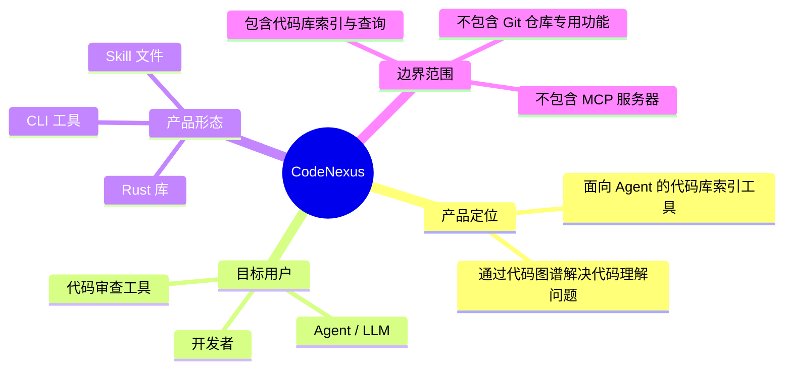
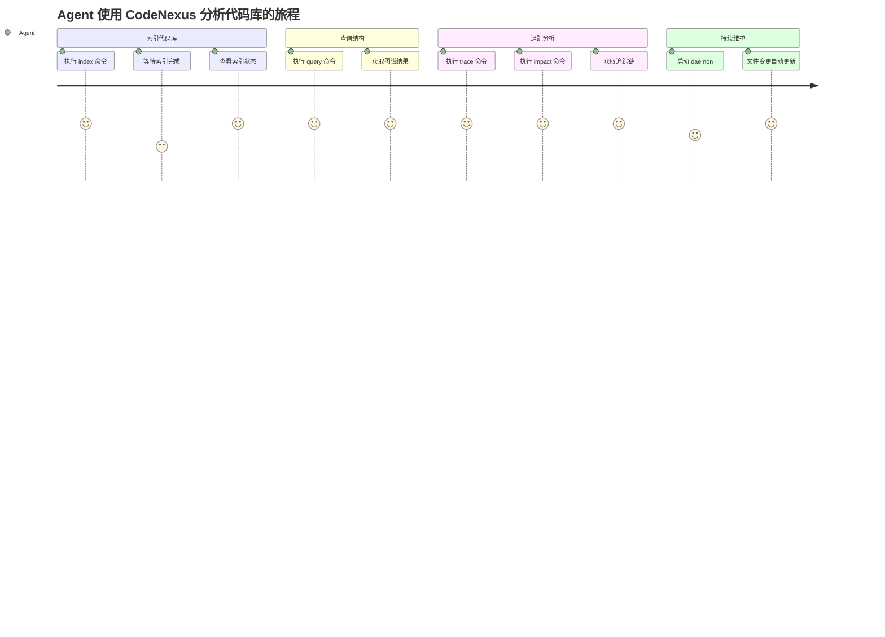
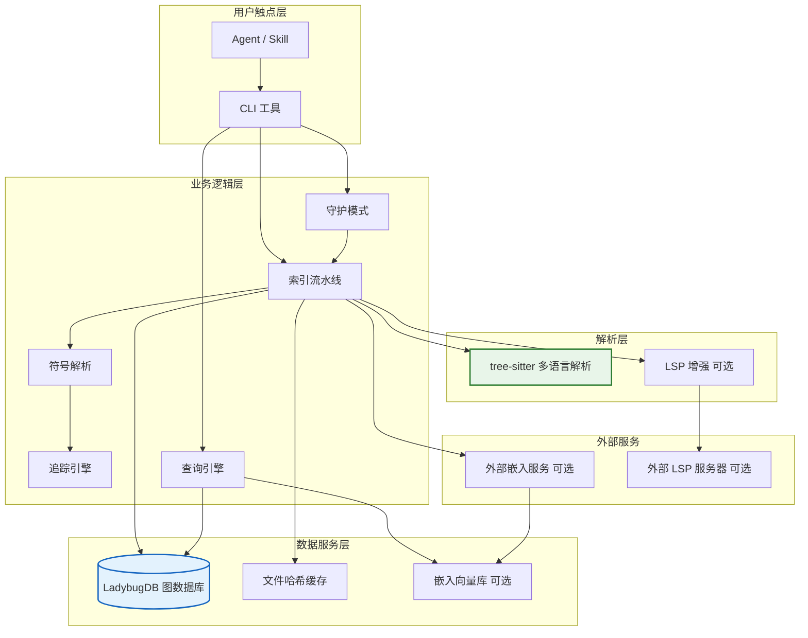
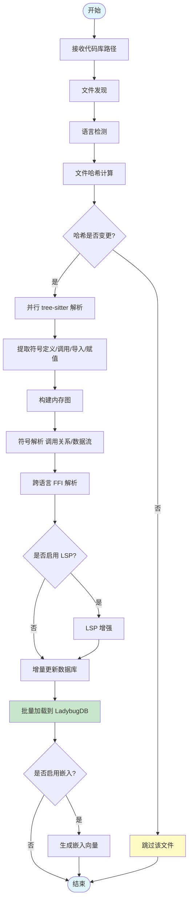
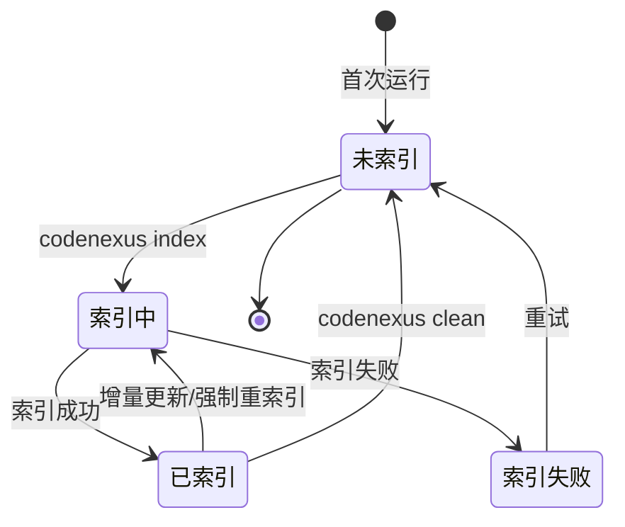
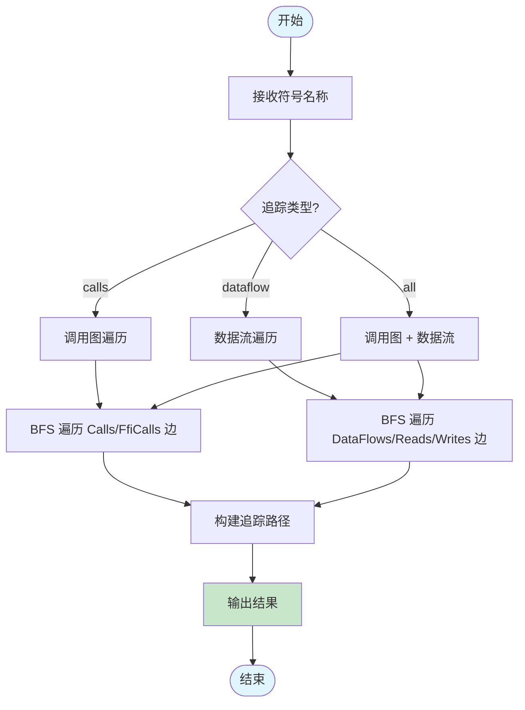
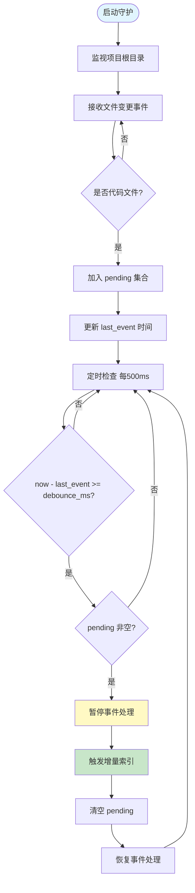
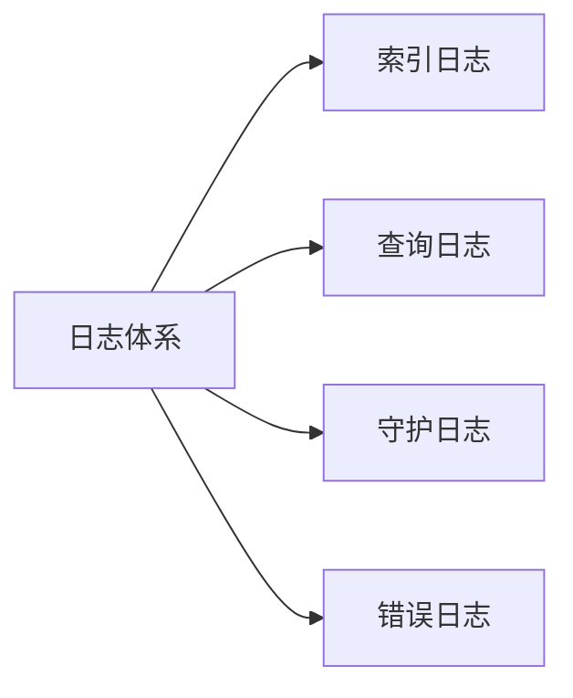
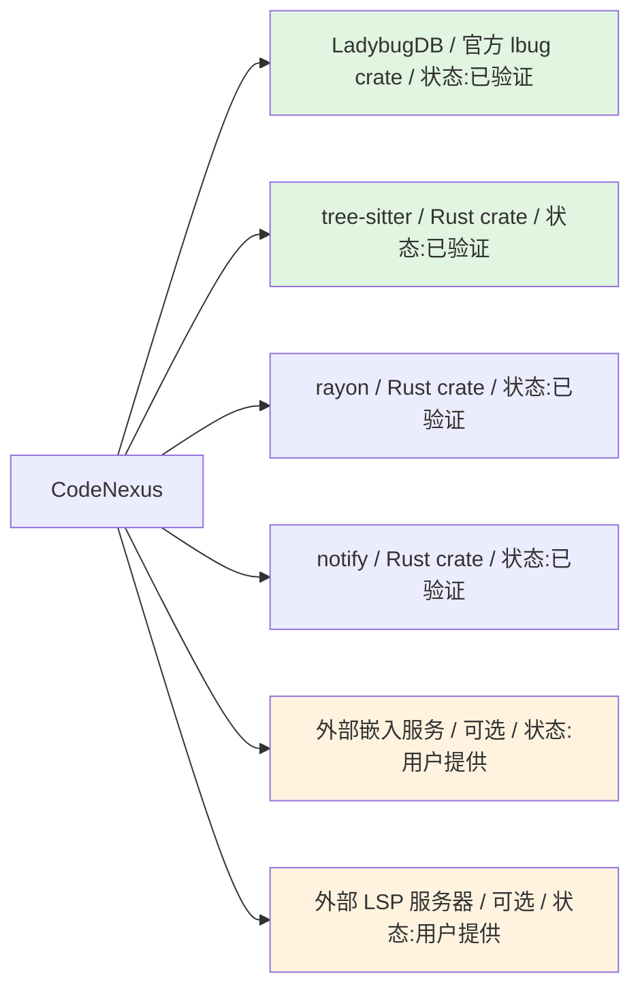

# CodeNexus - 产品需求文档（PRD）

> **文档状态：** 🟡 评审中
>
> **保密级别：** 内部公开
>
> **版本：** v0.1
>
> **日期：** 2026-06-23
>
> **撰写人：** CodeNexus Team
>
> **评审人：** [待定]
>
> **阅读对象：** 架构师、后端开发、Agent 开发者、技术负责人

---

## 0. 文档导读

### 0.1 文档目的与适用范围

**目的：** 定义 CodeNexus 代码库索引与图谱分析工具的产品需求，明确功能边界、验收标准与发布计划。

**适用场景：**
- ✅ 需要对任意代码库（非仅 Git 仓库）建立代码知识图谱
- ✅ 需要支持多语言项目（C/Rust/Fortran 等）的统一索引
- ✅ 需要支持变量追踪、调用链分析、影响分析
- ✅ Agent 需要通过 CLI + Skill 方式查询代码库结构

**不适用场景：**
- ❌ 仅对 Git 仓库进行索引（请使用 GitNexus）
- ❌ 需要 MCP 服务器集成（CodeNexus 仅提供 CLI）
- ❌ 需要本地嵌入模型（CodeNexus 使用外部 HTTP 嵌入服务）

### 0.2 相关文档

| 文档类型 | 文件名 | 相关章节 |
|---------|--------|---------|
| 技术需求 | TRD.md 1-8 | 技术选型、性能指标、可靠性 |
| 架构设计 | ADD.md 3-9 | C4 视图、动态行为、ADR |
| 数据库设计 | DDD.md 4-7 | LadybugDB 图模式、节点/边类型 |
| 实现计划 | .trae/documents/codenexus-implementation-plan.md 3-4 | 数据模型、实施阶段 |

### 0.3 变更记录

| 版本 | 日期 | 修订人 | 变更内容 | 审核人 |
| :--- | :--- | :--- | :--- | :--- |
| v0.1 | 2026-06-23 | CodeNexus Team | 初稿：完成背景、功能清单、功能详述、非功能需求 | — |

---

## 1. 文档概述（Document Overview）

### 1.1 项目背景（Background）

**一句话描述：** `CodeNexus 为任意代码库建立可查询的代码知识图谱，支持嵌套结构与跨语言追踪。`

**背景详情：**
- **市场/业务背景：** 现有代码索引工具（如 GitNexus）仅支持 Git 仓库，且多语言项目的跨语言调用关系（如 C↔Rust FFI、C↔Fortran ISO_C_BINDING）难以被自动解析。Agent 在分析大型代码库时缺乏统一的代码结构查询入口，需依赖 grep/正则等低准确率手段。
- **数据支撑：** GitNexus 已验证 LadybugDB 图数据库 + tree-sitter 解析的可行性；codebase-memory-mcp 已验证 tree-sitter + LSP 分层解析的可行性。两者均未同时支持"非 Git 代码库 + 跨语言 FFI 追踪 + 变量数据流"。
- **战略对齐：** 为 Agent 提供代码库结构化查询能力，支撑代码理解、影响分析、重构建议等下游场景。

### 1.2 项目目标（Objectives）

| 目标类型 | 目标描述 | 衡量指标 | 目标值 | 优先级 |
|:---|:---|:---|:---:|:---:|
| 功能目标 | 支持任意代码库索引 | 支持的代码库类型 | 非 Git 代码库 | P0 |
| 功能目标 | 多语言解析 | 支持语言数 | ≥ 5（C/Rust/Fortran/Python/TypeScript） | P0 |
| 功能目标 | 跨语言调用追踪 | FFI 调用解析准确率 | ≥ 80% | P0 |
| 功能目标 | 变量数据流追踪 | 追踪链深度 | ≥ 5 层 | P0 |
| 性能目标 | 增量索引效率 | 未变更文件跳过率 | 100% | P0 |
| 质量目标 | 测试覆盖率 | 覆盖率 | ≥ 90% | P0 |

## 2. 产品定义（Product Definition）

### 2.1 产品概述（Product Summary）

**产品定位：** `CodeNexus 是面向 Agent 与开发者的代码库索引工具，通过 tree-sitter 多语言解析与 LadybugDB 图数据库，对任意代码库建立可查询的代码知识图谱，支持嵌套结构、变量追踪、跨语言调用分析与影响分析。`

**本次迭代范围：**
- ✅ **包含（In Scope）：**
  - 多语言代码库索引（C/Rust/Fortran/Python/TypeScript）
  - 代码知识图谱（项目→文件→类→函数→变量嵌套）
  - 变量数据流追踪（参数传递、返回赋值、变量赋值）
  - 函数调用关系追踪（caller/callee 链）
  - 跨语言 FFI 调用解析（C↔Rust、C↔Fortran）
  - 文件哈希增量索引
  - 并行解析（rayon）
  - 守护模式（文件监视 + 防抖 + 自动增量更新）
  - 可选 RAG 模糊搜索（外部 HTTP 嵌入服务）
  - CLI 工具（index/query/trace/impact/search/daemon/status/list/clean）
  - Skill 文件（指导 Agent 使用）
- ❌ **不包含（Out of Scope）：**
  - MCP 服务器集成
  - 本地嵌入模型（使用外部 HTTP 服务）
  - Git 仓库专用功能（如分支索引、commit 追踪）
  - Web UI
  - 自研 LSP 实现（使用外部 LSP 服务器）
- ⏳ **后续版本（Future）：**
  - 更多语言支持（Go/Java/JavaScript/C++）
  - MinHash/LSH 去重
  - 分布式索引
  - IDE 插件

### 2.2 用户画像（User Personas）

**核心用户一：Agent / LLM**
- **用户名称：** 代码分析 Agent
- **类型：** AI Agent
- **核心诉求：** 通过 CLI 命令查询代码库结构，获取函数调用链、变量数据流、影响分析结果
- **痛点场景：** Agent 无法直接阅读整个代码库，需要结构化查询入口；grep/正则匹配准确率低，无法理解跨语言调用
- **技术熟练度：** 高，通过 Skill 文件指导使用 CLI

**核心用户二：开发者**
- **用户名称：** 后端开发者
- **核心诉求：** 索引本地代码库，查询函数调用关系，分析变更影响范围
- **痛点场景：** 大型代码库中难以追踪函数调用链；跨语言项目（如 Rust 调 C 库）的 FFI 关系不清晰
- **技术熟练度：** 高，熟悉命令行

### 2.3 用户旅程地图（User Journey Map）

---

## 3. 需求全景（Requirement Landscape）

### 3.1 功能清单（Feature List）

| 模块 | 功能点 | 功能描述 | 优先级 | 负责人 | 依赖项 | 状态 |
|:---|:---|:---|:---:|:---:|:---|:---:|
| 索引模块 | 代码库索引 | 对任意代码库建立代码知识图谱 | P0 | 后端 | tree-sitter, LadybugDB | ⚪ |
| 索引模块 | 多语言解析 | 支持 C/Rust/Fortran/Python/TypeScript | P0 | 后端 | tree-sitter 语法包 | ⚪ |
| 索引模块 | 增量索引 | 文件哈希检测，仅解析变更文件 | P0 | 后端 | SHA-256 | ⚪ |
| 索引模块 | 并行解析 | rayon 并行 tree-sitter 解析 | P0 | 后端 | rayon | ⚪ |
| 索引模块 | 守护模式 | 文件监视 + 防抖 + 自动增量更新 | P1 | 后端 | notify | ⚪ |
| 图谱模块 | 嵌套结构 | 项目→文件→类→函数→变量嵌套 | P0 | 后端 | — | ⚪ |
| 图谱模块 | 全局变量支持 | 支持全局变量、静态变量、常量等特殊类型 | P0 | 后端 | — | ⚪ |
| 追踪模块 | 变量数据流 | 变量传递链、赋值追踪 | P0 | 后端 | — | ⚪ |
| 追踪模块 | 函数调用链 | caller/callee 链追踪 | P0 | 后端 | — | ⚪ |
| 追踪模块 | 跨语言 FFI | C↔Rust、C↔Fortran FFI 调用解析 | P0 | 后端 | — | ⚪ |
| 追踪模块 | 影响分析 | 变更符号的爆炸半径分析 | P1 | 后端 | — | ⚪ |
| 查询模块 | Cypher 查询 | 直接执行 Cypher 查询 | P0 | 后端 | LadybugDB | ⚪ |
| 查询模块 | 结构化搜索 | 按名称/类型/文件搜索符号 | P0 | 后端 | — | ⚪ |
| 查询模块 | 全文搜索 | BM25 关键词搜索 | P1 | 后端 | LadybugDB FTS | ⚪ |
| 查询模块 | 语义搜索 | 向量搜索 + RRF 融合（可选） | P2 | 后端 | 外部嵌入服务 | ⚪ |
| 存储模块 | 多项目共存 | 多个项目存入同一数据库 | P0 | 后端 | — | ⚪ |
| 存储模块 | 自定义数据库路径 | 支持指定数据库位置 | P0 | 后端 | — | ⚪ |
| CLI 模块 | index 命令 | 索引代码库 | P0 | 后端 | — | ⚪ |
| CLI 模块 | query 命令 | 执行 Cypher 查询 | P0 | 后端 | — | ⚪ |
| CLI 模块 | trace 命令 | 追踪符号 | P0 | 后端 | — | ⚪ |
| CLI 模块 | impact 命令 | 影响分析 | P1 | 后端 | — | ⚪ |
| CLI 模块 | search 命令 | 搜索符号 | P0 | 后端 | — | ⚪ |
| CLI 模块 | daemon 命令 | 启动守护模式 | P1 | 后端 | — | ⚪ |
| CLI 模块 | status 命令 | 查看索引状态 | P0 | 后端 | — | ⚪ |
| CLI 模块 | list 命令 | 列出已索引项目 | P0 | 后端 | — | ⚪ |
| CLI 模块 | clean 命令 | 清理项目索引 | P0 | 后端 | — | ⚪ |
| 增强模块 | LSP 增强 | 可选 LSP 服务器增强解析 | P2 | 后端 | 外部 LSP 服务器 | ⚪ |
| 文档模块 | Skill 文件 | 指导 Agent 使用的 Skill | P0 | 后端 | — | ⚪ |

**优先级定义：**
- **P0（Must-have）：** 不满足则产品无法发布，阻塞性需求
- **P1（Should-have）：** 重要但非阻塞，可降级或分期实现
- **P2（Could-have）：** 锦上添花，资源充裕时实现

### 3.2 产品架构图（Product Architecture）

---

## 4. 功能详述（Functional Requirements）

---

### 4.1 功能模块一：代码库索引模块

#### 4.1.1 功能定义（Feature Definition）

| 属性 | 说明 |
|:---|:---|
| **功能名称** | 代码库索引 |
| **功能ID** | FUNC-001 |
| **所属模块** | 索引模块 |
| **优先级** | P0 |
| **需求来源** | 用户需求 |
| **关联需求** | FUNC-002, FUNC-003, FUNC-004 |

**功能描述：** 对任意代码库（非仅 Git 仓库）建立代码知识图谱，支持多语言解析、嵌套结构、增量索引与并行解析。

#### 4.1.2 业务流程图（Business Flow）

#### 4.1.3 输入输出定义（Input & Output）

**CLI 输入：**

| 输入项 | 类型 | 必填 | 来源 | 校验规则 | 示例值 |
|:---|:---:|:---:|:---|:---|:---|
| path | string | 是 | 用户输入 | 存在的目录路径 | /home/user/myproject |
| --name | string | 是 | 用户输入 | 非空字符串 | myproject |
| --db | string | 否 | 用户输入 | 有效路径，默认 ./codenexus.lbug | /data/codenexus.lbug |
| --force | flag | 否 | 用户输入 | 无 | — |
| --lsp | flag | 否 | 用户输入 | 无 | — |
| --embed | flag | 否 | 用户输入 | 无 | — |

**CLI 输出：**

| 输出项 | 类型 | 说明 | 示例值 |
|:---|:---:|:---|:---|
| project_id | string | 项目唯一标识 | proj_0190a3b5 |
| files_indexed | number | 索引的文件数 | 152 |
| files_skipped | number | 跳过的文件数 | 48 |
| nodes_created | number | 创建的节点数 | 1240 |
| edges_created | number | 创建的边数 | 3560 |
| duration_ms | number | 耗时（毫秒） | 8500 |

#### 4.1.4 业务规则（Business Rules）

| 规则ID | 规则描述 | 触发条件 | 执行动作 | 优先级 |
|:---|:---|:---|:---|:---:|
| BR-INDEX-001 | 文件哈希增量 | 文件 SHA-256 哈希与数据库一致 | 跳过该文件解析 | P0 |
| BR-INDEX-002 | 文件删除检测 | 数据库有该文件但磁盘无 | 删除节点与关联边 | P0 |
| BR-INDEX-003 | 强制重索引 | --force 标志 | 忽略哈希，全量重解析 | P0 |
| BR-INDEX-004 | 多项目共存 | 同一数据库已有其他项目 | 新项目独立命名空间，不冲突 | P0 |
| BR-INDEX-005 | 忽略规则 | 匹配 .gitignore 或 .codenexusignore | 跳过该文件 | P0 |
| BR-INDEX-006 | 硬编码跳过 | 目录名在 ALWAYS_SKIP_DIRS | 跳过该目录 | P0 |

#### 4.1.5 状态机（State Machine）

#### 4.1.6 异常处理（Exception Handling）

| 异常场景 | 异常类型 | CLI 表现 | 内部处理 | 补偿机制 |
|:---|:---|:---|:---|:---|
| 路径不存在 | 输入异常 | 提示"路径不存在" | 退出码 1 | 无 |
| 数据库锁定 | 存储异常 | 提示"数据库被占用" | 重试 3 次 | 退出码 2 |
| 解析失败 | 解析异常 | 跳过该文件，继续索引 | 记录错误日志 | 部分索引成功 |
| 内存不足 | 系统异常 | 提示"内存不足" | 退出码 3 | 无 |
| 磁盘空间不足 | 系统异常 | 提示"磁盘空间不足" | 退出码 3 | 无 |
| LadybugDB 损坏 | 存储异常 | 提示"数据库损坏" | 建议删除重建 | 退出码 4 |

#### 4.1.7 验收标准（Acceptance Criteria）

| 验收项ID | 验收标准（Given-When-Then） | 验收方式 | 通过标准 |
|:---|:---|:---|:---:|
| AC-INDEX-001 | **Given** 一个包含 C/Rust/Fortran 的代码库 **When** 执行 codenexus index **Then** 成功索引所有文件，生成代码图谱 | 端到端测试 | 100%通过 |
| AC-INDEX-002 | **Given** 已索引的代码库 **When** 修改一个文件后再次索引 **Then** 仅解析变更文件，跳过未变更文件 | 集成测试 | 100%通过 |
| AC-INDEX-003 | **Given** 同一数据库已有项目 A **When** 索引项目 B **Then** 两个项目共存，互不干扰 | 集成测试 | 100%通过 |
| AC-INDEX-004 | **Given** .gitignore 包含 target/ **When** 索引代码库 **Then** target/ 目录被跳过 | 单元测试 | 100%通过 |
| AC-INDEX-005 | **Given** --force 标志 **When** 执行索引 **Then** 忽略哈希，全量重解析 | 集成测试 | 100%通过 |

---

### 4.2 功能模块二：变量追踪与调用分析模块

#### 4.2.1 功能定义

| 属性 | 说明 |
|:---|:---|
| **功能名称** | 变量追踪与调用分析 |
| **功能ID** | FUNC-002 |
| **所属模块** | 追踪模块 |
| **优先级** | P0 |
| **需求来源** | 用户需求 |
| **关联需求** | FUNC-001 |

**功能描述：** 追踪变量的数据流（传递给哪个函数、被谁赋值）、函数调用关系（caller/callee 链）、跨语言 FFI 调用，支持深度限制与路径输出。

#### 4.2.2 业务流程图

#### 4.2.3 输入输出定义

**trace 命令输入：**

| 输入项 | 类型 | 必填 | 校验规则 | 说明 |
|:---|:---:|:---:|:---|:---|
| symbol | string | 是 | 非空字符串 | 符号名称或 FQN |
| --type | enum | 否 | calls/dataflow/all，默认 all | 追踪类型 |
| --depth | number | 否 | >0，默认 3 | 最大追踪深度 |
| --db | string | 否 | 有效路径 | 数据库路径 |

**trace 命令输出：**

| 输出项 | 类型 | 说明 |
|:---|:---:|:---|
| symbol | string | 查询的符号 |
| paths | array | 追踪路径列表 |
| paths[].nodes | array | 路径上的节点（名称+类型+位置） |
| paths[].edges | array | 路径上的边（类型+原因） |
| paths[].depth | number | 路径深度 |

#### 4.2.4 数据流追踪规则

| 规则ID | 场景 | 源节点 | 目标节点 | 边类型 | 说明 |
|:---|:---|:---|:---|:---|:---|
| BR-TRACE-001 | 参数传递 | Variable | Parameter | DataFlows | foo(var) → var 传递给 foo 的参数 |
| BR-TRACE-002 | 返回赋值 | Function | Variable | DataFlows | x = foo() → foo 返回值赋给 x |
| BR-TRACE-003 | 变量赋值 | Variable | Variable | DataFlows | x = y → y 的值赋给 x |
| BR-TRACE-004 | 函数赋值 | Function | Variable | DataFlows | x = foo() → foo 赋给 x |
| BR-TRACE-005 | 变量读取 | Function | Variable | Reads | 函数内读取变量 |
| BR-TRACE-006 | 变量写入 | Function | Variable | Writes | 函数内赋值变量 |
| BR-TRACE-007 | 同语言调用 | Function | Function | Calls | A() 调用 B() |
| BR-TRACE-008 | 跨语言调用 | Function | Function | FfiCalls | Rust extern "C" 调用 C 函数 |

#### 4.2.5 验收标准

| 验收项ID | 验收标准（Given-When-Then） | 验收方式 | 通过标准 |
|:---|:---|:---|:---:|
| AC-TRACE-001 | **Given** 函数 A 调用函数 B **When** trace A --type calls **Then** 返回 A→B 的调用路径 | 单元测试 | 100%通过 |
| AC-TRACE-002 | **Given** 变量 x 传递给函数 foo 的参数 **When** trace x --type dataflow **Then** 返回 x→foo.param 的数据流路径 | 单元测试 | 100%通过 |
| AC-TRACE-003 | **Given** Rust 函数通过 extern "C" 调用 C 函数 **When** trace rust_func --type calls **Then** 返回含 FfiCalls 边的路径 | 集成测试 | 100%通过 |
| AC-TRACE-004 | **Given** --depth 2 **When** trace symbol **Then** 返回路径深度不超过 2 | 单元测试 | 100%通过 |

---

### 4.3 功能模块三：守护模式模块

#### 4.3.1 功能定义

| 属性 | 说明 |
|:---|:---|
| **功能名称** | 守护模式 |
| **功能ID** | FUNC-003 |
| **所属模块** | 守护模式 |
| **优先级** | P1 |
| **需求来源** | 用户需求 |
| **关联需求** | FUNC-001 |

**功能描述：** 后台程序监视代码库文件变更，防抖后自动触发增量索引更新数据库。

#### 4.3.2 业务流程图

#### 4.3.3 业务规则

| 规则ID | 规则描述 | 触发条件 | 执行动作 | 优先级 |
|:---|:---|:---|:---|:---:|
| BR-DAEMON-001 | 防抖窗口 | 文件变更事件 | 等待 debounce_ms（默认 2000ms）无新事件后触发 | P0 |
| BR-DAEMON-002 | 代码文件过滤 | 文件扩展名不在支持列表 | 忽略事件 | P0 |
| BR-DAEMON-003 | 索引期间暂停 | 增量索引进行中 | 暂停事件处理，索引完成后恢复 | P0 |
| BR-DAEMON-004 | 可配置防抖 | --debounce-ms 参数 | 覆盖默认 2000ms | P1 |

#### 4.3.4 验收标准

| 验收项ID | 验收标准（Given-When-Then） | 验收方式 | 通过标准 |
|:---|:---|:---|:---:|
| AC-DAEMON-001 | **Given** 守护模式运行中 **When** 修改一个代码文件 **Then** 2s 后自动触发增量索引 | 集成测试 | 100%通过 |
| AC-DAEMON-002 | **Given** 连续修改多个文件 **When** 最后一次修改后 2s **Then** 仅触发一次增量索引 | 集成测试 | 100%通过 |
| AC-DAEMON-003 | **Given** 修改非代码文件 **When** 文件变更 **Then** 不触发索引 | 单元测试 | 100%通过 |

---

### 4.4 功能模块四：查询与搜索模块

#### 4.4.1 功能定义

| 属性 | 说明 |
|:---|:---|
| **功能名称** | 查询与搜索 |
| **功能ID** | FUNC-004 |
| **所属模块** | 查询模块 |
| **优先级** | P0 |
| **需求来源** | 用户需求 |
| **关联需求** | FUNC-001 |

**功能描述：** 支持 Cypher 查询、结构化搜索、全文搜索（BM25）与可选语义搜索（向量 + RRF 融合）。

#### 4.4.2 输入输出定义

**query 命令：**

| 输入项 | 类型 | 必填 | 说明 |
|:---|:---:|:---:|:---|
| cypher | string | 是 | Cypher 查询语句 |
| --db | string | 否 | 数据库路径 |
| --project | string | 否 | 限定项目 |

**search 命令：**

| 输入项 | 类型 | 必填 | 说明 |
|:---|:---:|:---:|:---|
| text | string | 是 | 搜索文本 |
| --semantic | flag | 否 | 启用语义搜索 |
| --limit | number | 否 | 返回数量，默认 10 |
| --db | string | 否 | 数据库路径 |

#### 4.4.3 验收标准

| 验收项ID | 验收标准（Given-When-Then） | 验收方式 | 通过标准 |
|:---|:---|:---|:---:|
| AC-QUERY-001 | **Given** 已索引的代码库 **When** query "MATCH (f:Function) RETURN f.name LIMIT 10" **Then** 返回函数名称列表 | 集成测试 | 100%通过 |
| AC-SEARCH-001 | **Given** 已索引的代码库 **When** search "parse" **Then** 返回含 parse 关键词的符号 | 集成测试 | 100%通过 |
| AC-SEARCH-002 | **Given** 启用嵌入功能 **When** search "解析函数" --semantic **Then** 返回语义相关的符号（如 parse 函数） | 集成测试 | 100%通过 |

---

## 5. 非功能需求（Non-Functional Requirements）

### 5.1 性能需求（Performance）

| 指标 | 目标值 | 测试场景 | 优先级 |
|:---|:---:|:---|:---:|
| 索引速度 | ≥ 100 文件/秒 | 中等规模代码库（1000 文件） | P0 |
| 增量索引速度 | ≥ 500 文件/秒（跳过未变更） | 仅 1 文件变更 | P0 |
| 查询响应时间（P99） | ≤ 200ms | Cypher 查询 | P0 |
| 追踪响应时间（P99） | ≤ 500ms | 深度 3 的调用链 | P0 |
| 守护模式内存占用 | ≤ 200MB | 持续运行 | P1 |
| 首次索引内存峰值 | ≤ 1GB | 10000 文件代码库 | P1 |

### 5.2 安全需求（Security）

| 需求项 | 具体要求 | 实现方式 |
|:---|:---|:---|
| 数据库隔离 | 多项目数据隔离 | 节点带 project 属性，查询时过滤 |
| 路径安全 | 防止路径遍历攻击 | 路径规范化 + 边界检查 |
| 外部服务安全 | 嵌入服务 HTTPS | reqwest 默认 HTTPS |
| 无远程代码执行 | 不执行任何代码 | 仅静态解析，不运行代码 |

### 5.3 可用性需求（Availability）

| 需求项 | 目标值 | 说明 |
|:---|:---:|:---|
| 工具可用性 | 99.9% | CLI 工具本身可用 |
| 故障恢复 | 自动重试 | 解析失败跳过，不中断整体索引 |
| 数据完整性 | 100% | 索引失败不破坏已有数据 |

### 5.4 兼容性需求（Compatibility）

| 平台 | 支持范围 | 优先级 |
|:---|:---|:---:|
| Windows | Windows 10+ | P0 |
| Linux | Ubuntu 20.04+ / CentOS 7+ | P0 |
| macOS | macOS 11+ | P0 |
| LadybugDB | v0.17+ | P0 |
| Rust | 1.81+ | P0 |

---

## 6. 数据埋点方案（Data Tracking）

> CodeNexus 为 CLI 工具，无前端埋点。通过日志记录关键指标。

### 6.1 日志总览

### 6.2 日志清单

| 日志ID | 日志名称 | 触发时机 | 关键属性 | 用途 |
|:---|:---|:---|:---|:---|
| LOG-001 | 索引开始 | codenexus index | project, path, file_count | 性能监控 |
| LOG-002 | 索引完成 | 索引结束 | project, duration, nodes, edges | 性能分析 |
| LOG-003 | 文件跳过 | 哈希一致 | file, hash | 增量验证 |
| LOG-004 | 解析失败 | 解析异常 | file, error | 问题定位 |
| LOG-005 | 守护触发 | 防抖窗口结束 | files_changed, debounce_ms | 守护监控 |
| LOG-006 | 查询执行 | codenexus query | cypher, duration, results | 查询性能 |

---

## 7. 发布计划（Release Plan）

### 7.1 里程碑（Milestones）

| 阶段 | 任务 | 开始日期 | 工期 | 状态 |
|:---|:---|:---|:---:|:---:|
| Phase 1 | 基础框架（数据模型 + LadybugDB 集成） | 2026-06-23 | — | ⚪ |
| Phase 2 | 文件发现 + tree-sitter 解析 | Phase 1 完成后 | — | ⚪ |
| Phase 3 | 符号解析 + 变量追踪 + 跨语言 | Phase 2 完成后 | — | ⚪ |
| Phase 4 | 索引流水线 + 存储 | Phase 3 完成后 | — | ⚪ |
| Phase 5 | 查询追踪 + CLI | Phase 4 完成后 | — | ⚪ |
| Phase 6 | 守护模式 + 可选嵌入 | Phase 5 完成后 | — | ⚪ |
| Phase 7 | 测试套件 + 90% 覆盖率 | Phase 6 完成后 | — | ⚪ |
| Phase 8 | 文档（PRD + TRD + ADD + DDD） | Phase 7 完成后 | — | 🟡 |
| Phase 9 | Skill 创建 | Phase 8 完成后 | — | ⚪ |

### 7.2 回滚方案（Rollback Plan）

| 触发条件 | 回滚动作 | 预计耗时 | 影响范围 |
|:---|:---|:---:|:---|
| 索引结果错误 | 删除数据库，重新索引 | 取决于代码库大小 | 全量数据 |
| LadybugDB 损坏 | 删除数据库文件，重建 | 取决于代码库大小 | 全量数据 |
| 守护模式异常 | 停止守护进程 | 即时 | 守护功能 |

---

## 8. 风险与依赖（Risks & Dependencies）

### 8.1 风险登记册（Risk Register）

| 风险ID | 风险描述 | 可能性 | 影响度 | 风险等级 | 应对策略 | 责任人 |
|:---|:---|:---:|:---:|:---:|:---|:---:|
| R-001 | ~~tree-sitter-fortran crate 不可用~~ → **已解决**：v0.5.1 已验证可用（MIT，51K 下载） | 低 | 中 | 🟢 低 | 无需替代方案 | 后端 |
| R-002 | 跨语言 FFI 解析准确率低 | 中 | 中 | 🟡 中 | 名称+签名双匹配，置信度标注 | 后端 |
| R-003 | LadybugDB VECTOR 扩展 Windows 不支持 | 低 | 低 | 🟢 低 | 嵌入搜索 Windows 降级为仅 BM25 | 后端 |
| R-004 | lbug crate 首次编译耗时 | 高 | 低 | 🟢 低 | 首次编译后缓存 | 后端 |
| R-005 | Windows 非 ASCII 路径问题 | 中 | 中 | 🟡 中 | 8.3 短名 / NTFS junction 兜底 | 后端 |

### 8.2 外部依赖（Dependencies）

---

## 9. 附录（Appendix）

### 9.1 竞品分析摘要

| 竞品 | 核心优势 | 借鉴点 | 差异化策略 |
|:---|:---|:---|:---|
| GitNexus | LadybugDB 图模式成熟，嵌入支持完善 | 混合图模式（每类型 NODE TABLE + 单一 REL TABLE） | CodeNexus 索引任意代码库，非仅 Git |
| codebase-memory-mcp | tree-sitter + LSP 分层解析，FQN 格式 | FQN 格式、作用域链、文件级+项目级符号表 | CodeNexus 使用外部 LSP，不自研 |

### 9.2 参考文档

- [LadybugDB 官方文档](https://docs.ladybugdb.com/)
- [tree-sitter 文档](https://tree-sitter.github.io/)
- [Skill 定义规范](https://code.claude.com/docs/zh-CN/skills)
- [实现计划](.trae/documents/codenexus-implementation-plan.md)

### 9.3 术语表

| 术语 | 定义 |
|:---|:---|
| **FQN** | Fully Qualified Name，完全限定名，如 project.dir.file.function |
| **FFI** | Foreign Function Interface，跨语言函数调用接口 |
| **LadybugDB** | 嵌入式图数据库（原 Kùzu），支持 Cypher 查询 |
| **tree-sitter** | 增量解析库，支持多语言语法解析 |
| **守护模式** | 后台文件监视 + 防抖 + 自动增量更新 |
| **RRF** | Reciprocal Rank Fusion，倒数排名融合 |

---

## 📌 PRD撰写Checklist（自查清单）

- [x] **完整性：** 覆盖所有功能模块（索引/追踪/守护/查询）
- [x] **可执行性：** 研发可不看原型直接开发，测试可直接写用例
- [x] **一致性：** 术语统一（FQN/FFI/守护模式）
- [x] **可验证性：** 每个功能有明确的验收标准
- [x] **异常覆盖：** 覆盖异常场景（路径不存在/数据库锁定/解析失败等）
- [x] **依赖清晰：** 外部依赖明确（LadybugDB/tree-sitter/嵌入服务）
- [x] **数据闭环：** 日志覆盖关键指标
- [x] **版本控制：** 修订记录已更新

---

**文档结束**
