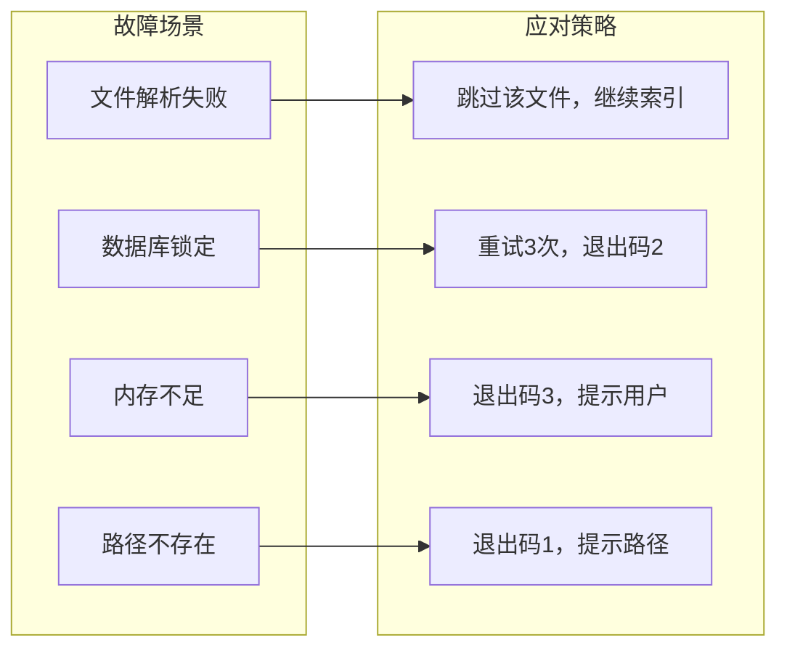
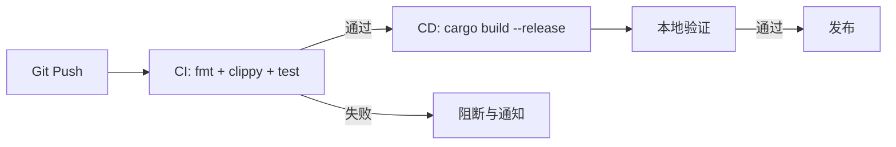

# CodeNexus - 技术需求文档（TRD）

> **文档状态：** 🟡 评审中
>
> **保密级别：** 内部公开
>
> **版本：** v0.1
>
> **日期：** 2026-06-23
>
> **撰写人：** CodeNexus Team
>
> **评审人：** [待定]
>
> **阅读对象：** 架构师、后端开发、技术负责人
>
> **关联文档：** PRD.md 1-9, ADD.md 3-9, DDD.md 4-7

---

## 0. 文档导读

### 0.1 文档目的与适用范围

**TRD 回答**："用什么技术栈、达到什么性能指标、有什么非功能约束"——跨子系统、跨团队的技术评审层。

**适用场景：**
- ✅ 新建代码库索引技术平台
- ✅ 重大技术选型决策（LadybugDB 图数据库、tree-sitter 多语言解析）
- ✅ 性能/可靠性基线定义
- ❌ 单个子系统的内部架构（用 ADD 即可）
- ❌ 业务需求分析（用 PRD）

### 0.2 相关文档

| 文档类型 | 文件名 | 相关章节 |
| -------- | -------- | -------- |
| 产品需求 | PRD.md 3-4 | 功能清单、功能详述 |
| 架构设计 | ADD.md 3-9 | C4 视图、ADR |
| 数据库设计 | DDD.md 4-7 | LadybugDB 图模式 |
| 实现计划 | .trae/documents/codenexus-implementation-plan.md 3-4 | 数据模型、依赖清单 |

### 0.3 变更记录

| 版本 | 日期 | 修订人 | 变更内容 | 审核人 |
| :----- | :--------- | :----- | :------- | :------- |
| v0.1 | 2026-06-23 | CodeNexus Team | 初稿 | — |

---

## 1. 技术挑战分析（Technical Challenges）

> **架构师导读：** 5 分钟说明我们要解决的核心技术难题。

### 1.1 挑战清单

| 挑战 ID | 挑战分类 | 挑战描述 | 量化指标 | 优先级 |
| :------ | :------- | :------- | :------- | :----: |
| TC-001 | 性能 | 大型代码库（10000+ 文件）索引速度 | ≥ 100 文件/秒 | P0 |
| TC-002 | 准确性 | 跨语言 FFI 调用解析准确率 | ≥ 80% | P0 |
| TC-003 | 可扩展 | 多语言支持扩展性 | 新增语言 ≤ 1 个提取器文件 | P0 |
| TC-004 | 一致性 | 增量索引与全量索引结果一致 | 100% 一致 | P0 |
| TC-005 | 可靠性 | 守护模式长时间运行稳定性 | 连续运行 ≥ 7 天无泄漏 | P1 |
| TC-006 | 兼容性 | Windows 非 ASCII 路径支持 | 100% 支持 | P1 |

### 1.2 关键技术难题深析

#### TC-001 性能：大型代码库索引速度

**问题本质**：tree-sitter 解析是 CPU 密集型，单线程解析 10000 文件耗时过长。

**当前方案局限**：串行解析 10000 文件约需 100 秒，无法满足大型代码库需求。

**本方案创新点**：rayon 文件级并行 + tree-sitter parser 线程局部复用，避免重复 `Parser::new()`，解析阶段不建立跨文件边（延迟到符号解析阶段），无锁合并。

**技术风险**：tree-sitter parser 非线程安全，需线程局部复用。

#### TC-002 准确性：跨语言 FFI 调用解析

**问题本质**：C↔Rust（extern "C"）、C↔Fortran（ISO_C_BINDING）的跨语言调用关系难以通过单语言解析获得。

**当前方案局限**：单语言解析器无法识别跨语言边界。

**本方案创新点**：名称匹配 + 签名匹配（参数数量/类型）双策略，置信度 0.70-0.85 标注，可选 LSP 增强提升准确率。

**技术风险**：名称冲突（不同语言同名函数）可能导致误匹配。

---

## 2. 技术选型矩阵（Technology Stack Selection）

### 2.1 选型决策矩阵

| 技术维度 | 当前选型 | 备选方案 | 选型理由 | 决策 ADR |
| :------------- | :---------------------------- | :------------------------------------ | :--- | :-------: |
| **编程语言** | Rust 1.81+ | C++ / Go | 性能 + 内存安全 + tree-sitter 原生支持 | ADR-001 |
| **图数据库** | LadybugDB（官方 lbug crate v0.17） | Neo4j / SurrealDB | 嵌入式无需部署、Cypher 支持、FTS+VECTOR 扩展、官方 Rust crate | ADR-002 |
| **解析器** | tree-sitter 0.26（语法包：c 0.24 / rust 0.24 / fortran 0.6 / python 0.25 / typescript 0.23） | 自研解析器 / LSP only | 多语言支持、增量解析、Rust 原生绑定、生态成熟 | ADR-003 |
| **并行框架** | rayon 1 | tokio / 自研线程池 | 数据并行标准方案、文件级无锁、API 简洁 | — |
| **文件发现** | ignore 0.4（ripgrep 同源） | walkdir + globset / 自研 gitignore | 内置完整 gitignore 语义、1.32 亿下载验证、消除自研匹配引擎 bug 风险 | ADR-012 |
| **文件监视** | notify 6 + notify-debouncer-full 0.7 | inotify 直接调用 / 轮询 / 自写防抖 | 跨平台、事件驱动、官方防抖器消除竞态风险 | ADR-006/013 |
| **CLI 框架** | clap 4 | structopt / cobra | derive 宏、子命令、帮助生成、Rust 标准 | — |
| **哈希算法** | SHA-256（sha2 crate） | xxHash / BLAKE3 | 与参考项目一致、可靠性高、碰撞率极低 | ADR-009 |
| **HTTP 客户端** | reqwest 0.12（可选） | ureq / hyper | async 支持、JSON 序列化、生态成熟 | — |
| **错误处理** | thiserror + anyhow | failure / 手动 | thiserror 库错误、anyhow 应用错误、Rust 标准 | — |
| **日志** | tracing + tracing-subscriber | log + env_logger | 结构化日志、span 追踪、性能好 | — |
| **序列化** | serde + serde_json | 手动 / bincode | Rust 序列化标准、JSON 兼容 | — |
| **CSV 生成** | csv 1 | 自写 RFC 4180 | Rust 标准、RFC 4180 合规、免边界 case | ADR-014 |

### 2.2 选型约束

- **依赖管控**：所有依赖为 MIT/Apache-2.0 许可；新依赖需评审
- **版本策略**：优先稳定版本；lbug crate 跟随 LadybugDB 官方发布
- **构建要求**：默认从源码编译 LadybugDB C++ 库（静态链接）；支持预编译库加速

### 2.3 关键技术决策 ADR 索引

| ADR 编号 | 决策主题 | 状态 | 评审日期 |
| :-------- | :------- | :--: | :------- |
| ADR-001 | 选 Rust 作为核心开发语言 | 🟢 通过 | 2026-06-23 |
| ADR-002 | 选 LadybugDB 官方 lbug crate | 🟢 通过 | 2026-06-23 |
| ADR-003 | tree-sitter 为默认解析，LSP 为可选增强 | 🟢 通过 | 2026-06-23 |
| ADR-004 | 嵌入为可选 feature | 🟢 通过 | 2026-06-23 |
| ADR-005 | 仅 CLI，不提供 MCP | 🟢 通过 | 2026-06-23 |
| ADR-006 | notify 文件监视 + 防抖 | 🟢 通过 | 2026-06-23 |
| ADR-007 | 混合图模式（每类型 NODE TABLE + 单一 REL TABLE） | 🟢 通过 | 2026-06-23 |
| ADR-008 | 嵌套用 CONTAINS 边 + parent_qn 双重表示 | 🟢 通过 | 2026-06-23 |
| ADR-009 | SHA-256 文件哈希增量 | 🟢 通过 | 2026-06-23 |
| ADR-010 | rayon 并行解析 | 🟢 通过 | 2026-06-23 |
| ADR-011 | 符号解析：自研通用编排器 + 薄语言适配器 | 🟢 通过 | 2026-06-24 |
| ADR-012 | 用 ignore crate 替代自研 gitignore | 🟢 通过 | 2026-06-24 |
| ADR-013 | 用 notify-debouncer-full 替代自写防抖 | 🟢 通过 | 2026-06-24 |
| ADR-014 | 用 csv crate 替代自写 CSV 生成 | 🟢 通过 | 2026-06-24 |

> **ADR-003 说明**：当前版本未实现 LSP，feature gate 为空，--lsp 标志保留为预留。

---

## 3. 性能与可扩展性指标（Performance & Scalability）

### 3.1 性能基线

| 指标 | 当前值 | 目标值 | 测量方法 | 验收场景 |
| :--- | :--- | :--- | :--- | :--- |
| **索引速度** | — | ≥ 100 文件/秒 | 基准测试 | 中等代码库（1000 文件） |
| **增量索引速度** | — | ≥ 500 文件/秒（跳过） | 基准测试 | 仅 1 文件变更 |
| **查询 P99 延迟** | — | ≤ 200ms | 压测 | Cypher 查询 |
| **追踪 P99 延迟** | — | ≤ 500ms | 压测 | 深度 3 调用链 |
| **守护模式内存** | — | ≤ 200MB | 长时间运行 | 持续监视 |
| **首次索引内存峰值** | — | ≤ 1GB | 内存分析 | 10000 文件 |

### 3.2 容量规划

| 资源 | 1000 文件代码库 | 10000 文件代码库 | 100000 文件代码库 |
| :--- | :--- | :--- | :--- |
| **索引耗时** | ≤ 10s | ≤ 100s | ≤ 1000s |
| **数据库大小** | ≤ 50MB | ≤ 500MB | ≤ 5GB |
| **内存峰值** | ≤ 200MB | ≤ 1GB | ≤ 8GB |
| **节点数** | ~10000 | ~100000 | ~1000000 |
| **边数** | ~30000 | ~300000 | ~3000000 |

### 3.3 扩展性策略

- **水平扩展能力**：单机工具，无水平扩展需求
- **垂直扩展能力**：rayon 自动利用多核 CPU
- **数据分片策略**：多项目共存于同一数据库，通过 `project` 属性隔离
- **增量策略**：SHA-256 文件哈希，仅解析变更文件

---

## 4. 可靠性与容灾（Reliability & DR）

### 4.1 可靠性指标

| 指标 | 目标 | 测量方法 |
| :--- | :--- | :--- |
| **工具可用性** | ≥ 99.9% | CLI 工具本身可用 |
| **错误率** | ≤ 0.1%（解析失败率） | 解析失败文件数 / 总文件数 |
| **数据完整性** | 100% | 索引失败不破坏已有数据 |
| **增量一致性** | 100% | 增量索引与全量索引结果一致 |

### 4.2 容错架构

### 4.3 降级与熔断策略

| 场景 | 降级策略 | 触发条件 | 恢复策略 |
| :--- | :--- | :--- | :--- |
| 单文件解析失败 | 跳过该文件，记录日志 | tree-sitter 解析异常 | 无，需修复源文件 |
| LadybugDB 锁定 | 重试 3 次 | 数据库被占用 | 释放占用后自动恢复 |
| VECTOR 扩展不可用 | 降级为仅 BM25 搜索 | Windows 平台 | 无 |
| 嵌入服务不可用 | 跳过嵌入生成 | HTTP 请求失败 | 服务恢复后重新索引 |
| LSP 服务器不可用 | 使用 tree-sitter 结果 | LSP 进程退出 | 重启 LSP 服务器 |

---

## 5. 可观测性（Observability）

### 5.1 日志规范

- **日志格式**：结构化日志（tracing），含 timestamp/level/target/message
- **日志级别**：生产 INFO；调试 DEBUG
- **日志输出**：stderr（不干扰 stdout 的查询结果）
- **关键日志**：索引开始/完成、文件跳过、解析失败、守护触发、查询执行

### 5.2 指标规范

- **业务指标**：索引文件数、跳过文件数、节点数、边数、索引耗时
- **技术指标**：解析速度（文件/秒）、查询延迟、内存占用
- **RED 指标**：Rate（索引/查询速率）、Errors（解析失败率）、Duration（耗时）

### 5.3 链路追踪

- **Trace 协议**：tracing span（非分布式追踪，单进程）
- **关键 span**：index → parse → resolve → load → query
- **采样率**：100%（本地工具，无采样压力）

### 5.4 告警策略

| 告警级别 | 触发条件 | 通知方式 | 响应时限 |
| :--- | :--- | :--- | :--- |
| **P0 紧急** | 索引完全失败 | CLI 退出码 + stderr | 即时 |
| **P1 高** | 解析失败率 > 5% | 日志警告 | 即时 |
| **P2 中** | 性能低于基线 50% | 日志信息 | 事后分析 |
| **P3 低** | 单文件解析失败 | 日志 debug | 无需响应 |

---

## 6. 安全与合规（Security & Compliance）

### 6.1 认证与授权

- **认证方式**：无（本地 CLI 工具）
- **授权模型**：无（本地文件系统权限控制）
- **密钥管理**：嵌入服务 API Key 通过环境变量传入，不持久化

### 6.2 数据安全

| 数据分级 | 示例 | 加密要求 | 存储要求 |
| :--- | :--- | :--- | :--- |
| **L2 内部** | 代码结构、函数签名 | 无 | LadybugDB 本地文件 |
| **L1 公开** | 节点/边元数据 | 无 | LadybugDB 本地文件 |
| **L3 机密** | 嵌入 API Key | 环境变量，不存储 | 内存中临时使用 |

### 6.3 网络安全

- **传输加密**：嵌入服务 HTTPS（reqwest 默认）
- **本地通信**：无网络通信（除可选嵌入服务）
- **DDoS 防护**：不适用（本地工具）

### 6.4 合规要求

- [x] **开源许可**：所有依赖为 MIT/Apache-2.0
- [x] **数据本地化**：所有数据存储在本地，不上传
- [x] **无远程代码执行**：仅静态解析，不执行任何代码

### 6.5 审计日志

- **审计范围**：索引操作、清理操作
- **审计字段**：时间 / 项目名 / 文件数 / 操作结果
- **审计保留**：随日志输出，不独立存储

---

## 7. 可维护性（Maintainability）

### 7.1 代码组织

- **仓库结构**：单 crate 多 mod（用户明确要求）
- **模块划分**：model / discover / parse / resolve / storage / index / embed / daemon / trace / cli
- **代码规范**：rustfmt + clippy（`-D warnings`）
- **依赖管理**：Cargo.toml 锁定版本；features 控制可选功能（lsp / embed）

### 7.2 CI/CD

- **代码合并**：PR 需评审；CI 必过
- **自动化测试**：单元测试 ≥ 90% 覆盖；集成测试全关键路径；端到端测试真实代码库
- **发布策略**：cargo build --release 产出单一二进制
- **回滚时间**：≤ 1 分钟（删除数据库重建）

### 7.3 技术债务管理

- **债务登记**：代码中 `TODO` / `FIXME` 标注
- **债务清偿**：每个版本评估并清偿
- **重构原则**：禁止破坏性重构与功能迭代并行

---

## 8. 技术风险评估（Technical Risk Assessment）

| 风险 ID | 风险描述 | 概率 | 影响 | 风险等级 | 缓解措施 | 责任人 |
| :------ | :------- | :---: | :---: | :------: | :--- | :--- |
| TR-001 | ~~tree-sitter-fortran crate 不可用或过时~~ → **已解决**：v0.5.1 已验证可用（MIT，51K 下载） | 🟢 低 | 🟡 中 | 🟢 低 | 无需替代方案 | 后端 |
| TR-002 | 跨语言 FFI 解析准确率低于 80% | 🟡 中 | 🟡 中 | 🟡 中 | 名称+签名双匹配，置信度标注，LSP 增强 | 后端 |
| TR-003 | lbug crate 首次编译耗时过长 | 🔴 高 | 🟢 低 | 🟡 中 | 首次编译后缓存；支持预编译库加速 | 后端 |
| TR-004 | Windows 非 ASCII 路径导致 LadybugDB 打开失败 | 🟡 中 | 🟡 中 | 🟡 中 | 8.3 短名 / NTFS junction 兜底 | 后端 |
| TR-005 | LadybugDB VECTOR 扩展 Windows 不支持 | 🟢 低 | 🟢 低 | 🟢 低 | 嵌入搜索 Windows 降级为仅 BM25 | 后端 |
| TR-006 | 90% 覆盖率难以达到（IO 代码难测） | 🟡 中 | 🟡 中 | 🟡 中 | IO 层用 tempfile；核心逻辑优先覆盖 | 后端 |

---

## 9. 附录（Appendix）

### 9.1 术语表

| 术语 | 英文 | 释义 |
| :--- | :--- | :--- |
| FQN | Fully Qualified Name | 完全限定名，如 project.dir.file.function |
| FFI | Foreign Function Interface | 跨语言函数调用接口 |
| LadybugDB | LadybugDB | 嵌入式图数据库（原 Kùzu），支持 Cypher |
| tree-sitter | tree-sitter | 增量解析库，支持多语言语法解析 |
| RRF | Reciprocal Rank Fusion | 倒数排名融合，用于混合搜索 |
| BM25 | BM25 | 全文搜索排名算法 |
| LSP | Language Server Protocol | 语言服务器协议 |
| WAL | Write-Ahead Log | 预写日志 |
| FTS | Full Text Search | 全文搜索 |
| P99 | Percentile 99 | 99% 请求在该时间内完成 |

### 9.2 参考文献

1. LadybugDB Documentation. (2026). _LadybugDB_. https://docs.ladybugdb.com/
2. tree-sitter Documentation. (2026). _tree-sitter_. https://tree-sitter.github.io/
3. GitNexus Architecture. (2026). _GitNexus_. [内部参考项目]
4. codebase-memory-mcp. (2026). _codebase-memory-mcp_. [内部参考项目]
5. Skill 定义规范. (2026). _Claude Skills_. https://code.claude.com/docs/zh-CN/skills

---

## 📌 TRD 撰写 Checklist

- [x] §0 文档导读：目的与适用范围 / 相关文档 / 变更记录
- [x] §1 技术挑战：6 个挑战，含量化指标
- [x] §2 技术选型矩阵：11 个技术维度，每个有选型理由
- [x] §3 性能基线：含索引速度 / P99 / 容量规划 / 扩展策略
- [x] §4 可靠性：含可用性 / 容错 / 降级策略
- [x] §5 可观测性：日志 / 指标 / 链路追踪 / 告警四要素齐备
- [x] §6 安全合规：认证 / 加密 / 合规清单
- [x] §7 可维护性：CI/CD / 测试 / 债务管理
- [x] §8 风险评估：6 个风险，含概率影响与缓解
- [x] §9 附录：术语 / 引用
- [x] 关联文档链接完整

---

**文档结束**
