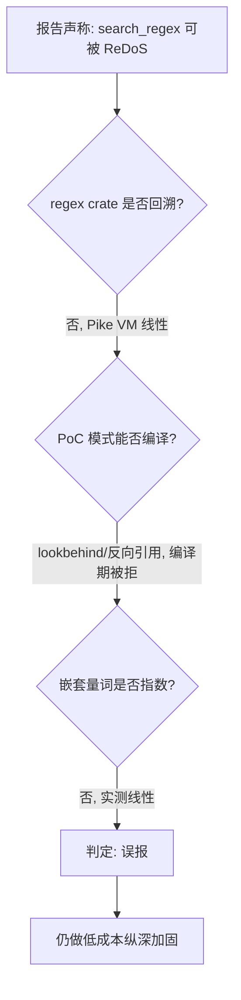

# 安全审计 triage：strix_runs/codenexus_679c

> Strix 对 CodeNexus 源码的安全审计结果复核。结论先行：唯一的 1 个 finding（CWE-400 ReDoS）判定为**误报**，并附可复现实证；另对输入边界做了低成本纵深加固。

## 摘要

| 项 | 值 |
|---|---|
| 审计工具 | Strix（v1.1.0 规则集） |
| 产物路径 | `strix_runs/codenexus_679c/` |
| Finding 数 | 1（`vuln-0001`） |
| 类别 / 严重度 | CWE-400 ReDoS / CVSS 5.5 MEDIUM |
| 目标符号 | `SearchEngine::search_regex`（`src/query/structured.rs`） |
| **triage 判定** | **误报（false positive）** |
| 运行状态 | `failed`（token 耗尽，网络层中断，详见 §5） |
| 处置 | 误报归档 + 低成本纵深加固（§4，已实施） |

## 1. 报告原文要点

报告（`findings.sarif` / `vulnerabilities/vuln-0001.md`）声称：

- `search_regex` 接受未经验证的用户 regex，无 timeout / 复杂度限制；
- 对知识库中所有符号名依次 `re.is_match()`，可被构造的模式拖死（100% CPU、请求挂起）；
- 给出的 PoC 模式：`(?<=(a+))+a+`、`(a+)+b`、`^(a+)+$`；
- 建议修复：`RegexBuilder::backtrack_limit()`、线程超时、`regex-automata` HybridBuilder。

## 2. 为何是误报：四个技术误判

报告把通用 ReDoS 知识（针对 **回溯引擎**：PCRE / Python `re` / Java / JS）错误套用到 Rust `regex` crate 上。该 crate 的核心设计目标就是**线性时间、免疫 ReDoS**。

### 误判一：Rust `regex` 不会"回溯"

> 报告原文："patterns requiring backtracking ... fall back to a backtracking NFA engine ... exponential-time evaluation"

**事实**：Rust `regex` crate（1.x）基于 **Pike VM**（并行 NFA 仿真）+ lazy DFA，匹配复杂度为 **O(n·m)**（n=输入长度，m=模式长度），线性，永不指数回溯。不存在"回溯 NFA 后备路径"。这是该 crate 与回溯引擎的根本区别。

### 误判二：主推 PoC 在编译期即被拒绝

报告主推 PoC `(?<=(a+))+a+` 使用 **lookbehind**。Rust `regex` crate **不支持** lookbehind / lookahead / 反向引用——这些在编译期直接 `parse error` 拒绝。

实证（`cargo run`，完整源码见 `docs/security/strix-codenexus_679c-redos-proof.rs`）：

```text
[编译被拒] "(?<=(a+))+a+"   -> regex parse error
[编译被拒] "(?<=a)b"         -> regex parse error
[编译被拒] "(a+)\\1"         -> regex parse error   （反向引用不支持）
```

→ PoC 根本无法编译成可执行的 `Regex`，谈不上触发 ReDoS。

### 误判三：嵌套量词在 `regex` 下是线性时间

报告声称 `(a+)+b` / `^(a+)+$` 造成灾难性回溯。这在回溯引擎中成立，在 Pike VM 中不成立。对 `(a+)+b` 匹配 `aⁿ`（**无尾部 b，回溯引擎的最坏情况**）实测：

| 输入长度 n | `is_match` | 耗时 |
|---|---|---|
| 1 000 | false | 21 µs |
| 2 000 | false | 2 µs |
| 4 000 | false | 4 µs |
| 8 000 | false | 8 µs |
| 16 000 | false | 16 µs |
| 32 000 | false | 34 µs |

长度翻倍耗时近似翻倍 → **线性**。若为指数，n=32000 会比 n=1000 慢 2²² 倍（不可完成）。

### 误判四：建议的修复 API 不存在

报告建议 `RegexBuilder::backtrack_limit()`。该 API 在 Rust `regex` crate 中**不存在**——正因为 `regex` 不回溯，无需 backtrack limit。报告对修复路径的描述进一步暴露了对 crate 语义的误解（混淆了 `regex` 与支持回溯的引擎）。

### 判定流程



## 3. 威胁模型补充

即便忽略上述技术误判，威胁模型也不成立：

- CodeNexus 是**本地 CLI / MCP 工具**，报告所述 "authenticated user" 即本机用户；
- ReDoS 是"用户攻击自己"，无外部收益场景；
- MCP 场景下，pattern 来自用户意图经 AI 传递，自伤动机弱。

## 4. 已实施的轻微加固（纵深防御，非修复 ReDoS）

虽判定误报，仍按"补输入边界缺口"原则做了低成本加固（`src/query/structured.rs`）。**注意：这并非修复 ReDoS**（`regex` 本就免疫），而是补"pattern 输入规模"的边界：

| 加固项 | 取值 | 作用维度 |
|---|---|---|
| `MAX_REGEX_PATTERN_LEN` | 4096 字节 | 超长字符串在**编译前**拒绝，防 parse/compile 的 CPU 消耗 |
| `RegexBuilder::size_limit` / `dfa_size_limit` | 4 MiB | 编译期 NFA / DFA 内存预算显式化（默认 10 MiB 收紧） |

测试覆盖（4 个，全绿）：超长 pattern 拒绝、语法错误拒绝、正常 anchored pattern 回归、per-table 查询错误继续。

## 5. Strix 运行失败说明

- `run.json` `status = failed`；
- token 消耗约 1720 万，超出预算；
- 终止原因：`httpx.ReadError`（网络层中断），非正常完成；
- 影响：审计未走完整流程，仅产出 1 个 finding 即中断；判定需人工复核（即本 triage）。

## 6. 结论

- **CWE-400 判定：误报**——基于对 Rust `regex` crate 语义的四重误判（不回溯、PoC 编译被拒、嵌套量词线性、臆造 API），并有可复现实证支撑；
- 处置：归档本 triage；保留原始 finding 供复核；已叠加低成本纵深加固；
- 不阻断发布：无 CRITICAL / HIGH 真实漏洞，满足发布前 SAST 门禁（0 CRITICAL）。

## 复现指引

```bash
# 1. 复现 PoC 免疫证据
cd docs/security
cargo new redos_proof && cp strix-codenexus_679c-redos-proof.rs redos_proof/src/main.rs
echo 'regex = "1"' >> redos_proof/Cargo.toml
cargo run --release --manifest-path redos_proof/Cargo.toml

# 2. 验证加固后的 search_regex 测试
cargo test --lib search_regex
```
